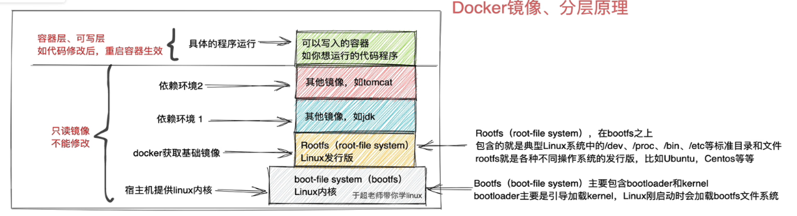

## 安装

**安装教程： https://blog.csdn.net/weixin_43755251/article/details/127512751**

使用yml简易安装完成后

```shell
# 查看系统发行版本
cat /etc/redhat-release
# 查看内核版本
uname -r


#镜像配置
{
  "registry-mirrors": [
    "https://docker.m.daocloud.io",
    "https://dockerproxy.com",
    "https://docker.mirrors.ustc.edu.cn",
    "https://docker.nju.edu.cn",
    "http://hammal.staronearth.win/",
    "http://hub.staronearth.win/",
    "http://hub-mirror.c.163.com",
    "https://registry.docker-cn.com",
    "https://1d7bgakn.mirror.aliyuncs.com"
  ]
}

# yum源
wget -O /etc/yum.repos.d/CentOS-Base.repo http://mirrors.aliyun.com/repo/Centos-7.repo
wget -O /etc/yum.repos.d/epel.repo http://mirrors.aliyun.com/repo/epel-7.repo

# 其清空缓存
yum clean all
# 生成新的缓存
yum makecache
# 清空现有规则
iptables -F
# 关闭 SElinux
# 修改配置为 SELINUX=disabled, 重启
vim /etc/selinux/config


# docker的基础环境配置
# 修改内核参数配置,打开内核流量转发功能
cat <<EOF > /etc/sysctl.d/docker.conf
net.bridge.bridge-nf-call-ip6tables = 1
net.bridge.bridge-nf-call-iptables = 1
net.ipv4.conf.default.rp_filter = 0
net.ipv4.conf.all.rp_filter = 0
net.ipv4.ip_forward=1
EOF
# 重新加载内核参数
modprobe br_netfilter
sysctl -p /etc/sysctl.d/docker.conf

# yum安装docker
# 先卸载原先的
# 查看已经安装的docker相关的东西
yum list installed|grep docker
yum remove xxx 

# 配置阿里云专属的docker repo仓库
curl -o /etc/yum.repos.d/docker-ce.repo http://mirrors.aliyun.com/docker-ce/linux/centos/docker-ce.repo
# 更新缓存
yum clean all & yum makecache

yum install docker-ce-20.10.6 -y


# 启动docker,设置开启自启动
systemctl enable docker
# 刷新配置
systemctl daemon-reload
# 通过systemctl启动docker
systemctl restart docker

# 以nginx的安装为例子
# 1.搜索安装包, 我这里一直报错,尝试修改镜像等方法也一直不行
docker search nginx

# 查看目前所有已经下载的镜像
> docker images
REPOSITORY   TAG       IMAGE ID       CREATED       SIZE
nginx        latest    39286ab8a5e1   5 weeks ago   188MB
mysql        latest    680b8c60dce6   8 weeks ago   586MB

# 运行进行
docker run imageId

# -d 后台运行, -p 端口映射
docker run -d -p 80:80 nginx

# 显示网络连接状态和监听状态
netstat -tunlp
> Proto Recv-Q Send-Q Local Address           Foreign Address         State       PID/Program name 
> tcp        0      0 0.0.0.0:80              0.0.0.0:*               LISTEN      18042/docker-proxy

# 停止容器
docker stop 容器id


```

## docker 原理知识

传统的环境部署方案:

### 纯物理服务器部署

这是一种最传统的部署方式,所有的应用全部架设在逻辑上,没有任何虚拟化技术或者容器技术.
CPU,内存,硬盘,网络都是由宿主机的操作系统完全调度.

优点:

- 没有虚拟化层,应用程序直接使用硬件资源,减少性能损耗
- 所有硬件资源都可以被一个操作系统和其上运行的应用完全使用,适合高性能计算任务

缺点:

- 资源利用率低,每台物理机上只能运行一个操作系统,多个应用程序共享资源,造成资源浪费
- 扩展性查差,增加容量或计算能力时需要采购和配置新的物理机,成本高且耗时长
- 维护成本高,硬件故障,操作系统更新或应用程序都需要更多的手动维护
- 隔离性差,多个应用程序运行在同一个操作系统中,如其中一个应用程序出现问题,可能影响整个系统的稳定性

### 虚拟机部署

虚拟机(VM)部署是在物理机上运行多个虚拟的操作系统,每个虚拟机都有自己的操作系统和应用程序
虚拟机由虚拟化软件(Vmware,Hyper-V等)管理
Vmware来说,他提供一种二进制翻译技术,Vmware通过Hypervisor把虚拟机操作系统的命令翻译成恰当的指令交给物理机来执行,有点类似Java虚拟机

优点:

- 资源隔离好,每个虚拟机都有独立的操作系统和资源,应用之间隔离性强,问题互不影响
- 更好的资源利用率,可以在同一个物理机上运行多个虚拟机,提升硬件的资源利用率
- 灵活性强,可以轻松增加或减少虚拟机的数量,便于水平扩展
- 支持多种操作系统,在同一物理机上可以运行不同的操作系统版本或类型

缺点:

- 性能损耗,因为虚拟机需要运行一个完整的操作系统,并且有一层虚拟化管理程序,会导致一定程度的性能损耗
- 启动时间长,虚拟机需要启动整个操作系统,启动时间较长
- 资源占用大,每个虚拟机都需要占用大量的内存和存储空间,尤其是完整的操作系统镜像文件

### 容器部署

无论是全虚拟化,半虚拟化,还是CPU硬件加持下的全虚拟化技术(KVM),虚拟机的目标都是构建一台完整的计算机,性能消耗非常大
Docker是一种基于容器技术的轻量级虚拟化方式,容器共享主机的操作系统内核,但每个容器拥有各自的文件系统,进程,和网络空间,具有独立的运行环境

优点:

- 轻量级,容器不需要运行完整的操作系统,只共享主机的内核,启动和运行开销很小,资源利用高
- 启动速度快,容器的启动通常只需要几秒钟,远快于虚拟机的启动
- 资源利用率高,多个容器可以共享主机的资源,灵活配置和动态扩容资源使用,最大化硬件利用率
- 跨平台兼容性强,容器打包的应用及其以来能够在不同的平台上无缝运行(只需要操作系统内核兼容)
- 持续集成和交付友好,docker容器便于集成到自动化的CI/DI流程中,加速开发和部署

缺点:

- 隔离性不如虚拟机,容器共享操作系统内核,虽然在用户空间上隔离,但是在内核层面的隔离不如虚拟机
- 安全性相对较低,由于共享操作系统内核,若内核出现安全漏洞,可能会影响到多个容器
- 需要操作系统支持,docker需要依赖linux内核特性,在某些操作系统上,尤其是Windows,docker的支持相对有限(
  所以在Windows上面使用docker的时候,会自动安装Hyper-V)

### docker 镜像

```shell
# 通过docker查找一个centos的镜像
# 可以看到 centos的大小是很小的,相较于我自己下载的一个完整的centOS7的完整镜像 CentOS-7-x86_64-DVD-2009(4.38 GB (4,712,300,544 字节))是非常小的
# 这是因为docker的这个images的centos并不是一个完整的镜像,他只是centos运行的一个环境
[root@node-140 ~]# docker images
REPOSITORY    TAG       IMAGE ID       CREATED         SIZE
nginx         latest    39286ab8a5e1   5 weeks ago     188MB
mysql         latest    680b8c60dce6   2 months ago    586MB
hello-world   latest    d2c94e258dcb   17 months ago   13.3kB
centos        latest    5d0da3dc9764   3 years ago     231MB
```



docker通过联合文件系统(Union File System)将上述不同的每一层,整合为一个文件系统,为用户隐藏了多层的视角

| 分层管理    | 实际内容                                                                              |
|---------|-----------------------------------------------------------------------------------|
| 第一层     | 宿主机会提供一个系统内核,这个是linux系统提供的一个文件系统,也就是boot-file system                              |
| 第二层     | linux操作系统会提供一些标准目录和文件,这些文件和目录会基于不同的操作系统的发行版有所不同(不如Ubuntu,CentOS),比如/dev,/etc,/bin |
| 第三层     | 依赖的一些底层环境(jdk,tomcat等)                                                            |
| 容器层,可写层 | 镜像的可写内容                                                                           |

