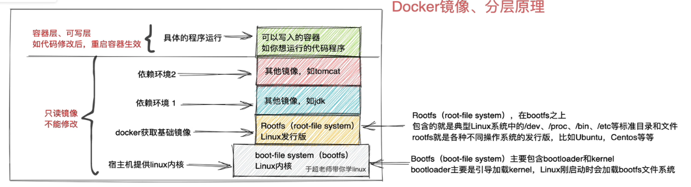

# 安装

**安装教程： https://blog.csdn.net/weixin_43755251/article/details/127512751**

```shell
# 安装依赖包
# 这条命令通常用于配置和管理系统的存储环境，特别是在设置 Docker 或使用 LVM 功能时。例如，在安装和配置 Docker 时，device-mapper-persistent-data 和 lvm2 是必需的，因为 Docker 依赖这些库来管理容器的存储。
yum install -y yum-utils device-mapper-persistent-data lvm2

# 设置阿里云的 docker-ce 镜像源
yum-config-manager --add-repo https://mirrors.aliyun.com/docker-ce/linux/centos/docker-ce.repo

# 安装 docker-ce
yum install -y docker-ce

# 启动docker,设置开启自启动
systemctl enable docker
# 刷新配置
systemctl daemon-reload
# 通过systemctl启动docker
systemctl restart docker

#镜像配置 
vim /etc/docker/daemon.json

{
  "registry-mirrors": [
    "https://docker.m.daocloud.io",
    "https://dockerproxy.com",
    "https://docker.mirrors.ustc.edu.cn",
    "https://docker.nju.edu.cn",
    "http://hammal.staronearth.win/",
    "http://hub.staronearth.win/",
    "http://hub-mirror.c.163.com",
    "https://registry.docker-cn.com",
    "https://1d7bgakn.mirror.aliyuncs.com"
  ]
}


```


# 使用

## docker的基础用法

```shell
# 查看系统发行版本
cat /etc/redhat-release
# 查看内核版本
uname -r

# yum源
wget -O /etc/yum.repos.d/CentOS-Base.repo http://mirrors.aliyun.com/repo/Centos-7.repo
wget -O /etc/yum.repos.d/epel.repo http://mirrors.aliyun.com/repo/epel-7.repo

# 其清空缓存
yum clean all
# 生成新的缓存
yum makecache
# 清空现有规则
iptables -F
# 关闭 SElinux
# 修改配置为 SELINUX=disabled, 重启
vim /etc/selinux/config


# docker的基础环境配置
# 修改内核参数配置,打开内核流量转发功能
cat <<EOF > /etc/sysctl.d/docker.conf
net.bridge.bridge-nf-call-ip6tables = 1
net.bridge.bridge-nf-call-iptables = 1
net.ipv4.conf.default.rp_filter = 0
net.ipv4.conf.all.rp_filter = 0
net.ipv4.ip_forward=1
EOF
# 重新加载内核参数
modprobe br_netfilter
sysctl -p /etc/sysctl.d/docker.conf

# yum安装docker
# 先卸载原先的
# 查看已经安装的docker相关的东西
yum list installed|grep docker
yum remove xxx 

# 配置阿里云专属的docker repo仓库
curl -o /etc/yum.repos.d/docker-ce.repo http://mirrors.aliyun.com/docker-ce/linux/centos/docker-ce.repo
# 更新缓存
yum clean all & yum makecache

yum install docker-ce-20.10.6 -y


# 启动docker,设置开启自启动
systemctl enable docker
# 刷新配置
systemctl daemon-reload
# 通过systemctl启动docker
systemctl restart docker

# 以nginx的安装为例子
# 1.搜索安装包, 我这里一直报错,尝试修改镜像等方法也一直不行
docker search nginx

# 获取镜像 镜像后可以跟版本
docker pull ubuntu:20.04

# 查看目前所有已经下载的镜像
> docker images
REPOSITORY   TAG       IMAGE ID       CREATED       SIZE
nginx        latest    39286ab8a5e1   5 weeks ago   188MB
mysql        latest    680b8c60dce6   8 weeks ago   586MB

# 运行进行
docker run imageId

# -d 后台运行, -p 端口映射
docker run -d -p 80:80 nginx

# 显示网络连接状态和监听状态
netstat -tunlp
> Proto Recv-Q Send-Q Local Address           Foreign Address         State       PID/Program name 
> tcp        0      0 0.0.0.0:80              0.0.0.0:*               LISTEN      18042/docker-proxy

# 停止容器
docker stop 容器id

```

## 镜像的管理操作

```shell

# 删除镜像
#  rm          Remove one or more containers
#  rmi         Remove one or more images
docker rmi 

# 删除镜像的时候可能镜像被某个容器引用着 
# [root@node-140 ~]# docker rmi 39286ab8a5e1
# Error response from daemon: conflict: unable to delete 39286ab8a5e1 (must be forced) - image is being used by stopped container add4e2a22b97
# 这个时候我们需要去删除对应的容器
docker rm container
# 删除所有容器 docker rm $(docker ps -aq), 删除所有镜像也类似

# 可以对现存的镜像进行导出操作
docker image save nginx > nginx.tgz

# 导入对应的镜像文件
docker image load -i nginx.tgz

# 查看镜像的信息
docker image inspect nginx

```

## docker的容器管理

docker run 命令会创建和启动一个容器,如果镜像在本地不存在,那么会直接在远程去下载这个镜像

**注意**: 容器内的进程必须处于前台运行状态,否则容器就会直接推出了

```shell
# 1. 运行一个挂掉的容器
docker run centos

# 2. 运行一个容器,并进入容器
# -it复合命令, -i: 保持STDIN(标准输入)打开,即使没有附加在终端,这样可以在容器运行时与它进行交互 -t:分配一个伪终端,这允许在容器内使用命令行界面,就像本地终端一样
# sh: 容器启动时要运行的命令,这样当容器启动之后,会直接进入sh命令的命令行界面
docker run -it centos bash

# 3. 运行一个容器,并执行相关的命令
docker run centos ping www.baidu.com

# 4. 运行一个活着的容器
# -d: 使这个docker容器后台运行
docker run -d centos ping www.baidu.com
# --rm: 容器在运行完毕之后自动删除记录
# --name: 给容器取名字
# 在docker stop 之后,在容器记录中是没有这条记录的
docker run -d --rm --name mycentos centos ping www.baidu.com

# 5. 查看容器日志
# -f 循环打印, 可以使用管道符 tail
docker logs -f fe1e1f7b8d48

# 6. 进入容器空间内
# docker exec -it <容器id> sh
# exec 在一个已经运行的容器中执行命令
docker exec -it fe1e1f7b8d48 sh

# 7. 查看运行中的容器的具体信息
docker container inspect fe1e1f7b8d48

# 8. 容器的端口映射
# docker run -p <宿主机端口>:<容器端口> <镜像>
# docker run -d -p 8080:80 nginx
docker run -d -p 80:80 nginx 

# 9. 查看容器的转发情况
# docker port <容器ID>
docker port b33a83bc2cf80ebe2f38b88374c4643ceb1afec4e92dc43e4e5e50c8a0ee27e9
# 结果如下：
# 80/tcp 表示这个是在TCP协议上的80端口, 0.0.0.0 表示该服务绑定到所有的网络接口 这意味着80端口接收所有可用网络接口上的监听和接收来自任意IP地址的连接请求
# 也就是说本机有一个TCP协议上的80端口监听和接受来自所有ipv4地址的80端口的请求连接
80/tcp -> 0.0.0.0:80
# [::] 这是一个ipv6地址,和ipv4的 0.0.0.0相当,表示接受所有可用的ipv6地址
# 表示服务器监听所有IPv6接口上的80端口，接受来自任何IPv6地址的连接。
80/tcp -> [::]:80

# 10. 随机映射端口
# -P 随机使用一个宿主机的空闲端口,来映射到容器内的监听端口
docker run -d -P nginx

# 11. 容器的提交  运行一个基础的centos -> 容器内安装vim -> 提交新的镜像 -> 运行新镜像,直接拥有vim
# docker start <容器ID> 运行之前挂掉的容器
# start之后我们通过  docker exec -it <容器ID> sh 进入之前的centos的sh界面
# 这里可能会遇到yum失败的情况 https://blog.csdn.net/lxcw_sir/article/details/140185068  说是由于版本原因,部分东西已经停止更新和维护了,原来的yum源已经失效

# 容器的删除
docker rm <容器id>

# 进入仓库源文件夹下
cd /etc/yum.repos.d/
# 修改镜像配置内容
sed -i 's/mirrorlist/#mirrorlist/g' /etc/yum.repos.d/CentOS-*
sed -i 's|#baseurl=http://mirror.centos.org|baseurl=http://vault.centos.org|g' /etc/yum.repos.d/CentOS-*
# 清空缓存,并重新生成
yum clean all && yum makecache
# 安装vim
yum install vim
# 安装完成后退出容器 exit, 然后提交新的镜像
# docker commit <容器记录ID> 新的镜像名
docker commit 716569939c55 mycentos
# sha256:adcff16466c9a99b7ab3f59d6188d78a46d1c2fcfc0f6bbc95969e4e23b1f2e3
# 这样就可以在 docker images 中看到新的镜像,运行新的镜像就可以直接使用之前安装的 vim 了
```

## 查看docker容器的启动参数

```shell
docker inspect 容器ID

# RestartPolicy 参数可以查看重启策略
# PortBindings 用于配置容器内部端口和宿主机端口之间的映射关系。它指定了容器内部端口如何映射到宿主机端口，这样外部流量可以通过宿主机访问到容器内部的服务。
  "5044/tcp" : [ {
    "HostIp" : "",
    "HostPort" : "5044"
  } ],
# NetworkSettings 提供了与容器网络配置相关的详细信息。
```


# dockerfile 学习

## dockerfile主要的组成部分

- 基础镜像信息 From centos:6.8
- 制作镜像操作指令 RUN yum install openssh-server -y
- 容器启动时执行指令 CMD ["/bin/bash"]

## dockerfile指令

> - FORM 指定基础镜像
> - MAINTAINER 指定镜像的维护者信息
> - RUN 容器内需要执行的命令
> - ADD 添加文件到容器内,如果文件是压缩文件,那么会自动解压
> - COPY 作用和ADD相似,但是不会自动解压
> - WORKDIR 相当于cd,设置当前容器的工作目录
> - VOLUME 设置卷,挂载主机目录
> - EXPOSE 指定对外的端口
> - CMD 指定容器启动时需要做的事情

## 实操构建nginx,并且修改主页内容

```shell
# 1. 创建Dockerfile文件, 文件名必须是 Dockerfile 
touch Dockerfile

# 2. 打开Dockerfile文件, 写入以下内容
FROM nginx
RUN echo '<meta charset=utf-8> 学习docker的第二次' > /usr/share/nginx/html/index.html

# 3. 退出Dockerfile文件, 构建Dockerfile
docker build .
# 可以发现构造后的镜像没有名称
# REPOSITORY    TAG       IMAGE ID       CREATED          SIZE
# <none>        <none>    9f041af9b1d8   20 seconds ago   192MB
# 4. 修改镜像名
docker tag mynginx 9f041af9b1d8
# 5. 运行这个image
docker run -d -P mynginx
```

## 其他命令

```dockerfile
# 拷贝一个文件到镜像内
COPY test.txt /home/
# add一个文件到镜像内部,如果是压缩文件,这个压缩文件会自动解压
# 如果是一个url,那么会下载这个连接放入目标路径,且权限自动设置为 600 
ADD test.tar.gz /home/add

# CMD 在容器内运行某个命令, 启动程序
# CMD ["参数1","参数2"]
# 在centos镜像CMD默认的是 /bin/bash , 指定docker run -it centos会直接进入bash解释器
# 比如容器启动就查看系统版本,我们这里传入 cat /etc/os-release 命令,可以在 centos容器启动后打印出系统版本
CMD ["cat","/etc/os-release"]

# ENTRYPOINT 作用和CMD类似, 当指定了ENTRYPOINT之后, CMD指令的语义就变成了把CMD的内容当作参数传递给ENTRYPOINT指令
# CMD 存在的问题就是虽然我们事先指定了命令,但是如果还想传入一些个性化参数,这些参数会直接覆盖我们写好的指令
# 现在我们编写一个执行curl命令的centos镜像
# rpm(Red Hat Package Manager) linux系统中用于软件包管理的命令行工具,主要用于安装,升级,删除,查询和验证软件包
# --rebuilddb 用于重构数据库
# epel-release 这是一个软件包仓库,允许用户从这个仓库中安装额外的软件包和工具
# curl 一个常用的命令行工具, 主要作用于服务器传输数据或向服务器传输数据
# -y 自动回答yes以确认安装过程中所有的提示
FROM centos
RUN cd /etc/yum.repos.d/
RUN sed -i 's/mirrorlist/#mirrorlist/g' /etc/yum.repos.d/CentOS-*
RUN sed -i 's|#baseurl=http://mirror.centos.org|baseurl=http://vault.centos.org|g' /etc/yum.repos.d/CentOS-*
RUN yum clean all && yum makecache
RUN rpm --rebuilddb && yum install epel-release -y
RUN rpm --rebuilddb && yum install curl -y
CMD ["curl","-s","http://ipinfo.io/ip"]

# 保存退出, docker build -t mycentos2 .
# 启动镜像之后,返回 119.85.105.24
# 但是现在的问题是,如果我们在run命令后面添加其他命令,这会覆盖我们默认curl命令行为
# 比如 docker run mycentos2 pwd 这条命令将返回 / ,而不会返回 curl的结果
# 解决办法 
# 1.直接重新传入完整的命令 docker run mycentos2 curl -s http://ipinfo.io/ip I 但是这么做却完全没有意义
# 2.使用 ENTRYPOINT, 把CMD直接改为ENTRYPOINT
ENTRYPOINT ["curl","-s","http://ipinfo.io/ip"]
# 构建好之后重新运行镜像 docker run mycentos3 -I 就能正确执行 curl 并且打印请求信息


# 设置环境变量  ENV ARG
# ENV 定义变量值, 后续使用 $符号就可以使用之前定义的变量 
ENV NAME = "hulei"
# ARG和ENV一样, 区别于ENV的是, 无论是在环境构建时,还是在容器运行时,该变量都可以使用

# VOLUME 挂载目录到宿主机
# 容器在运行时,应该保证在存储层不写入任何数据,容器的运行期间产生的数据,推荐应该挂载到宿主机进行维护
# 这里挂载两个目录到宿主机内,宿主机上的目录docker会自动指定
VOLUME ["/data1","/data2"]
# 后续可以通过 docker inspect <容器id>


# 剩下的其他指令
# EXPOSE 指定容器运行时对外提供的端口服务
# WORKDIR 更改当前的工作目录
```

## dockerfile实践,搭建一个Springboot的mvc项目

第一步. **搭建一个配置文件在jar包内的jar镜像**

```dockerfile
# 初期搭建,暂时不考虑配置文件的问题,我这里配置文件内的配置都写死在jar包内
# 为了排除所有其他东西的干扰,这里以一个纯净的centos来搭建整个dockerfile

# 1. centos作为基础镜像
FROM centos
# 2. 更新yum的仓库源
RUN cd /etc/yum.repos.d/
RUN sed -i 's/mirrorlist/#mirrorlist/g' /etc/yum.repos.d/CentOS-*
RUN sed -i 's|#baseurl=http://mirror.centos.org|baseurl=http://vault.centos.org|g' /etc/yum.repos.d/CentOS-*
RUN yum clean all && yum makecache
# 3. 安装jdk,为了方便jdk的安装,我这里直接使用yum安装jdk,这里就安装配套的开发工具了
RUN yum install -y java-1.8.0-openjdk-src.x86_64
# 4. COPY我们的jar包进入dockerfile,不使用ADD,ADD会自动解压
COPY springboot-js.jar /home/
# 遇到了问题就是这里启动容器会报错 Error: Unable to access jarfile springboot-js.jar
# 因为 COPY 之后这个文件的权限默认是 600, 也就是拥有着有 读(4)写(2)权限, 但是没有执行权限(1)
# 所以需要在中间插入一个赋权的操作
RUN chmod 700 /home/springboot-js.jar
# 5. 暴露容器内部的对应的端口
EXPOSE 10008
# 6. 使用CMD来跑这个jar包
CMD ["java","-jar","/home/springboot-js.jar"]

## 完成后docker build
# docker build -t myjar .
```

第二步. **搭建一个配置文件不在jar包内的jar镜像**

```dockerfile
# 初期搭建,暂时不考虑配置文件的问题,我这里配置文件内的配置都写死在jar包内
# 为了排除所有其他东西的干扰,这里以一个纯净的centos来搭建整个dockerfile

# 1. centos作为基础镜像
FROM centos
# 2. 更新yum的仓库源
RUN cd /etc/yum.repos.d/
RUN sed -i 's/mirrorlist/#mirrorlist/g' /etc/yum.repos.d/CentOS-*
RUN sed -i 's|#baseurl=http://mirror.centos.org|baseurl=http://vault.centos.org|g' /etc/yum.repos.d/CentOS-*
RUN yum clean all && yum makecache
# 3. 安装jdk,为了方便jdk的安装,我这里直接使用yum安装jdk,这里就安装配套的开发工具了
RUN yum install -y java-1.8.0-openjdk-src.x86_64
# 4. COPY我们的jar包进入dockerfile,不使用ADD,ADD会自动解压
COPY springboot-js.jar /home/
# 复制配置文件到docker镜像内
COPY config /home/config
# 把生成的日志挂载到宿主机上
VOLUME /home/logs/
# 遇到了问题就是这里启动容器会报错 Error: Unable to access jarfile springboot-js.jar
# 因为 COPY 之后这个文件的权限默认是 600, 也就是拥有着有 读(4)写(2)权限, 但是没有执行权限(1)
# 所以需要在中间插入一个赋权的操作
RUN chmod 700 /home/springboot-js.jar
# 以/home为工作目录, 我这里如果不在/home下,始终获取不到配置文件
WORKDIR /home

# 5. 暴露容器内部的对应的端口
EXPOSE 10008
# 6. 使用CMD来跑这个jar包
CMD ["java","-jar","/home/springboot-js.jar","--spring.config.location=/home/config"]
```

第三步. **直接把配置目录挂载到主机的配置文件目录上,直接读取宿主机的配置文件内容**

```shell
# 这需要在容器启动的时候通过 -v指定外部的挂载目录
# VOLUME和-v都能挂载目录, 两者的区别:
# VOLUME 命令用于在 Docker 容器中创建持久化存储卷。以便数据在容器停止或者删除后也能够继续存在. 场景: 持久化数据
# 通过 -v 可以更加灵活的挂载目录, 不仅可以指定容器内的目录,还可以指定宿主机的目录 场景: 数据共享,开发调试,轻松切换数据位置
docker run -P -v /root/learn_docker/config:/home/config myjar
# 通过 --restart=always来让这个容器只要docker启动容器就会自动开启 
# unless-stopped除非手动停止
# on-failure (--restart=on-failure:5): 如果容器以非零状态退出，则重启容器。你可以指定最大重启次数。
# no 默认行为,不自动重启容器
docker run -d -p 10008:10008 -v /root/learn_docker/config:/home/config --restart=unless-stopped myjar

```

# docker 原理知识

传统的环境部署方案:

## 纯物理服务器部署

这是一种最传统的部署方式,所有的应用全部架设在逻辑上,没有任何虚拟化技术或者容器技术.
CPU,内存,硬盘,网络都是由宿主机的操作系统完全调度.

优点:

- 没有虚拟化层,应用程序直接使用硬件资源,减少性能损耗
- 所有硬件资源都可以被一个操作系统和其上运行的应用完全使用,适合高性能计算任务

缺点:

- 资源利用率低,每台物理机上只能运行一个操作系统,多个应用程序共享资源,造成资源浪费
- 扩展性查差,增加容量或计算能力时需要采购和配置新的物理机,成本高且耗时长
- 维护成本高,硬件故障,操作系统更新或应用程序都需要更多的手动维护
- 隔离性差,多个应用程序运行在同一个操作系统中,如其中一个应用程序出现问题,可能影响整个系统的稳定性

## 虚拟机部署

虚拟机(VM)部署是在物理机上运行多个虚拟的操作系统,每个虚拟机都有自己的操作系统和应用程序
虚拟机由虚拟化软件(Vmware,Hyper-V等)管理
Vmware来说,他提供一种二进制翻译技术,Vmware通过Hypervisor把虚拟机操作系统的命令翻译成恰当的指令交给物理机来执行,有点类似Java虚拟机

优点:

- 资源隔离好,每个虚拟机都有独立的操作系统和资源,应用之间隔离性强,问题互不影响
- 更好的资源利用率,可以在同一个物理机上运行多个虚拟机,提升硬件的资源利用率
- 灵活性强,可以轻松增加或减少虚拟机的数量,便于水平扩展
- 支持多种操作系统,在同一物理机上可以运行不同的操作系统版本或类型

缺点:

- 性能损耗,因为虚拟机需要运行一个完整的操作系统,并且有一层虚拟化管理程序,会导致一定程度的性能损耗
- 启动时间长,虚拟机需要启动整个操作系统,启动时间较长
- 资源占用大,每个虚拟机都需要占用大量的内存和存储空间,尤其是完整的操作系统镜像文件

## 容器部署

无论是全虚拟化,半虚拟化,还是CPU硬件加持下的全虚拟化技术(KVM),虚拟机的目标都是构建一台完整的计算机,性能消耗非常大
Docker是一种基于容器技术的轻量级虚拟化方式,容器共享主机的操作系统内核,但每个容器拥有各自的文件系统,进程,和网络空间,具有独立的运行环境

优点:

- 轻量级,容器不需要运行完整的操作系统,只共享主机的内核,启动和运行开销很小,资源利用高
- 启动速度快,容器的启动通常只需要几秒钟,远快于虚拟机的启动
- 资源利用率高,多个容器可以共享主机的资源,灵活配置和动态扩容资源使用,最大化硬件利用率
- 跨平台兼容性强,容器打包的应用及其以来能够在不同的平台上无缝运行(只需要操作系统内核兼容)
- 持续集成和交付友好,docker容器便于集成到自动化的CI/DI流程中,加速开发和部署

缺点:

- 隔离性不如虚拟机,容器共享操作系统内核,虽然在用户空间上隔离,但是在内核层面的隔离不如虚拟机
- 安全性相对较低,由于共享操作系统内核,若内核出现安全漏洞,可能会影响到多个容器
- 需要操作系统支持,docker需要依赖linux内核特性,在某些操作系统上,尤其是Windows,docker的支持相对有限(
  所以在Windows上面使用docker的时候,会自动安装Hyper-V)

## docker 镜像

```shell
# 通过docker查找一个centos的镜像
# 可以看到 centos的大小是很小的,相较于我自己下载的一个完整的centOS7的完整镜像 CentOS-7-x86_64-DVD-2009(4.38 GB (4,712,300,544 字节))是非常小的
# 这是因为docker的这个images的centos并不是一个完整的镜像,他只是centos运行的一个环境
[root@node-140 ~]# docker images
REPOSITORY    TAG       IMAGE ID       CREATED         SIZE
nginx         latest    39286ab8a5e1   5 weeks ago     188MB
mysql         latest    680b8c60dce6   2 months ago    586MB
hello-world   latest    d2c94e258dcb   17 months ago   13.3kB
centos        latest    5d0da3dc9764   3 years ago     231MB
```



docker通过联合文件系统(Union File System)将上述不同的每一层,整合为一个文件系统,为用户隐藏了多层的视角

| 分层管理    | 实际内容                                                                              |
|---------|-----------------------------------------------------------------------------------|
| 第一层     | 宿主机会提供一个系统内核,这个是linux系统提供的一个文件系统,也就是boot-file system                              |
| 第二层     | linux操作系统会提供一些标准目录和文件,这些文件和目录会基于不同的操作系统的发行版有所不同(不如Ubuntu,CentOS),比如/dev,/etc,/bin |
| 第三层     | 依赖的一些底层环境(jdk,tomcat等)                                                            |
| 容器层,可写层 | 镜像的可写内容                                                                           |


# Maven Docker 插件

目前主流的 Docker Maven 插件主要有以下几种，它们各有特点，适用于不同的使用场景：

------

### 🚀 1. **spring-boot-maven-plugin（推荐）**

- **组织**：Spring 官方

- **功能**：自 Spring Boot 2.3+ 支持 `build-image` 目标，基于 **Cloud Native Buildpacks** 构建 OCI 镜像，无需 Dockerfile

- **优点**：

  - 官方支持，集成良好
  - 不依赖本地 Docker 守护进程（通过 Buildpacks）

- **适用人群**：Spring Boot 项目，尤其希望不维护 Dockerfile 的开发者

- **示例**：

  ```bash
  mvn spring-boot:build-image
  ```

------

### 🐳 2. **Jib Maven Plugin（推荐）**

- **组织**：Google

- **功能**：将 Java 应用直接构建为 Docker 镜像，**无需 Dockerfile 和 Docker 守护进程**

- **优点**：

  - 构建速度快（分层优化）
  - 可推送到远程仓库
  - 可配置性强

- **缺点**：

  - 与 Spring Boot 无深度集成（但兼容）

- **示例配置**：

  ```xml
  <plugin>
    <groupId>com.google.cloud.tools</groupId>
    <artifactId>jib-maven-plugin</artifactId>
    <version>3.4.0</version>
    <configuration>
      <to>
        <image>my-registry/my-app</image>
      </to>
    </configuration>
  </plugin>
  ```

  - 构建命令：`mvn compile jib:build`

------

### 🧰 3. **Dockerfile Maven Plugin（Spotify 插件，已停止维护）**

- **组织**：Spotify

- **功能**：通过本地 Dockerfile 构建镜像

- **优点**：

  - 简单直观，贴近 Docker 原生用法

- **缺点**：

  - 已不再维护（弃用）

- **示例配置**：

  ```xml
  <plugin>
    <groupId>com.spotify</groupId>
    <artifactId>dockerfile-maven-plugin</artifactId>
    <version>1.4.13</version>
    <executions>
      <execution>
        <id>default</id>
        <goals>
          <goal>build</goal>
        </goals>
      </execution>
    </executions>
    <configuration>
      <repository>my-app</repository>
      <tag>${project.version}</tag>
    </configuration>
  </plugin>
  ```

------

### ⚙️ 4. **Fabric8 Docker Maven Plugin**

- **组织**：Red Hat

- **功能**：功能最强大的 Docker 插件之一，支持复杂构建、Kubernetes 集成、远程主机操作

- **优点**：

  - 功能强大，适合企业项目
  - 可配置性极高（如 push、run、ssh、restart 等）

- **缺点**：

  - 学习曲线稍陡

- **示例配置**：

  ```xml
  <plugin>
    <groupId>io.fabric8</groupId>
    <artifactId>docker-maven-plugin</artifactId>
    <version>0.41.0</version>
    <configuration>
      <images>
        <image>
          <name>my-app</name>
          <build>
            <dockerFile>${project.basedir}/Dockerfile</dockerFile>
          </build>
        </image>
      </images>
    </configuration>
  </plugin>
  ```

------

## ✅ 推荐选择总结

| 插件名称                          | 是否维护     | 是否需要 Dockerfile  | 是否依赖 Docker 守护进程 | 推荐场景                         |
| --------------------------------- | ------------ | -------------------- | ------------------------ | -------------------------------- |
| spring-boot-maven-plugin          | ✅ 官方维护   | ❌（使用 Buildpacks） | ❌（Buildpacks 模式）     | Spring Boot 项目                 |
| Jib                               | ✅ 活跃维护   | ❌                    | ❌                        | 构建速度要求高、部署容器化需求高 |
| Dockerfile Maven Plugin (Spotify) | ❌ 已停止维护 | ✅                    | ✅                        | 简单项目（不推荐新项目）         |
| Fabric8 Docker Maven Plugin       | ✅ 维护中     | ✅（或配置式）        | ✅                        | 复杂构建、K8s、企业级项目        |

------

如你只是构建并传输至远程服务器，**spring-boot-maven-plugin（Buildpacks）** 或 **Jib** 会是最佳选择。如果你喜欢直接控制 Dockerfile，**Fabric8** 更灵活。

如需，我可以为你推荐最佳插件并帮你配好 `pom.xml`。要吗？


# 问题汇总

## docker打包镜像，注册中心的服务显示为乱码

使用docker打包jar成镜像运行后，注册中心显示为 a07e0425e6ce:eureka-client:10002 乱码host

这里的 a07e0425e6ce 实则是容器ID

解决方案：

1. 运行images时加上  `--net "host"` ，此参数指定使用主机网络模式

2. 手动设置ip地址信息 `-e DUBBO_IP_TO_REGISTRY=192.168.2.102` 
