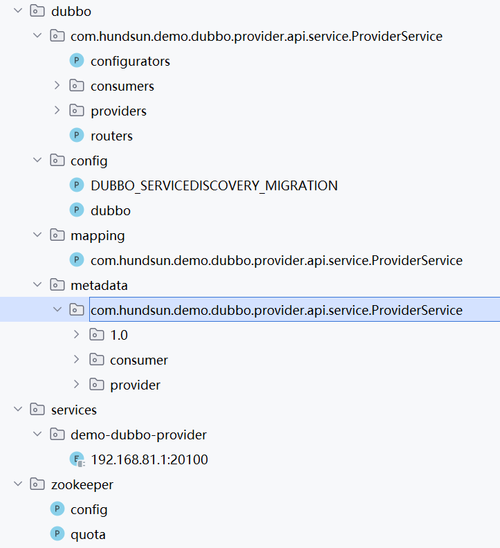

# 基础

## RPC协议是什么

RPC 协议被设计成远程调用就像是本地调用一样，其具体实现包括以下几个主要步骤：

1. **接口定义**: 首先，需要定义远程服务的接口，包括服务的方法名称、参数类型和返回值类型等。这个接口可以使用通用的接口定义语言（IDL）进行定义，例如 Protocol Buffers、Thrift 的 IDL 等。

2. **序列化与反序列化**: 在进行远程调用时，需要将方法调用的参数和返回值进行序列化（编码）成字节流，并在远程端进行反序列化（解码）成对应的数据结构。常见的序列化工具包括 Protocol Buffers、JSON、XML 等。

3. **通信协议**: 选择合适的通信协议进行数据传输。常见的通信协议包括 HTTP、TCP、UDP 等。通常情况下，RPC 框架会使用 TCP 协议来实现可靠的数据传输。

4. **网络通信**: 客户端通过网络将序列化后的请求数据发送给服务端，服务端接收到请求数据后进行处理，并将处理结果序列化后返回给客户端。

5. **错误处理**: 在远程调用过程中，可能会出现各种错误，例如网络故障、服务端异常等。因此，RPC 框架需要提供相应的错误处理机制，以确保调用的可靠性和稳定性。

6. **负载均衡和容错**: 在实际的分布式环境中，可能会有多个服务提供者提供同一个服务，RPC 框架需要提供负载均衡和容错机制，以确保请求能够被合理地分发和处理。

综上所述，RPC 协议的实现涉及到接口定义、序列化与反序列化、通信协议、网络通信、错误处理、负载均衡和容错等多个方面，通过这些步骤可以将远程调用封装成类似于本地调用的方式，从而简化分布式系统的开发和维护。不同的 RPC 框架可能有不同的实现细节和特性，但基本的原理和步骤是相似的。


## 为什么需要RPC，HTTP不好吗


------

### 🔍 1️⃣ 什么是 RPC？

- **RPC（远程过程调用）** 本质上是一种 **调用方式**。
- 它的目的是：让你调用远程机器上的函数，就像调用本地函数一样。
- 它是一种 **抽象**，屏蔽了底层通信细节。

------

### 🔗 2️⃣ 那 HTTP 是什么？

- **HTTP** 是一种 **应用层传输协议**，用来定义两台机器如何通过网络传递消息（请求、响应）。
- 你可以用 HTTP 做远程调用，但 HTTP 本身不是 RPC，它只是传输手段之一。

------

### ⚙️ 3️⃣ 为什么需要 RPC？

HTTP 当然可以直接用，但 RPC 相比直接用 HTTP 有一些优势：

#### ✅ **(1) 更高效**

- 传统 HTTP（比如 REST API）通常是基于文本（JSON/XML），有额外的解析开销。
- RPC 框架（比如 gRPC）可以用二进制序列化（比如 Protobuf），体积更小、性能更高。

#### ✅ **(2) 更强的接口约束**

- RPC 框架一般会生成客户端和服务端的代码（IDL：接口定义语言）。
- 比如 gRPC 的 `.proto` 文件，保证了双方数据结构、协议一致。

#### ✅ **(3) 屏蔽细节**

- 调用像本地函数一样，不需要自己写 HTTP 请求、序列化、反序列化。
- 框架帮你处理网络传输、重试、负载均衡等。

------

### 📌 4️⃣ 那是不是 HTTP 和 RPC 是对立的？

不是。它们是 **互补** 的：

- 很多现代 RPC 框架底层其实就是用 HTTP/2 或 HTTP/3 做传输（比如 gRPC 就是基于 HTTP/2）。
- 只不过 RPC 框架把序列化、路由、流控都封装好了，你不用自己操心。

------

### 🧩 5️⃣ 什么时候直接用 HTTP 比较好？

- 对外暴露的 **REST API**：面向前端、第三方，不要求高性能，兼容性和可读性更重要。
- 需要人肉调试、浏览器直接访问：HTTP + JSON 很方便调试。
- 不需要强一致的接口约束，或项目规模较小。

------

### ✅ 总结一句话

> **RPC 是对“怎么调用远程服务”的封装，HTTP 是“怎么传输数据”的协议，二者并不冲突，很多 RPC 框架底层就是走 HTTP。**


## Dubbo的优势

1. **高性能**：Dubbo采用了基于Netty的高性能通讯框架，支持多种序列化协议和负载均衡策略，能够提供快速的远程调用服务，适用于高并发、低延迟的场景。

2. **服务治理**：Dubbo提供了完善的服务治理功能，包括服务注册与发现、负载均衡、服务降级、容错机制等，可以有效地管理和监控分布式系统中的各个服务。

3. **可扩展性**：Dubbo的设计允许用户根据实际需求选择合适的扩展点，如自定义协议、序列化方式、负载均衡策略等，以满足不同场景下的特殊需求。

4. **成熟稳定**：Dubbo作为一个经过多年发展的成熟框架，在阿里巴巴等大型企业中得到了广泛应用，拥有稳定的代码质量和丰富的使用案例。

5. **社区支持**：Dubbo拥有庞大的社区支持和活跃的开发团队，用户可以获取到丰富的文档、教程和技术支持，快速解决问题和获取帮助。

虽然Dubbo具有诸多优势，但在某些场景下，也可以考虑其他分布式架构的技术栈，每种技术栈都有其适用的场景和特点：

## 其他分布式架构技术栈的优劣

1. **Spring Cloud**：
    - 优势：Spring Cloud是一套完整的微服务架构体系，提供了丰富的组件和功能，如服务发现、配置中心、断路器、网关等，适用于构建复杂的微服务系统。
    - 劣势：相对于Dubbo，Spring Cloud的性能可能略低，而且配置较为复杂，对于小型项目或者对性能要求较高的场景可能不够轻量级。

2. **gRPC**：
    - 优势：gRPC是一个高性能、跨语言的远程调用框架，基于HTTP/2协议，支持多种语言和平台，适用于构建分布式系统的通讯层。
    - 劣势：相比Dubbo，gRPC在服务治理方面的支持相对较弱，需要额外的工作来实现服务注册、负载均衡等功能。

3. **Kubernetes + Istio**：
    - 优势：Kubernetes提供了强大的容器编排和管理能力，而Istio则提供了服务网格、流量管理、安全策略等功能，适用于构建大规模的容器化微服务系统。
    - 劣势：相对于Dubbo等传统框架，Kubernetes + Istio的学习成本较高，需要深入理解容器化和服务网格的概念，对运维人员的要求也较高。

综上所述，选择合适的分布式架构技术栈应根据项目需求、团队技术栈以及实际场景来决定。Dubbo适用于需要高性能、稳定可靠的传统Java企业应用，而其他技术栈则可以根据具体情况进行选择和应用。

# dubbo 通信协议 dubbo 协议为什么要消费者比提供者个数多?

dubbo 使用单一长连接, 当服务上线或者下线,会订阅或者取消订阅这个消费者.通过日志也可以看到  
`` INFO [main-EventThread] o.a.d.r.z.ZookeeperRegistry.notify(407) :  [DUBBO] Notify urls for subscribe url consumer://192.168.80.1/com.hundsun.demo.dubbo.provider.api.service.ProviderService?application=demo-dubbo-consumer&category=providers,configurators,routers&check=false&cluster=failsafe&dubbo=2.0.2&init=false&interface=com.hundsun.demo.dubbo.provider.api.service.ProviderService&loadbalance=roundrobin&metadata-type=remote&methods=RpcInvoke&pid=20316&qos.enable=false&release=2.7.8&side=consumer&sticky=false&timeout=30000&timestamp=1710519547651, urls: [dubbo://192.168.80.1:20100/com.hundsun.demo.dubbo.provider.api.service.ProviderService?anyhost=true&application=demo-dubbo-provider&deprecated=false&dubbo=2.0.2&dynamic=true&generic=false&interface=com.hundsun.demo.dubbo.provider.api.service.ProviderService&metadata-type=remote&methods=RpcInvoke&pid=7752&release=2.7.8&side=provider&timestamp=1710521177820&token=admin], dubbo version: 2.7.8, current host: 192.168.80.1``  
当第一次调用服务提供者提供的服务时,可以看到消费者会与服务提供者建立连接  
``24-03-16 00:46:54.991 INFO  [http-nio-9000-exec-3] o.a.d.r.p.d.LazyConnectExchangeClient.initClient(77) :  [DUBBO] Lazy connect to dubbo://192.168.80.1:20100/com.hundsun.demo.dubbo.provider.api.service.ProviderService?_client_memo=referencecounthandler.replacewithlazyclient&anyhost=true&application=demo-dubbo-consumer&check=false&cluster=failsafe&codec=dubbo&connect.lazy.initial.state=true&deprecated=false&dubbo=2.0.2&dynamic=true&generic=false&heartbeat=60000&init=false&interface=com.hundsun.demo.dubbo.provider.api.service.ProviderService&lazyclient_request_with_warning=true&loadbalance=roundrobin&metadata-type=remote&methods=RpcInvoke&pid=20316&qos.enable=false&reconnect=false&register.ip=192.168.80.1&release=2.7.8&remote.application=demo-dubbo-provider&send.reconnect=true&side=consumer&sticky=false&timeout=30000&timestamp=1710519518589&token=admin&warning=true, dubbo version: 2.7.8, current host: 192.168.80.1``  
``24-03-16 00:46:55.010 INFO  [NettyClientWorker-1-2] o.a.d.r.t.n.NettyClientHandler.channelActive(62) :  [DUBBO] The connection of /192.168.80.1:9289 -> /192.168.80.1:20100 is established., dubbo version: 2.7.8, current host: 192.168.80.1``   
``24-03-16 00:46:55.010 INFO  [http-nio-9000-exec-3] o.a.d.r.t.AbstractClient.connect(200) :  [DUBBO] Successed connect to server /192.168.80.1:20100 from NettyClient 192.168.80.1 using dubbo version 2.7.8, channel is NettyChannel [channel=[id: 0x2fb817dc, L:/192.168.80.1:9289 - R:/192.168.80.1:20100]], dubbo version: 2.7.8, current host: 192.168.80.1``  
``24-03-16 00:46:55.011 INFO  [http-nio-9000-exec-3] o.a.d.r.t.AbstractClient.<init>(73) :  [DUBBO] Start NettyClient /192.168.80.1 connect to the server /192.168.80.1:20100, dubbo version: 2.7.8, current host: 192.168.80.1``


因 dubbo 协议采用单一长连接，假设网络为千兆网卡(1024Mbit=128MByte), 根据测试经验数据每条连接最多只能压满 7MByte(不同的环境可能不一样，供参考)，理论上 1 个服务提供者需要 20 个服务消费者才能压满网卡。

----

# dubbo服务治理篇

## 什么是服务降级 (包括本地的mock和admin服务的mock)

在跨团队或是多应用开发时，在前期开发中往往会出现依赖的服务还未开发完成的情况，这样就会导致流程的阻塞，影响研发效率。基于这种情况，Dubbo Admin 提供了 mock 能力来解耦 Consumer 与 Provider 之间的依赖，以确保在 Provider 未就绪的情况下 Consumer
仍能正常开展测试，提高研发效率。  
Dubbo 框架本身设计有服务降级（有时也称为 mock）能力，通过配置 org.apache.dubbo.config.ReferenceConfig 的 mock
字段（可设置为true或是对应接口的Mock实现）或动态配置规则，此时就可以启动服务降级能力。这种服务降级能力是为生产环境的限流降级准备的，虽然也可以用于本地开发测试场景，但灵活度并不高  
基于提升开发效率的根本诉求，dubbo设计了基于 Admin 的服务降级能力。

服务降级是一种分布式系统设计中的策略，用于在服务不可用或性能下降时，以一种有限但可控的方式维持系统的可用性和稳定性。服务降级通常在以下情况下发挥作用：

1. **服务不可用**: 当服务因为网络故障、硬件故障或其他原因导致不可用时，降级策略可以保证系统的其他部分仍然可以正常运行，而不会因为单个服务的故障而导致整个系统崩溃。

2. **服务性能下降**: 当服务因为负载过高、资源不足或其他原因导致性能下降时，降级策略可以通过限制资源使用或调整服务响应行为来减轻服务的负载，从而保证系统的整体性能不受影响。

服务降级的具体实现方式包括以下几个方面：

1. **限流**: 限制对服务的请求流量，避免过多的请求导致服务的负载过高。可以通过配置最大并发数、最大请求速率等参数来控制流量。

2. **返回默认值或缓存数据**: 当服务不可用时，可以返回一个默认值或者使用缓存数据代替实时数据，以确保系统的正常运行。

3. **熔断**: 当服务的响应时间超过一定阈值或者出现一定比例的错误时，可以触发熔断机制，暂时停止对该服务的请求，避免继续向故障的服务发起请求，减少资源浪费和系统负载。

4. **降级页面**: 当服务不可用时，可以向用户返回一个友好的降级页面，提示用户当前服务不可用，并提供一些备选方案或者帮助信息。

通过合理使用服务降级策略，可以提高系统的可用性和稳定性，保证系统在面对异常情况时能够以一种有限但可控的方式继续提供服务，而不会因为局部故障而导致整个系统的崩溃。


#  zk 上 dubbo 服务的注册信息

好的，我来详细说一下：
 Dubbo 使用 ZooKeeper（ZK）作为注册中心时，服务提供者（provider）和服务消费者（consumer）都会把自己的信息注册到 ZK 上，ZK 里就保存了 Dubbo 的服务注册信息和订阅信息。

下面是 **如何在 ZK 中查看 Dubbo 的注册信息**：

------

## 📂 一、Dubbo 在 ZooKeeper 中的节点结构

Dubbo 的服务注册信息在 ZK 上的结构一般是这样的（假设 `serviceName` 是你的接口全限定名）：

```
/dubbo
 └── /com.xxx.ServiceName
      ├── /providers
      │     ├── dubbo://ip:port/com.xxx.ServiceName?param1=value1...
      │     └── ...
      ├── /consumers
      │     ├── consumer://ip/com.xxx.ServiceName?param2=value2...
      │     └── ...
      ├── /routers
      └── /configurators
```

- `/dubbo`：Dubbo 的根节点
- `/providers`：注册到这个服务的所有提供者
- `/consumers`：订阅这个服务的所有消费者
- `/routers`：路由规则（可选）
- `/configurators`：动态配置（可选）

------

## 🧭 二、查看方法

### ✅ 1️⃣ 使用命令行工具 `zkCli.sh`

ZK 自带的命令行工具是最直接的：

```bash
# 连接 ZK
./zkCli.sh -server 127.0.0.1:2181

# 查看 dubbo 根节点
ls /dubbo

# 查看某个服务
ls /dubbo/com.xxx.ServiceName

# 查看提供者
ls /dubbo/com.xxx.ServiceName/providers

# 查看某个提供者的信息（是一个 URL）
get /dubbo/com.xxx.ServiceName/providers/xxx
```

------

### ✅ 2️⃣ 使用可视化工具

更方便的方式是使用图形化的 ZK 客户端：

- [ZooInspector](https://github.com/clevertension/zooinspector)
- [ZK UI](https://github.com/DeemOpen/zkui)
- [ZK Browser](https://github.com/sswenson/zk-browser)
- 或者 IDEA 的 ZK 插件

连接后展开 `/dubbo` 节点，就能看到所有服务、提供者、消费者。

------

## 📌 三、信息内容

- `providers` 里的 URL，包含了：
  - 协议（dubbo://）
  - IP 和端口
  - 接口名
  - 版本、分组、权重、应用名等元数据（都在 URL 的 query 参数里）
- `consumers` 里的 URL：
  - 表示某个消费者向注册中心订阅了这个服务。
- `routers` 和 `configurators`：
  - 如果用了动态路由或动态配置，也会在这里出现。

------

## ⚠️ 注意

- Dubbo 的 ZK 节点是**临时节点**（Ephemeral），提供者如果下线，对应节点就会消失。
- 如果发现节点还在但服务不可用，可能是提供者宕机但 ZK 会话还没过期，需要排查提供者进程状态。

------

# zk目录信息分析



好的，这张图很典型，是基于 **Dubbo 2.7+** 或 **Dubbo 3.x** 的服务注册在 **ZooKeeper** 中的完整示例。我来帮你把这几个节点逐个解释清楚，包含它们的含义和作用👇

------

## 📂 1️⃣ `/dubbo` 节点

这是 Dubbo 在 ZooKeeper 里的 **根节点**，所有注册信息都挂在这里。

------

## 📂 2️⃣ `/dubbo/com.hundsun.demo.dubbo.provider.api.service.ProviderService`

这个节点表示 **某个具体的服务接口**，对应你定义的接口 `com.hundsun.demo.dubbo.provider.api.service.ProviderService`。

在它下面有 4 个子节点：

### ✔ `configurators`

用于存放该服务的**动态配置**信息，例如动态权重、动态版本、动态禁用等。

> 如果用了 Dubbo Admin 来对某个服务做了动态配置，配置会保存在这里。

------

### ✔ `consumers`

表示**哪些消费者订阅了这个服务**。

- 每个消费者在这里会有一个临时节点（Ephemeral），以 `consumer://...` 的 URL 形式保存自己的订阅信息。
- 如果消费者离线了，这个节点会自动消失。

------

### ✔ `providers`

表示**哪些提供者提供了这个服务**。

- 每个提供者在这里也会有一个临时节点（Ephemeral），以 `dubbo://...` 的 URL 形式保存自己的信息（IP、端口、协议、版本、分组、权重等）。
- 提供者离线，这个节点会自动消失。

------

### ✔ `routers`

用于存放该服务的**路由规则**（可选）。
 例如：

- 灰度发布
- 分组路由
- 权重路由

如果用了 Dubbo 的动态路由功能，就会在这里出现数据。

------

## 📂 3️⃣ `/config`

这块是 **Dubbo 全局配置** 节点，一般由 Dubbo Admin 或 Dubbo 3.x 的 Service Governance 写入。

在你的截图里：

- `DUBBO_SERVICEDISCOVERY_MIGRATION`：
   表示 Dubbo 2.7+ 的**服务发现迁移**模式。Dubbo 2.7+ 引入了新的注册方式（服务发现与配置中心分离），这里的配置会指示 Dubbo 用哪种方式。
- `dubbo`：
   可能存放全局的动态配置，比如路由规则、全局黑白名单等。

------

## 📂 4️⃣ `/mapping`

这是 **Dubbo 3.x 的新节点**，用于 **Service Mesh** 或 **多注册中心场景**下做接口名与服务名的映射。

比如：

- 一个接口 `com.hundsun.demo.dubbo.provider.api.service.ProviderService`
- 对应一个具体的服务名 `demo-dubbo-provider`
- ZK 会用 `/mapping` 记录这种映射关系，供注册发现或 Mesh 查询。

------

## 📂 5️⃣ `/metadata`

也是 Dubbo 2.7+ 和 Dubbo 3.x 的重要节点：
 用于存放服务的 **元数据**（Metadata）。

- 里面会保存完整的接口签名、方法、参数、版本、分组、序列化协议等信息。
- 例如：
  - `1.0`：服务版本
  - `consumer`：消费者的元数据
  - `provider`：提供者的元数据

Dubbo 会把这些元数据写到 ZK（或 Nacos），供 Mesh、服务治理、接口兼容性检查用。

------

## 📂 6️⃣ `/services`

这是 Dubbo 3.x 开始引入的 **Service Discovery Registry** 节点。

- `demo-dubbo-provider`：服务名
- `192.168.81.1:20100`：提供者的实例（IP:Port）

Dubbo 3.x 引入了 **服务名注册**（Service Name Registry）概念：

- 传统 Dubbo 是基于接口注册（Interface Registry）。
- Dubbo 3.x 是基于服务名注册（Service + Metadata），可以更好地支持云原生和 Service Mesh。
- `/services` 节点保存了服务与实例的直接映射，和 `/providers` 里的数据有重叠，但是面向云原生的形式。

------

## 📂 7️⃣ `/zookeeper`

这个是 ZooKeeper 本身的管理节点。

- `config`：ZooKeeper 配置节点
- `quota`：ZooKeeper 节点的配额信息（如果有开启 quota 功能）

跟 Dubbo 没关系，这个是 ZK 自己的系统节点。

------

## 🔍 重点总结

| 节点            | 含义                                   |
| --------------- | -------------------------------------- |
| `/dubbo`        | Dubbo 的注册根目录                     |
| `/dubbo/接口名` | 单个服务接口                           |
| `providers`     | 注册了这个接口的所有提供者             |
| `consumers`     | 订阅了这个接口的所有消费者             |
| `configurators` | 该服务的动态配置                       |
| `routers`       | 该服务的路由规则                       |
| `/config`       | 全局配置，包含服务发现迁移模式等       |
| `/mapping`      | 接口名与服务名映射                     |
| `/metadata`     | 接口的元数据信息（版本、参数等）       |
| `/services`     | Dubbo 3.x 的服务名注册节点，面向云原生 |
| `/zookeeper`    | ZooKeeper 自带的管理节点               |

------

如果需要，我可以帮你：
 ✅ 把 URL 解析出来看里面都有什么参数
 ✅ 写个脚本自动读取这些节点
 ✅ 或者帮你结合 Dubbo Admin 来做动态配置/路由

要不要帮你把某个服务提供者的 URL 拆出来分析一下？要的话直接告诉我！💪
