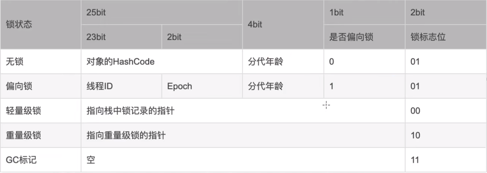

### 线程调度算法有哪些?

线程调度算法用于决定在多线程环境中，哪个线程应该在某一时刻获得CPU时间片并执行。下面是一些常见的线程调度算法：

1. **先来先服务 (First Come First Serve, FCFS)**：
    - 在这种调度算法中，任务按照它们抵达调度器的顺序执行。当一个线程释放CPU后，调度器选择队列中等待时间最长的线程来执行。
    - 这是最简单的调度算法之一，但可能会导致"饥饿"问题，即长任务可能会等待很长时间才能执行。

2. **最短作业优先 (Shortest Job First, SJF)**：
    - 在这种调度算法中，调度器会优先选择执行估计执行时间最短的任务。这个估计可以b是实际的执行时间，也可以是预测的执行时间。
    - SJF算法可以最大限度地减少平均等待时间，并且能够有效地避免长任务占用CPU导致的"饥饿"问题。

3. **最短剩余时间优先 (Shortest Remaining Time First, SRTF)**：
    - SRTF算法是SJF的一种抢占式版本。在SRTF中，如果有一个新的任务到达，它的执行时间比当前正在执行的任务剩余执行时间更短，那么调度器会中断当前任务，切换到新任务上。
    - SRTF算法可以确保最小化每个任务的等待时间，但是可能会导致频繁的上下文切换。

4. **轮转调度 (Round Robin)**：
    - 在轮转调度算法中，所有的任务都按照到达时间的顺序排队，并以轮转的方式获得CPU时间片执行。
    - 每个任务执行一个时间片后，它被放到队列的末尾，等待下一个轮转。这样做可以确保公平地分配CPU时间片，避免了长任务占用CPU导致的"饥饿"问题。

5. **多级反馈队列调度 (Multilevel Feedback Queue, MLFQ)**：
    - MLFQ算法是一种结合了轮转调度和优先级调度的算法。在MLFQ中，任务被分成多个优先级队列，每个队列使用不同的调度策略（通常是轮转调度）。
    - 当一个任务进入系统时，它被放入最高优先级的队列。如果一个任务没有在时间片内完成，那么它将被移到下一个更低优先级的队列中。
    - MLFQ算法能够平衡短任务和长任务的执行，同时也能够避免"饥饿"和"过度调度"的问题。

### 如何实现线程间通信

Java 中线程间通信可以通过以下几种方式来实现：

1. **共享变量**：线程之间通过共享变量进行通信。多个线程共享同一个对象的字段，通过读写这些字段来进行通信。但要确保在访问共享变量时进行同步，以避免竞态条件和内存可见性问题。常见的同步机制包括 `synchronized`
   关键字和 `volatile` 关键字。

2. **等待/通知机制**：通过 `wait()`、`notify()` 和 `notifyAll()` 方法实现线程间的等待和通知。在使用这种机制时，线程通常持有一个锁对象，并调用该锁对象的 `wait()`
   方法使线程等待，在某个条件满足时，调用 `notify()`
   或 `notifyAll()` 方法唤醒等待的线程。这种机制通常与 `synchronized` 关键字一起使用。

3. **阻塞队列**：使用 `java.util.concurrent`
   包中的阻塞队列来实现线程间的通信。阻塞队列提供了线程安全的队列操作，并且在队列为空或队列已满时能够自动阻塞或唤醒线程。常用的阻塞队列包括 `ArrayBlockingQueue`、`LinkedBlockingQueue`
   等。

4. **信号量**：使用 `java.util.concurrent` 包中的 `Semaphore` 类来进行线程间通信。信号量可以控制同时访问某个资源的线程数量，并提供了 `acquire()` 和 `release()`
   方法来获取和释放许可证。当许可证数量不足时，线程会被阻塞，直到有足够的许可证可用。

5. **Condition 条件**：使用 `java.util.concurrent.locks` 包中的 `Condition` 接口和 `ReentrantLock` 或 `ReentrantReadWriteLock`
   实现线程间的等待和通知。`Condition`
   接口提供了类似于 `wait()` 和 `notify()` 方法的 `await()` 和 `signal()` 方法，可以用于在特定条件下等待和通知线程。

这些方法各有特点，可以根据具体的需求和场景选择合适的方式来实现线程间的通信。

## 线程池

### 在线程池内提交一个任务之后的流程是怎么样的?

提交  
->判断是否需要创建新线程(corePoolSize)  
->尝试把任务加入任务队列 如果不成功,继续尝试创建线程(maxPoolSize)  
->如果创建线程不成功,那么执行拒绝策略

### 线程池如何保证线程一直运行, 并等待新任务

线程池内部维护(worker队列),worker队列内的每个worker是一个线程,这些线程会一直尝试在阻塞队列获取任务,获取到任务后,会执行任务的run方法

内部还维护了一个阻塞队列,阻塞队列用于保存任务.

如果线程执行任务时发生了异常,就ThreadPoolExecutor而言,线程会停止运行.

### 线程池本身的状态

**RUNNING**-会接收新任务并且会处理队列中的任务  
**SHUTDOWN**-不会接收新任务并且会处理队列中的任务,处理完成之后会终端所有线程. (我们主动想要关闭线程池,调用shutdown方法)  
**STOP**-不会接收新的任务,也不会处理队列中的任务,并且还会直接中断所有的线程  
**TIDYING**-所有线程都停止之后,线程池的状态就是这个,然后会调用线程池的terminated()方法  
**TERMINATED**-终止,关闭资源,ThreadPoolExecutor没实现,供子类特性化

### 线程池的调优经验

线程池的调优是确保多线程应用性能和稳定性的关键。合理配置线程池可以显著提高系统的响应速度和处理能力，降低资源消耗。以下是一些实用的线程池调优经验：

#### 1. 确定合适的线程数量

线程数量的配置应该根据任务的类型（CPU密集型、IO密集型或混合型）、服务器的硬件资源（如CPU核心数）以及系统的其他特性来决定。

- **CPU密集型任务**：通常推荐的线程数是CPU核心数加一，这样可以在某个线程因为页缺失或其他原因暂停时，其他线程可以继续利用CPU资源。
- **IO密集型任务**：由于IO操作不会占用CPU，因此可以配置更多的线程，一般推荐的线程数为CPU核心数的两倍或更多。
- **混合型任务**：需要根据实际情况调整，可能需要通过实验来确定最优配置。

#### 2. 使用合适的队列

线程池中的任务队列同样重要，队列类型和大小可以根据任务提交和处理速率来调整。

- **无界队列**：可以使用`LinkedBlockingQueue`来避免资源耗尽，但可能会导致高延迟和OOM（内存溢出）。
- **有界队列**：使用如`ArrayBlockingQueue`，控制队列的最大长度可以避免OOM，更适合任务执行时间比较一致的场景。

#### 3. 选择合适的拒绝策略

当队列满了且线程数达到最大后，新任务的处理策略也很关键。

- **丢弃策略**：如`DiscardPolicy`，直接丢弃新任务，不抛异常。
- **抛出异常**：如`AbortPolicy`，抛出`RejectedExecutionException`。
- **调用者运行**：如`CallerRunsPolicy`，调用任务的线程自己来执行任务。
- **丢弃最旧的任务**：如`DiscardOldestPolicy`，丢弃队列中最旧的任务。

#### 4. 动态调整线程池参数

在运行时依据系统的实时性能监控数据，动态调整线程池的配置可以更好地应对不同的负载情况。

- 实施动态调整线程数或队列大小。
- 根据不同时间段或负载，调整线程数或其他参数。

#### 5. 监控和日志

合理的监控和记录日志对于线程池的调优至关重要。

- 监控线程池的使用率、队列长度、完成的任务数等关键指标。
- 记录拒绝的任务和异常，分析可能的瓶颈。

#### 6. 使用现代化工具

利用现代化的并发工具和框架，如Java并发包中的`ThreadPoolExecutor`、`ForkJoinPool`或Spring的`@Async`支持，可以更容易地实现高效的线程管理。

#### 结论

线程池的调优需要根据具体应用的需求和运行环境来定制。通常，开始于系统的瓶颈分析，实施初步配置后，根据实际运行情况进行迭代调整。要实现最优的线程池配置，需要进行充分的测试和长期的监控。

## Java锁机制

### volatile 和 synchronized 关键字

volatile主要用来解决内存可见性的问题.

synchronized

1. synchronized会生成MONITORENTER,MONITOREXIT这两个字节码指令
2. MONITORENTER,MONITOREXIT字节码指令本身是由操作系统提供的,互斥同步带来的线程切换可能比代码本身执行更耗时
   ,这也是synchronized在优化前效率比较低的一个原因之一,所以JDK6之后jvm对synchronized进行了升级和改造

    * 自旋锁->自适应自旋 为了避免挂起线程和回复线程的操作(因为都需要进行内核态和用户态的转换),所以在获取锁的时候会进行自旋尝试,只有当超过次数之后才会进行线程挂起
    * 锁消除 通过逃逸分析之后得到需要同步的数据并不会逃逸出去被其他线程访问,那么就会把锁消除
    * 锁粗化 粒度很细的锁同步,但是却发生得很频繁也会导致不必要的性能损耗,所以该大还得大
    * 轻量级锁 操作对象的 mark word(这个会保存线程栈帧中的lockrecord指针) + cas操作(尝试更新markword) + lock record(这个又会保存markword的副本以及指针) 来完成轻量级锁
      如果有其他线程也在操作,其他线程会进行自旋(适应性自旋),如果自旋的线程超过两个,那么将会升级为重量级锁
    * 偏向锁 通过锁标志位和是否偏向的标志来避免额外的加锁,解锁和markword的更新.但是在使用偏向锁的同时发现有多个线程在竞争,那么偏向锁会升级为轻量级锁
    * 重量级锁 使用操作系统层面的monitor来进行锁操作

### 如何实现阻塞队列

1. (Object对象的wait()和notify())
2. (ArrayBlockingQueue) 使用 LockSupport.park(this) 和 LockSupport.unpark(node.thread);

`LockSupport.park()` 和 `LockSupport.unpark(Thread thread)` 是 `java.util.concurrent.locks` 包中的两个方法，用于线程的阻塞和解除阻塞操作。

1. **`park()` 方法**：
    - `park()` 方法用于使当前线程进入阻塞状态，直到另一个线程调用了 `unpark(Thread thread)` 方法将其解除阻塞。`park()` 方法可以在任何地方被调用，而不仅仅是在同步块中。
    - 如果在调用 `park()` 方法之前，线程已经被中断过，则调用 `park()` 方法时会立即返回，不会使线程阻塞。这种情况下，不会消耗线程的中断状态。
    - `park()` 方法还可以带有一个参数，用于指定一个绝对的超时时间，超过这个时间后线程会自动解除阻塞。
    - `park()` 方法可以防止虚假唤醒（spurious wakeups），即使没有调用 `unpark()` 方法，线程也不会在没有原因的情况下自动解除阻塞。

2. **`unpark(Thread thread)` 方法**：
    - `unpark(Thread thread)` 方法用于解除指定线程的阻塞状态，使其可以继续执行。如果线程之前由于调用了 `park()` 方法而被阻塞，调用 `unpark(Thread thread)`
      方法后，该线程将被解除阻塞。
    - `unpark(Thread thread)` 方法可以在 `park()` 方法调用之前调用，也可以在 `park()` 方法调用之后调用。即使线程未被阻塞，也可以安全地调用 `unpark()` 方法。
    - `unpark(Thread thread)` 方法不会使线程立即运行，而是设置线程的许可证，使线程在后续的 `park()` 方法调用时能够立即返回，而不会被阻塞。

总之，`LockSupport.park()` 方法用于使当前线程进入阻塞状态，`LockSupport.unpark(Thread thread)` 方法用于解除指定线程的阻塞状态。这两个方法通常用于实现线程间的同步与通信。

### 什么是CAS

CAS（Compare And Swap，比较并交换）是一种多线程同步的原子操作，常用于实现无锁算法。
CAS 操作包括三个参数：内存位置（通常是一个变量的内存地址）、期望值和新值。
执行 CAS操作时，如果内存位置的值与期望值相等，则将该位置的值更新为新值，否则不做任何操作。

CAS 操作通常用于实现线程安全的并发数据结构，例如 AtomicInteger、AtomicLong 和 AtomicReference 等。
它的特点是无锁，即使在高并发的情况下，也不需要进行加锁操作，减少了线程间的竞争和争用锁的开销。

在 Java 中，CAS 操作由 `sun.misc.Unsafe` 类提供的一系列方法来实现，例如 `compareAndSwapInt()`、`compareAndSwapLong()`
和 `compareAndSwapObject()` 等。此外，Java 也提供了一些基于 CAS
操作的原子类，例如 `AtomicInteger`、`AtomicLong` 和 `AtomicReference` 等，这些类封装了 CAS 操作，提供了更加易用的接口。

CAS 的优点是它是一种非阻塞的算法，因此在并发量较大的情况下，相较于传统的基于锁的同步方式，CAS 操作的性能更高。
然而，CAS 也有一些限制，例如 ABA 问题和循环时间长的问题，需要开发人员在使用 CAS 时注意处理这些问题。

### AbstractQueuedSynchronizer（AQS）是什么

`AbstractQueuedSynchronizer`（AQS）是 Java 中用于实现同步器的抽象基类。
它提供了一种用于构建同步器的框架，可以用于实现各种同步机制，例如锁、信号量、倒计时器等。

`AbstractQueuedSynchronizer` 的设计基于一个双向链表（双向队列），该链表中的节点表示等待获取共享资源的线程。
在实现具体的同步器时，需要重写 `AbstractQueuedSynchronizer`的一些方法，主要包括：

1. `acquire(int)` :提供给子类以独占资源的方式获取锁的方法. 此方法首先会尝试获取资源,如果失败,那么会把当前线程包装成一个节点放入队列的尾部
    1. `tryAcquire(int arg)`：尝试获取共享资源。如果获取成功，则返回 true；否则返回 false。
       此方法会由子类实现,例如ReentrantLock里的NonfairSync,他会去使用cas改变AQS中的stateOffset,通过是否成功来判断是否能够获取锁.
    2. `addWaiter`: 尝试获取锁失败之后,这个方法会尝试把当前线程包装成节点使用cas的方式尝试去把自己变成队列的尾节点
    3. `acquireQueued`: 尝试获取资源,如果获取不了,那么就 LockSupport.park(this);
2. `tryRelease(int arg)`：尝试释放共享资源。如果释放成功，则返回 true；否则返回 false。
3. `tryAcquireShared(int arg)`：尝试获取共享资源的共享模式。如果获取成功，则返回非负值；否则返回负值。
4. `tryReleaseShared(int arg)`：尝试释放共享资源的共享模式。如果释放成功，则返回 true；否则返回 false。

在实现自定义同步器时，通常需要使用 `AbstractQueuedSynchronizer` 提供的方法来实现对资源的获取和释放，并且需要注意确保线程安全性和可重入性。

`AbstractQueuedSynchronizer` 的子类中最为常见的是 `ReentrantLock`、`Semaphore`、`CountDownLatch` 等，它们都是基于 AQS 的同步器实现的。

总之，`AbstractQueuedSynchronizer` 提供了一个强大的框架，用于实现各种类型的同步器，为 Java 中并发编程提供了更加灵活和可扩展的解决方案。

### ReentrantLock

(基于AbstractQueuedSynchronizer)加锁释放锁过程(源码)

可重入,上锁和解锁配套,有几个上锁就要有几个解锁

`ReentrantLock` 提供了公平锁（Fair Lock）和非公平锁（Nonfair Lock）两种获取锁的方式，这两种方式在锁的获取上存在一些区别：

1. **公平锁**（Fair Lock）：

    - 在公平模式下，锁会按照线程请求锁的顺序分配给等待的线程，即先到先得。
    - 当一个线程调用 `lock()` 方法请求锁时，如果锁当前是空闲状态，或者当前持有锁的线程是将要释放锁的线程，则该线程将立即获得锁；否则，该线程将被放入到等待队列中，等待其他线程释放锁。
    - 公平锁模式保证了所有等待的线程都有机会获得锁，避免了饥饿（Starvation）现象。

2. **非公平锁**（Nonfair Lock）：

    - 在非公平模式下，锁的获取顺序不考虑等待线程的顺序，有可能导致某些线程一直无法获得锁，即线程饥饿的情况。
    - 当一个线程调用 `lock()` 方法请求锁时，如果锁当前是空闲状态，则该线程将立即获得锁；如果锁当前被其他线程持有，那么该线程将尝试获取锁，如果获取失败，它将被放入到等待队列中，等待其他线程释放锁。

在实际应用中，公平锁和非公平锁的选择取决于应用场景和需求：

- 如果要求锁的分配必须遵循 FIFO（先进先出）原则，确保每个线程都能公平地获取到锁，可以选择公平锁。
- 如果对性能要求更高，可以接受等待线程在获取锁时可能出现的不公平情况，那么可以选择非公平锁。

默认情况下，`ReentrantLock` 使用的是非公平锁，但是可以在创建 `ReentrantLock` 实例时通过构造函数指定是否使用公平锁。例如：

``java
Lock fairLock = new ReentrantLock(true); // 创建一个公平锁  
Lock nonfairLock = new ReentrantLock(); // 创建一个非公平锁
``

需要注意的是，公平锁的实现可能会带来额外的开销，因为需要维护一个有序的等待队列。因此，在性能要求高的情况下，可能需要权衡考虑使用公平锁的代价。

### 什么是悲观锁,乐观锁,无锁

悲观锁、乐观锁和无锁都是并发控制的一种方式，用于解决多个线程同时访问共享资源可能引发的数据一致性问题。

悲观锁是一种悲观地认为并发情况下会发生冲突的锁策略。在使用悲观锁的情况下，线程在访问共享资源之前会先获取锁，确保其他线程无法同时访问该资源。常见的悲观锁实现包括数据库的行级锁和排他锁。

乐观锁则是一种乐观地认为并发情况下不会发生冲突的锁策略。在使用乐观锁的情况下，线程在访问共享资源之前不会获取锁，而是在更新资源时检查是否被其他线程修改过。乐观锁的实现方式通常是通过版本号或时间戳等方式来实现。

无锁则是一种不使用锁的并发控制方案。在无锁的情况下，线程在访问共享资源时不会使用锁，而是通过原子操作或CAS（Compare and Swap）等方式来保证资源的原子性。无锁的并发控制方式通常比锁机制更高效，但实现起来也更复杂。
