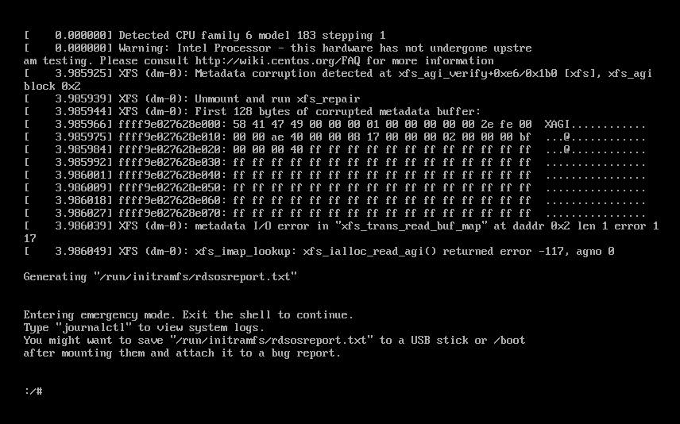

# 问题合集

## 虚拟机宕机




当VMware虚拟机遭遇强制下电后，重启可能会出现系统文件错误。
[参考文章](https://blog.csdn.net/zhanremo3062/article/details/113842682)

```shell
# 修复
xfs_repair /dev/mapper/centos-root
# 退出即可
exit
```


## Windows换行符问题

```shell
yum -y install dos2unix*
# 使用 dos2unix 格式化文件中的非linux格式的换行符
dos2unix one-more.sh
```


## 通过pid找到服务所在位置

在 Linux 系统中，可以通过进程号（PID）找到服务的位置。以下是一些步骤：

1. **找到进程号**：使用 `ps` 命令查找进程号。例如：
   ```bash
   ps aux | grep <服务名>
   ```
   这将列出所有包含指定服务名的进程及其进程号。

2. **进入 `/proc` 目录**：进程号通常存储在 `/proc` 目录下。例如，如果进程号是 `1234`，可以使用以下命令：
   ```bash
   cd /proc/1234
   ```

3. **查看进程的工作目录**：进入 `/proc/<PID>/cwd` 文件，这个文件的路径就是进程的当前工作目录。例如：
   ```bash
   ls -l /proc/1234/cwd
   ```
   这将显示进程的工作目录。


# 命令合集

## 开机服务

chkconfig --list 开机启动列表

## free 命令


## tar 命令

```shell
# -c --create 创建新的存档文件
# -x --extract 从存档中提取文件
# -C --directory 指定提取文件的目标目录
# -t --list 列出存档文件中的内容
# -z --gzip 使用gzip进行压缩或者解压缩
# -j --bzip2 使用bzip2进行压缩或者解压缩
# -J --xz 使用xz进行压缩或者解压缩

# -v --verbose 显示详细信息
# -f --file 指定存档文件名

# -x提取xxx.tar.gz文件 z使用gzip方式解压 v显示详细信息 f指定压缩文件 -C到 xxx目录下 
tar -xzvf xxx.tar.gz -C xxx
```

## top命令

`top` 命令是 Linux 系统中用于实时监控系统进程和资源使用情况的工具。以下是 `top` 命令输出中各列的详细解释：

### 1. **PID（Process ID）**
   - **含义**：进程的唯一标识符（ID）。
   - **作用**：用于唯一标识一个进程，可以通过 `kill` 命令终止指定 PID 的进程。

### 2. **USER**
   - **含义**：进程的所有者（运行该进程的用户）。
   - **作用**：显示哪个用户启动了该进程，对于多用户系统管理很重要。

### 3. **PR（Priority）**
   - **含义**：进程的优先级（Priority），由内核动态调整。
   - **范围**：数值越小，优先级越高（通常范围是 -20 到 19，`rt` 表示实时进程）。
   - **作用**：优先级高的进程会获得更多的 CPU 时间。

### 4. **NI（Nice Value）**
   - **含义**：进程的“友好值”（Nice Value），用于调整优先级。
   - **范围**：-20（最高优先级）到 19（最低优先级）。
   - **作用**：用户可以通过 `nice` 或 `renice` 命令调整 NI 值来影响进程的优先级。

### 5. **VIRT（Virtual Memory）**
   - **含义**：进程占用的虚拟内存总量（包括共享库、映射文件等）。
   - **单位**：默认 KB，可以使用 `E` 切换单位（KB/MB/GB）。
   - **作用**：显示进程理论上可以访问的内存总量（不一定全部在物理内存中）。

### 6. **RES（Resident Memory）**
   - **含义**：进程实际占用的物理内存（不包括交换分区）。
   - **单位**：默认 KB。
   - **作用**：反映进程实际使用的内存量，比 VIRT 更直观。

### 7. **SHR（Shared Memory）**
   - **含义**：进程使用的共享内存大小（可能被多个进程共享）。
   - **单位**：默认 KB。
   - **作用**：显示进程共享的库或其他资源占用的内存。

### 8. **S（Status）**
   - **含义**：进程的当前状态。
   - **常见状态**：
     - `R`（Running）：运行中或可运行（在运行队列中）。
     - `S`（Sleeping）：休眠中（等待事件完成）。
     - `D`（Uninterruptible Sleep）：不可中断的休眠（通常是在等待 I/O）。
     - `Z`（Zombie）：僵尸进程（已终止但未被父进程回收）。
     - `T`（Stopped）：进程被暂停（如通过 `Ctrl+Z` 或 `kill -STOP`）。

### 9. **%CPU**
   - **含义**：进程占用的 CPU 使用率。
   - **范围**：0% 到 100%（多核 CPU 可能超过 100%）。
   - **作用**：显示进程的 CPU 占用情况，帮助识别高负载进程。

### 10. **%MEM**
   - **含义**：进程占用的物理内存百分比（相对于总物理内存）。
   - **作用**：直观显示进程的内存占用比例。

### 11. **TIME+（CPU Time）**
   - **含义**：进程自启动以来占用的总 CPU 时间（格式：`分:秒.百分秒`）。
   - **作用**：显示进程累计消耗的 CPU 时间，帮助分析长时间运行的进程。

### 12. **COMMAND**
   - **含义**：启动进程的命令或程序名称。
   - **注意**：如果进程是命令行启动的，会显示完整命令；如果是内核线程，可能显示在 `[]` 中（如 `[kthreadd]`）。

---

### 其他常见操作
在 `top` 运行时，可以通过快捷键交互：
- **`q`**：退出 `top`。
- **`Shift + P`**：按 CPU 使用率排序。
- **`Shift + M`**：按内存使用率排序。
- **`k`**：终止指定 PID 的进程（输入 PID 后发送信号）。
- **`h`**：查看帮助。
- **`1`**：显示所有 CPU 核心的详细使用情况。

---

### 示例分析
假设某进程的 `top` 输出如下：
```
PID USER      PR  NI    VIRT    RES    SHR S  %CPU %MEM     TIME+ COMMAND
1234 root      20   0  256000   5000   3000 R   50.0  2.5   1:23.45 python3
```
- **PID 1234**：由 `root` 用户运行的 `python3` 程序。
- **PR 20, NI 0**：普通优先级。
- **VIRT 256000KB**：虚拟内存占用约 256MB。
- **RES 5000KB**：物理内存占用约 5MB。
- **SHR 3000KB**：共享内存占用约 3MB。
- **状态 R**：正在运行。
- **CPU 50%**：占用单核 50% 的计算资源（如果是 4 核机器，则占总 CPU 的 12.5%）。
- **MEM 2.5%**：占用总物理内存的 2.5%。
- **TIME+ 1:23.45**：累计占用 CPU 时间 1 分 23.45 秒。

通过 `top` 可以快速定位高 CPU/内存占用的进程，进而进行优化或终止异常进程。
