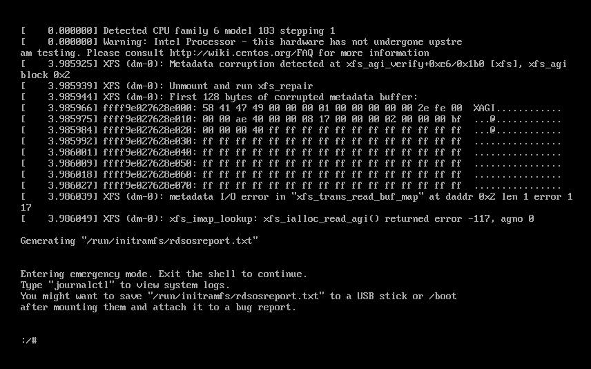

    useradd mysql -d /home/mysql -m;
    echo "es" | passwd --stdin es;

    chkconfig --list 开机启动列表


给es用户授权，包括es文件下的所有文件和文件夹，授权给es组下的es用户
chown -R es:es es


# free 命令


# 虚拟机宕机



当VMware虚拟机遭遇强制下电后，重启可能会出现系统文件错误。
[参考文章](https://blog.csdn.net/zhanremo3062/article/details/113842682)

```shell
# 修复
xfs_repair /dev/mapper/centos-root
# 退出即可
exit
```
