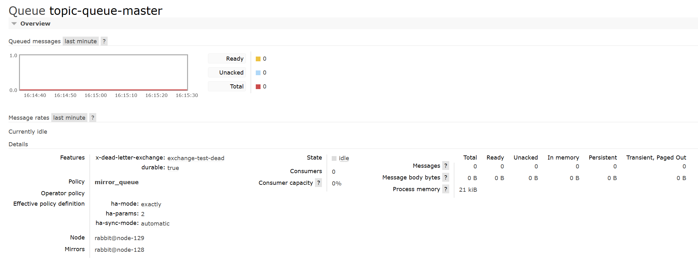

## 基础

### RabbitMQ 概念里的 channel、exchange 和 queue 这些是逻辑概念，还是对应着进程实体？这些别起什么作用？

在 RabbitMQ 中，channel、exchange 和 queue 是逻辑概念，它们各自扮演不同的角色：

- **Channel（通道）**

  Channel 是在客户端和 RabbitMQ 之间建立的虚拟连接，用于建立和管理 Exchange 和 Queue，以及在它们之间传递消息。
  每一个客户端连接到RabbitMQ服务器底层实际上是建立了一个TCP连接，而信道是建立在这个连接上的虚拟连接。
  Channel 是实际进行路由工作的实体，即负责按照 routing_key 将 message 投递给 queue。

- **Exchange（交换机）**

  Exchange 是消息交换机，接收生产者发送的消息并根据路由规则将消息分发到一个或多个队列。
  RabbitMQ 提供了四种类型的 Exchange：Direct、Topic、Fanout 和 Headers。
  Exchange 根据什么规则把消息投递到哪些 queue 中？这取决于 Exchange 的类型以及使用的 路由规则。

- **Queue（队列）**

  Queue 是消息在 RabbitMQ 中的存储区，它接收 Exchange 路由过来的消息，并将其存储起来，等待消费者来消费。
  Queue 可以绑定多个 Exchange，也可以由多个消费者来消费。
  在 Queue 中，消息遵循先进先出（FIFO）的原则。Queue 具有自己的 erlang 进程。

这些概念都是 RabbitMQ 中的核心组件，它们共同协调以实现消息的生产、路由和消费。

### RabbitMQ 中的 broker 是指什么?cluster 又是指什么?

在 RabbitMQ 中，"broker" 是指 RabbitMQ 服务器的实例，负责处理消息的传输和路由。它是消息代理的核心组件，负责接收、存储、传递和传输消息，同时提供了多种消息传输协议和可靠的消息传递机制。

RabbitMQ 的 "cluster" 则指的是多个 RabbitMQ broker 节点组成的集群。通过在多个节点之间共享队列、交换机和消息，RabbitMQ
集群可以提高消息的可靠性、可用性和伸缩性。集群中的各个节点可以相互通信，共同管理队列和消息，使得整个系统具有更强大的性能和可靠性。

在 RabbitMQ 集群中，每个节点都有自己的独立配置和存储，但它们共享相同的虚拟主机（Virtual Host）、用户和权限信息。通过将多个节点组成集群，可以实现消息的负载均衡和故障转移，从而提高系统的稳定性和可靠性。

### RabbitMQ集群

RabbitMQ集群具有以下特点：

1. **高可用和负载均衡**：当单台RabbitMQ服务处理消息的能力到达瓶颈时，可以通过集群来实现高可用和负载均衡¹。

2. **节点类型**：在RabbitMQ集群中，节点类型可以分为两种：内存节点和磁盘节点¹。

3. **集群模式**：RabbitMQ中的集群主要有两种模式：普通集群模式和镜像队列模式¹。

4. **数据同步**：在普通集群模式下，集群中各个节点之间只会相互同步元数据，也就是说，消息数据不会被同步¹。而在镜像队列模式下，节点之间不仅仅会同步元数据，消息内容也会在镜像节点间同步，可用性更高¹。

5. **高可用集群**：可以通过Keepalived和HAProxy两个组件实现了集群的高可用性和负载均衡功能²。

6. **多活模式**：这种模式需要依赖rabbitmq的federation插件，可以实现继续的可靠AMQP数据通信²。

7. **元数据共享**：集群节点之间共享元数据，不共享队列数据 (默认)⁴。

8. **数据互相转发**：RabbitMQ节点数据互相转发，客户端通过单一节点可以访问所有数据⁴。

RabbitMQ集群并非能保证消息万无一失,即使消息,队列,交换机等都设置为可持久化,客户端和服务端也都正确的使用了确认方式.当集群中的一个rabbitMQ节点崩溃时,该节点上所有的消息也会丢失.rabbitMQ集群中的所有节点会同步和备份所有的元数据信息.

在RabbitMQ中，"元数据"主要指的是以下几种信息¹³：

1. **队列元数据**：包括队列名称和它的属性³。
2. **交换器元数据**：包括交换器名称、类型和属性³。
3. **绑定元数据**：一张简单的表格展示了如何将消息路由到队列³。
4. **vhost元数据**：为vhost内的队列、交换器和绑定提供命名空间和安全属性³。

因此，当用户访问其中任何一个RabbitMQ节点时，通过rabbitmqctl查询到的queue／user／exchange/vhost等信息都是相同的³。这就是RabbitMQ在普通模式下同步元数据的含义。

### 普通集群模式

- **在普通集群下,同一个队列只要一个节点创建之后,其他节点就不会重复创建了吗?**  
  在RabbitMQ集群中，当一个队列在某个节点（例如node1）上被创建后，这个队列的元数据（包括队列名称、属性等）会被同步到集群中的所有其他节点（例如node2）¹²。因此，即使你在node2上尝试创建同名的队列，RabbitMQ会识别出这个队列已经存在，因此不会重复创建¹²。
  然而，需要注意的是，虽然队列的元数据在集群中的所有节点上都是可用的，但在普通模式下，队列中的消息数据是不会在节点之间同步的¹²。也就是说，如果一个消息被发布到node1上的队列，那么这个消息默认情况下只存在于node1上，除非有消费者从node2上消费这个队列，这时node2会从node1拉取消息¹²。
- **我现在有一个node1和node2的rabbitmq集群. 有一个test交换机, 我在node2上面创建了一个test的queue的队列,
  我在node1往test上面发消息,node2的queue队列上的消费者能收到消息吗?**  
  是的，node2上的消费者可以收到消息。在RabbitMQ集群中，交换器（Exchange）的元数据是在所有节点上同步的¹。当你在node1上向test交换器发送消息时，RabbitMQ会根据交换器的路由规则将消息路由到相应的队列¹。即使队列是在node2上创建的，消息仍然可以被路由到那里¹。
  然后，node2上的消费者可以从该队列中获取并消费这些消息¹。这是因为消费者和队列之间的交互是在队列所在的节点上进行的¹。
  所以，即使你在node1上发布消息，只要消息被路由到node2上的队列，node2上的消费者就可以收到这些消息¹。
    - 如果此时node2发生宕机:
        1. **队列将不可用,队列的状态会变成down**
        2. **新的服务会因为队列的状态而无法启动**,服务会报错channel error; protocol method: #method<channel.close>(reply-code=404,
           reply-text=NOT_FOUND - home node '
           rabbit@node-129' of durable queue 'topic-queue-slave' in vhost '/' is down or inaccessible, class-id=50,
           method-id=10)
        3. **消息生产者的消息将变得不可达,在到达交换机之后将被丢弃**
    - node2重启后,队列恢复可用
    - 如果node2是内存节点
        1. 那么这个节点上的所有信息都将丢失,如果信息是持久化的,那么节点重启后是可以恢复的(包括队列内的消息)
        2. 如果队列信息是非持久化的,那么node宕机后,数据都将丢失,但是其他节点就可以重新声明这个队列了

### 能够在地理上分开的不同数据中心使用 RabbitMQ cluster 么？ TODO

### 为什么 heavy RPC 的使用场景下不建议采用 disk node ？

"heavy RPC"是指在业务逻辑中高频调用 RabbitMQ 提供的 RPC 机制，这会导致不断创建、销毁 reply queue，从而对 disk node
产生性能问题。这是因为这种操作会导致针对元数据的频繁磁盘写入¹²。因此，在使用 RPC 机制时，需要根据自身的业务场景进行考虑¹²。

在重型 RPC 场景下，频繁地进行磁盘 I/O 操作可能会对性能产生较大影响，因此不建议采用磁盘节点（disk node）。

在 RabbitMQ 中，磁盘节点会将消息持久化到磁盘上，以确保消息的持久性和可靠性。这意味着每次发送和接收消息时都需要将消息写入磁盘，或者从磁盘中读取消息，这会导致大量的磁盘 I/O 操作。而在重型 RPC
场景下，消息的发送和接收频率可能会非常高，如果频繁进行磁盘 I/O
操作，会严重影响系统的响应速度和吞吐量。

相比之下，内存节点（memory node）通常会将消息存储在内存中，能够提供更高的性能和吞吐量。在 RPC 场景下，如果消息的持久性要求不高，可以考虑使用内存节点来避免频繁的磁盘 I/O 操作，从而提高系统的性能和响应速度。

### 什么是 Blackholed,什么情况下会发生,怎么避免?

"Blackholed"在RabbitMQ中是指，向exchange投递了message，但由于某些原因导致该message丢失，而发送者却不知道²⁶。以下是可能导致"blackholed"的情况：

1. 向未绑定queue的exchange发送message²⁶。
2. exchange以binding_key key_A绑定了queue queue_A，但向该exchange发送message使用的routing_key却是key_B²⁶。

避免"blackholed"问题的方法主要有：

1. 在具体实践中通过各种方式保证相关fabric的存在²。
2. 如果在执行Basic.Publish时设置mandatory=true，则在遇到可能出现"blackholed"情况时，服务器会通过返回Basic.Return告之当前message无法被正确投递（内含原因312
   NO_ROUTE）²。这样可以让发送者知道message没有被正确投递，从而采取相应的措施。

### 镜像队列是什么?

RabbitMQ 的镜像队列是一种高可用性和可靠性的队列模式。镜像队列通过在多个 RabbitMQ
节点之间复制队列的消息，确保即使其中一个节点失效，消息仍然可以被其他节点处理。具体来说，镜像队列会将队列中的消息同步到多个节点上，每个节点都会保存队列的完整副本。这样，即使某个节点发生故障，其他节点上的消息仍然可以被消费，从而保证了消息队列的高可用性和可靠性。

镜像队列主要涉及以下几个概念和特性：

1. **镜像队列：** 由多个节点上的相同队列组成，每个节点都保存着队列的完整副本。
2. **节点同步：** 队列中的消息会在多个节点之间同步，确保每个节点都有相同的消息副本。
3. **故障转移：** 如果某个节点失效，RabbitMQ 会自动将消息路由到其他节点上的队列中，保证消息的可靠性和不丢失。
4. **高可用性：** 镜像队列提供了数据的冗余存储，确保即使节点故障，系统仍然可以继续提供服务，保证了消息队列的高可用性。

总的来说，镜像队列是 RabbitMQ 提供的一种高可靠性的消息队列模式，适用于需要保证消息不丢失并且能够在节点故障时自动切换的应用场景。

当RabbitMQ的镜像队列的拥有节点（也就是master节点）宕机后，RabbitMQ会进行以下操作¹²：

1. **选举新的master节点**：RabbitMQ会从剩余的slave节点中选举一个最老的节点作为新的master节点¹。这是因为最老的slave节点与前任master节点之间的同步状态应该是最好的¹。RabbitMQ
   会自动将队列的控制权转移到这个新的master节点

2. **处理未同步的消息**：如果所有的slave节点都处于未同步状态，那么前任master节点中未被同步的消息将会丢失¹。

3. **重新入队所有unack的消息**
   ：新的master节点会重新入队所有unack的消息¹。这是因为新的slave节点无法区分这些unack的消息是否已经到达客户端，或者是ack信息丢失在旧的master节点链路上，再或者是丢失在旧的master节点组播ack消息到所有slave节点的链路上¹。所以出于消息可靠性的考虑，重新入队所有unack的消息，不过此时客户端可能会有重复消息¹。

4. **处理客户端连接**：如果客户端连接着slave，并且Basic.Consume消费时指定了x-cancel-on-ha-failover参数，那么断开之时客户端会收到一个Consumer Cancellation
   Notification的通知，消费者客户端中会回调Consumer接口的handleCancel方法¹。如果未指定x-cancel-on-ha-failover参数，那么消费者将无法感知master节点宕机¹。

5. **处理主动停止的master节点**：当所有slave节点都出现未同步状态，并且ha-promote-on-shutdown设置为when-synced (默认)
   时，如果master节点因为主动原因停掉，比如通过rabbitmqctl
   stop命令或者优雅关闭操作系统，那么slave节点不会接管master节点，也就是此时镜像队列不可用¹。但是如果master节点因为被动原因停掉，比如Erlang虚拟机或者操作系统崩溃，那么slave节点会接管master节点¹。

6. **原来的master节点恢复之后**: 根绝ha-mode的模式,会选择是否加入镜像队列

### RabbitMQ 中的 cluster、mirrored queue，以及 warrens 机制分别用于解决什么问题？存在哪些问题？

在 RabbitMQ 中，cluster、mirrored queue 和 warrens 机制都是用于解决高可用性和可靠性方面的问题，但它们的应用场景和解决方式略有不同：

1. **Cluster（集群）**：
    - **作用**：RabbitMQ 集群允许将多个节点组合在一起，以提高系统的可用性和性能。集群中的节点可以相互通信和共享消息，从而提供高可用性、负载均衡和故障容错等功能。
    - **解决的问题**：集群能够解决单点故障的问题，即使其中一个节点出现故障，整个系统仍然可以继续运行。
    - **存在的问题**：集群配置复杂，需要考虑节点之间的通信、数据同步、负载均衡等方面的问题，同时也需要考虑集群中可能出现的分区问题以及数据一致性等方面的挑战。

2. **Mirrored Queue（镜像队列）**：
    - **作用**：镜像队列允许在多个节点之间复制和同步队列中的消息，从而确保即使其中一个节点出现故障，消息仍然可以被其他节点接收和处理。
    - **解决的问题**：镜像队列解决了单点故障的问题，提高了消息的可靠性和可用性。
    - **存在的问题**：镜像队列会增加系统的负载和网络流量，特别是在消息量较大的情况下，需要考虑网络带宽和性能方面的限制。

3. **Warrens 机制**：
    - **作用**：Warrens 是 RabbitMQ 3.8 版本引入的一种新的分区容错机制，它可以帮助集群中的节点在网络分区时保持数据一致性，并尽可能地减少数据丢失的风险。
    - **解决的问题**：Warrens 机制主要解决了集群中可能出现的网络分区问题，确保分区后各个节点之间的数据同步和一致性。
    - **存在的问题**：Warrens 机制相对较新，可能存在一些实现上的挑战和性能方面的限制，需要在实际应用中进行充分的测试和评估。

综上所述，RabbitMQ 中的 cluster、mirrored queue 和 warrens
机制都是为了提高系统的可用性和可靠性而设计的，但在实际应用中需要根据具体的场景和需求来选择合适的解决方案，并注意它们可能存在的一些问题和限制。

### rabbimq自带工具

这些工具是 RabbitMQ 的管理工具，用于执行各种管理和维护任务。下面是每个工具的简要说明：

1. **rabbitmqctl**：RabbitMQ 控制工具，用于执行各种 RabbitMQ 命令，如启动、停止、重启节点，创建和删除队列、交换机等，管理用户、权限和策略等。

2. **rabbitmq-defaults**：RabbitMQ 默认配置文件，包含 RabbitMQ 启动时的默认配置参数。通常不需要手动编辑此文件，而是通过配置文件（如 rabbitmq.config）进行自定义配置。

3. **rabbitmq-diagnostics**：RabbitMQ 诊断工具，用于执行各种诊断命令，如检查 RabbitMQ 节点状态、性能指标、日志文件、插件信息等，用于故障排除和性能优化。

4. **rabbitmq-env**：RabbitMQ 环境变量设置脚本，用于设置 RabbitMQ 启动时的环境变量，如 JAVA_HOME、ERLANG_HOME 等。

5. **rabbitmq-plugins**：RabbitMQ 插件管理工具，用于启用、禁用、列出和查找 RabbitMQ 插件，以扩展 RabbitMQ 的功能。

6. **rabbitmq-queues**：RabbitMQ 队列管理工具，用于执行队列相关的管理任务，如查看队列状态、清除队列消息、移除队列等。

7. **rabbitmq-server**：RabbitMQ 服务器启动脚本，用于启动 RabbitMQ 服务器节点。

8. **rabbitmq-upgrade**：RabbitMQ 升级工具，用于执行 RabbitMQ 升级任务，如升级 RabbitMQ 节点的版本、插件等。

这些工具是 RabbitMQ 管理和维护的核心工具，通过它们可以进行各种操作，确保 RabbitMQ 集群的正常运行和管理。

### 关于spring配置集群的问题

像这样配置多个地址
spring.rabbitmq.addresses=192.168.80.128:5672,192.168.80.129:5672

提供了多个地址，那么 Spring Boot 会尝试按照你提供的顺序去连接这些地址。也就是说，如果第一个地址的 RabbitMQ 服务器无法连接，那么 Spring Boot 会尝试连接第二个地址，以此类推。

但是，需要注意的是，这并不意味着 Spring Boot 会与所有的 RabbitMQ 服务器建立连接。实际上，Spring Boot 只会与能够成功连接的第一个 RabbitMQ 服务器建立连接。如果这个连接断开，Spring Boot
会再次尝试按照你提供的顺序去连接这些地址。

### rabbimq管理界面queue界面

这个队列的参数解释如下：

- **Features**：列出了队列的功能配置。在这个队列中，已经配置了死信交换机（Dead Letter Exchange）为 "exchange-test-dead"，并且队列是持久化的。

- **Policy**：显示了应用于队列的策略。在这个例子中，策略为 "mirror_queue"，表示这是一个镜像队列。

- **Effective policy definition**：显示了应用到队列的有效策略定义。ha-mode 设置为 "exactly"，ha-params 设置为 "2"，ha-sync-mode 设置为 "automatic"
  。这表示队列采用确切的高可用性模式，有两个镜像节点，并且采用自动同步模式。

  在RabbitMQ中，`ha-mode`是指高可用模式（High Availability Mode），它是通过镜像队列（Mirrored Queues）来实现的¹。`ha-mode`有两种主要的模式：
    1. **all**：在这种模式下，队列会在所有的节点上进行镜像³⁴。这意味着，如果你的RabbitMQ集群有5个节点，那么每个队列都会在这5个节点上都有一个副本。
    2. **exactly**：这种模式允许你指定具体的镜像数量。例如，你可以设置`ha-params`为3，那么RabbitMQ会确保每个队列在集群中有3个副本¹。

  此外，还有一个`ha-sync-mode`参数，它决定了新的镜像节点加入时，数据是如何同步的¹。它有两种模式：

    1. **automatic**：新的镜像节点加入时，队列会自动进行同步¹。
    2. **manual**：需要手动触发同步¹。

  需要注意的是，RabbitMQ的镜像队列已经被标记为过时，并计划在RabbitMQ 4.0中移除¹。RabbitMQ建议使用Quorum
  Queues或者Streams来替代镜像队列¹。这两种新的队列类型都支持数据复制，而且相比于镜像队列，它们提供了更高的吞吐量和更稳定的延迟¹。

- **Node**：指定了队列所在的节点。在这里，队列位于节点 "rabbit@node-129" 上。

- **Mirrors**：指定了队列的镜像节点。在这里，队列的镜像节点是 "rabbit@node-128"。

- **State**：显示了队列的状态。在这里，队列状态为 "idle"，表示没有消息等待处理。

- **Consumers**：显示了当前消费者的数量。在这里，没有消费者，因此为0。

- **Consumer capacity**：显示了消费者容量。在这里，为0%，表示消费者容量尚未被使用。

- **Total, Ready, Unacked, In memory, Persistent, Transient, Paged Out**：显示了不同状态下消息的数量。在这里，所有这些数字都为0，表示队列中没有消息。
  这些参数是 RabbitMQ 管理界面中队列的各种状态指标，它们表示了队列当前的消息状态和存储情况：
    1. **Total**：
        - 表示队列中消息的总数量，包括就绪状态、未被确认的状态以及已被消费但未被删除的状态。

    2. **Ready**：
        - 表示队列中处于就绪状态的消息数量，即可以立即被消费的消息数量。
        - 这些消息已经被 RabbitMQ 接受，并且等待着被消费者取走。

    3. **Unacked**：
        - 表示队列中处于未被确认状态的消息数量，即已经被消费者取走但还未收到确认的消息数量。
        - 这些消息已经被消费者接收，但尚未发送确认消息给 RabbitMQ。

    4. **In memory**：
        - 表示队列中当前存储在内存中的消息数量。
        - 这些消息通常是就绪状态的消息，等待着被消费者取走。

    5. **Persistent**：
        - 表示队列中当前存储在磁盘上的持久化消息数量。
        - 这些消息通常是已经被消费者取走但尚未被删除的消息，或者是消息发送时被标记为持久化的消息。

    6. **Transient**：
        - 表示队列中当前存储在内存中的非持久化消息数量。
        - 这些消息通常是就绪状态的消息，但由于内存有限，可能会被转移到磁盘上以释放内存空间。

    7. **Paged Out**：
        - 表示队列中当前存储在磁盘上的非持久化消息数量。
        - 这些消息通常是就绪状态的消息，但由于内存不足，被移动到了磁盘上。
- **Messages，Message body bytes，Process memory**
  这些参数是关于队列消息和内存占用的指标：
    1. **Messages**：
        - 表示队列中消息的总数量，包括就绪状态、未被确认的状态以及已被消费但未被删除的状态。

    2. **Message body bytes**：
        - 表示队列中所有消息体的总字节数。
        - 这个指标反映了队列中所有消息内容的总大小。

    3. **Process memory**：
        - 表示队列所占用的进程内存大小，即队列所在节点上的 Erlang 进程的内存使用情况。
        - 这个指标反映了队列所在节点上 RabbitMQ 进程的内存占用情况。

### 消息重复消费的解决方案

### 消息幂等性(需要业务代码具备这种幂等性操作)

### 消息的有序性(单一消费者模式,kafka分区顺序,RocketMQ顺序消息队列)