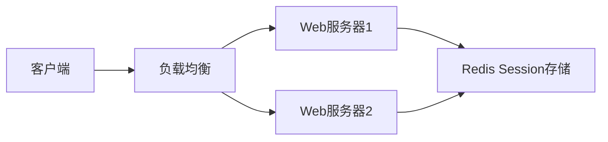
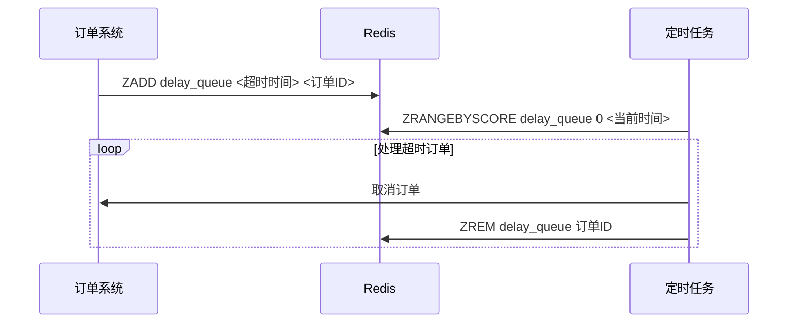
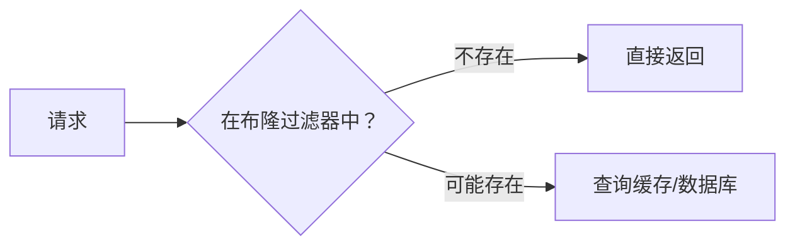
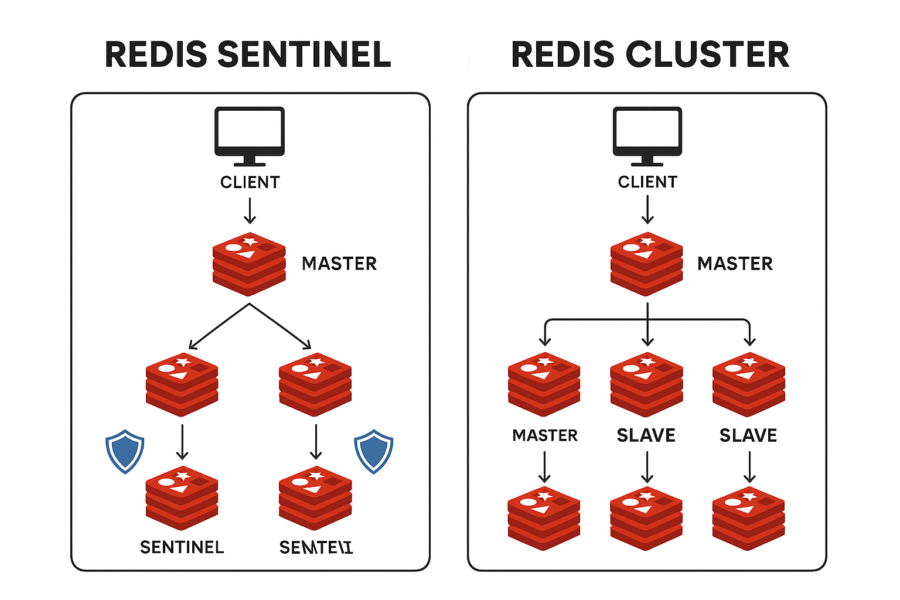
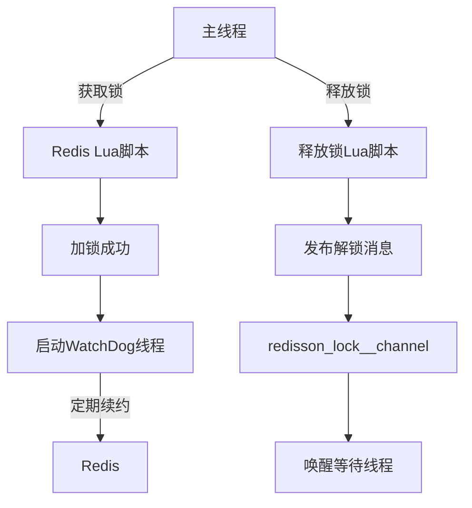
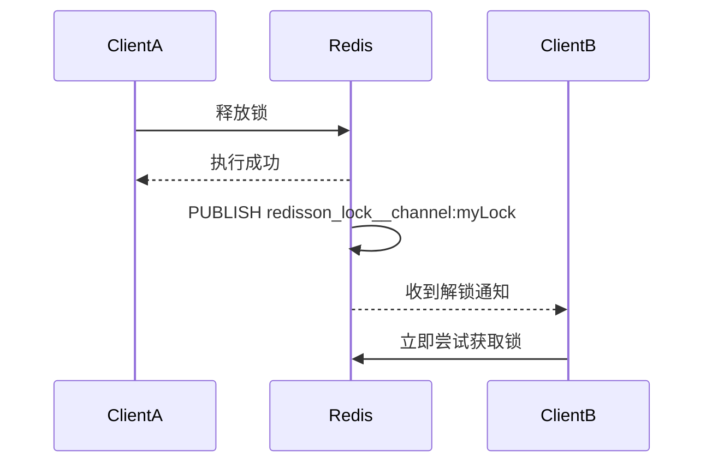
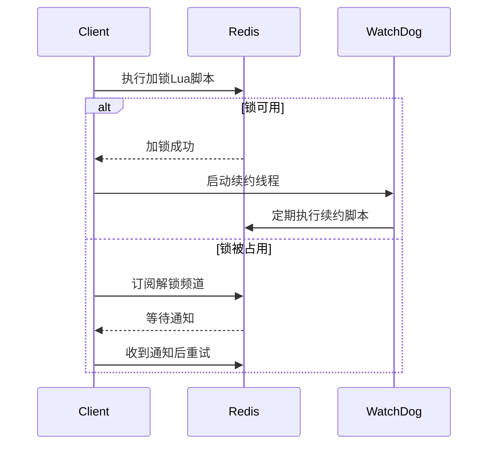
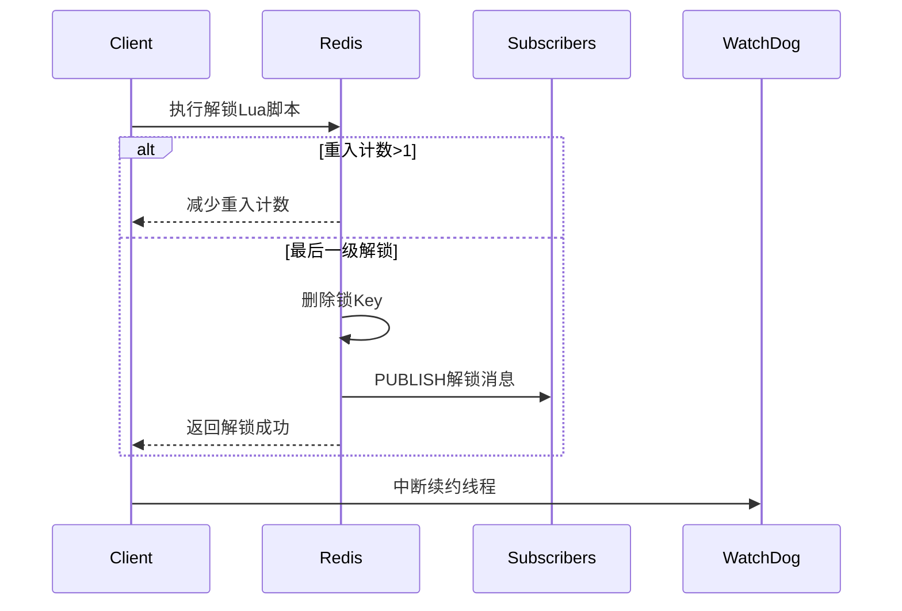

# 1.redis基础

## 什么是redis

Redis 本质上是一个 Key-Value 类型的内存数据库，很像 memcached，整个数据库统统加载
在内存当中进行操作，定期通过异步操作把数据库数据 flush 到硬盘上进行保存。

1. **内存数据库架构**：
    - Redis 是一个内存数据库，将整个数据库加载到内存中进行操作，这使得其能够实现非常快速的读写操作。
    - 数据库定期通过异步操作将数据刷新到硬盘上进行保存，以防止数据丢失。

2. **优异性能**：
    - Redis 的性能出色，每秒可以处理超过 10 万次读写操作，是已知性能最快的 Key-Value 数据库。
    - 这种高性能主要归因于其纯内存操作和单线程模型的设计。

3. **多种数据结构支持**：
    - Redis 支持多种数据结构，包括字符串、列表、集合、哈希、有序集合等。
    - 允许单个 value 的最大限制为 1GB，这比起 memcached 的 1MB 更加灵活。

4. **功能丰富**：
    - 可以利用 Redis 的不同数据结构来实现各种功能，如使用列表实现 FIFO 双向链表，使用集合实现高性能的标签系统等。
    - Redis 还支持为存储的 Key-Value 设置过期时间，可以作为功能更强大的 memcached 使用。

5. **容量限制**：
    - Redis 的数据库容量受到物理内存的限制，不适合处理海量数据的高性能读写。
    - 主要适用于处理较小数据量的高性能操作和计算场景。

## 为什么redis单线程架构还能那么快

Redis 之所以快，主要有以下几个原因：

1. **内存存储**：
   Redis 将所有数据存储在内存中，这使得数据的读取和写入速度极快。内存访问速度要远快于磁盘访问速度。

2. **单线程模型**：
   Redis 使用单线程模型处理请求，避免了多线程的上下文切换和竞争问题。具体来说：
    - **减少上下文切换**：在多线程系统中，线程之间的切换会带来额外的开销。而单线程模型不存在这些开销。
    - **避免资源竞争**：多线程系统中，多个线程同时访问同一资源可能引发锁竞争问题，导致线程阻塞。而单线程系统中不会有这种资源竞争。

3. **高效的 I/O 多路复用**：
   Redis 使用 I/O 多路复用技术（通常是 `epoll` 在 Linux 上），使得单线程也能高效地处理大量并发连接。I/O 多路复用使得 Redis 能够在单个线程中处理多个文件描述符（网络连接），从而提高了并发处理能力。

4. **紧凑的数据结构**：
   Redis 内部使用了高度优化的数据结构（如字典、跳表等），这些数据结构经过精心设计，能够在内存中高效地存储和访问数据。

5. **高效的事件处理机制**：
   单线程的事件循环机制使得 Redis 可以高效地处理客户端的请求。Redis 使用事件驱动模型来处理网络事件，从而减少了事件处理的延迟。

6. **避免死锁和竞争**：
   单线程模型中，不存在死锁问题，因为一次只能有一个操作在运行。另外，开发人员也不需要花费额外精力去管理多线程带来的同步问题，从而减少了 bug 的可能性。

7. **快速的序列化/反序列化**：
   Redis 的数据存储和传输格式非常高效，能够快速进行数据序列化和反序列化。这减少了数据在网络上传输的时间。

总的来说，Redis 的设计强调简单和高效，通过使用内存存储、单线程模型和优化的数据结构，实现了非常高的性能。

## 什么是非阻塞I/O

非阻塞 I/O（Non-blocking I/O）是一种 I/O 操作的处理模式，它允许程序在进行输入输出操作时不被阻塞，从而使得程序能够同时处理多个任务或请求。

在传统的阻塞 I/O 模式中，当一个 I/O 操作被调用时，程序会一直等待，直到操作完成或者超时。这意味着在进行 I/O 操作时，程序无法执行其他任务，从而可能导致程序的性能下降。

相比之下，非阻塞 I/O 模式允许程序在进行 I/O 操作时继续执行其他任务，而不必等待操作完成。当一个 I/O 操作被调用时，程序会立即返回，而不会阻塞在那里等待操作完成。程序可以通过轮询或事件驱动的方式来检查 I/O
操作的状态，一旦操作完成，程序就可以继续处理数据或执行其他任务。

非阻塞 I/O 可以通过以下几种方式来实现：

1. **轮询（Polling）**：程序周期性地查询 I/O 设备或文件描述符的状态，以确定是否有数据可读或可写。

2. **选择（Select）**：使用 select() 系统调用或类似的机制来监视多个文件描述符的状态，以确定哪些文件描述符已经准备好进行读取或写入。

3. **多路复用（Multiplexing）**：使用多路复用技术（如 epoll、kqueue 等）来同时监视多个文件描述符的状态，从而避免了轮询和选择的效率问题。

4. **异步 I/O（Asynchronous I/O）**：通过操作系统提供的异步 I/O 接口，在发起一个 I/O 操作后，程序可以立即返回，而不必等待操作完成。当操作完成时，操作系统会通知程序，从而实现了真正的非阻塞 I/O。

非阻塞 I/O 可以提高程序的并发性和吞吐量，特别适用于需要同时处理大量 I/O 操作的场景，如网络服务器、文件系统等。然而，非阻塞 I/O 也会增加程序的复杂性，因为程序需要自行管理 I/O 操作的状态和处理逻辑。

非阻塞 I/O 可以通过多种方式来实现，以下是其中几种常见的实现方式及其特点：

1. **轮询（Polling）**：
    - **实现原理**：程序周期性地查询 I/O 设备或文件描述符的状态，以确定是否有数据可读或可写。
    - **工作方式**：当调用非阻塞的 I/O 操作时，程序会立即返回，然后周期性地轮询检查 I/O 设备或文件描述符的状态。
    - **优点**：简单易实现，适用于较少的并发连接。
    - **缺点**：效率较低，需要频繁地查询状态，可能会造成 CPU 资源浪费。
    - **示例**：使用 Java NIO 的 Selector 类进行轮询式非阻塞 I/O 操作。
   ```
   Selector selector = Selector.open();
   channel.configureBlocking(false);
   channel.register(selector, SelectionKey.OP_READ);
   while (true) {
       int readyChannels = selector.select();
       if (readyChannels == 0) {
           continue;
       }
       Set<SelectionKey> selectedKeys = selector.selectedKeys();
       Iterator<SelectionKey> keyIterator = selectedKeys.iterator();
       while (keyIterator.hasNext()) {
           SelectionKey key = keyIterator.next();
           if (key.isReadable()) {
               // 处理读事件
           }
           keyIterator.remove();
       }
   }
   ```

2. **选择（Select）**：
    - **实现原理**：使用 select() 系统调用或类似的机制来监视多个文件描述符的状态，以确定哪些文件描述符已经准备好进行读取或写入。
    - **工作方式**：通过操作系统提供的 select() 系统调用，程序可以监视多个文件描述符的状态，一旦某个文件描述符可读或可写，程序就可以进行相应的读写操作。
    - **优点**：比轮询方式效率更高，可以同时监视多个文件描述符。
    - **缺点**：对文件描述符的数量有限制，且在高并发场景下可能存在性能瓶颈。
    - **示例**：使用 C 语言的 select() 系统调用进行非阻塞 I/O 操作。
   ```c
   fd_set readfds;
   FD_ZERO(&readfds);
   FD_SET(fd, &readfds);
   while (true) {
       int ready = select(fd + 1, &readfds, NULL, NULL, NULL);
       if (ready == -1) {
           perror("select");
           break;
       }
       if (FD_ISSET(fd, &readfds)) {
           // 处理读事件
       }
   }
   ```

3. **多路复用（Multiplexing）**：
    - **实现原理**：使用多路复用技术（如 epoll、kqueue 等）来同时监视多个文件描述符的状态，从而避免了轮询和选择的效率问题。
    - **工作方式**：多路复用技术允许程序注册多个文件描述符，并在某个文件描述符就绪时得到通知，从而可以立即处理对应的 I/O 操作。
    - **优点**：效率高，支持大量并发连接，适用于高性能网络服务器。
    - **示例**：使用 epoll() 系统调用进行非阻塞 I/O 操作。
   ```c
   int epollfd = epoll_create1(0);
   struct epoll_event event;
   event.events = EPOLLIN | EPOLLET;
   event.data.fd = fd;
   epoll_ctl(epollfd, EPOLL_CTL_ADD, fd, &event);
   while (true) {
       struct epoll_event events[MAX_EVENTS];
       int n = epoll_wait(epollfd, events, MAX_EVENTS, -1);
       for (int i = 0; i < n; ++i) {
           if (events[i].events & EPOLLIN) {
               // 处理读事件
           }
       }
   }
   ```

4. **异步 I/O（Asynchronous I/O）**：
    - **实现原理**：通过操作系统提供的异步 I/O 接口，在发起一个 I/O 操作后，程序可以立即返回，而不必等待操作完成。当操作完成时，操作系统会通知程序。
    - **工作方式**：程序通过调用异步 I/O 接口发起 I/O 操作，并指定操作完成后的回调函数。当操作完成时，操作系统会自动调用回调函数，从而实现异步操作。
    - **优点**：效率高，避免了轮询和选择的开销，适用于高并发和高吞吐量的场景。
    - **缺点**：编程复杂度较高，操作系统支持程度不一，可能在某些平台上无法完全实现。
    - **示例**：使用 Java NIO 的 AsynchronousFileChannel 类进行异步文件读取操作。
   ```
   Path path = Paths.get("file.txt");
   AsynchronousFileChannel channel = AsynchronousFileChannel.open(path, StandardOpenOption.READ);
   ByteBuffer buffer = ByteBuffer.allocate(1024);
   channel.read(buffer, 0, buffer, new CompletionHandler<Integer, ByteBuffer>() {
       @Override
       public void completed(Integer result, ByteBuffer attachment) {
           System.out.println("Read " + result + " bytes");
       }
       @Override
       public void failed(Throwable exc, ByteBuffer attachment) {
           exc.printStackTrace();
       }
   });
   ```

以上是几种常见的非阻塞 I/O 实现方式及其示例。不同的实现方式适用于不同的场景，具体选择取决于应用程序的需求和平台的支持情况。

## Redis数据淘汰策略

Redis 提供了多种数据淘汰策略，用于在内存达到设定的最大使用量时清除部分数据，以便为新数据腾出空间。以下是 Redis 中常见的数据淘汰策略：

1. **LRU（Least Recently Used）**：最近最少使用策略。根据数据的访问时间，淘汰最近最少使用的数据。当内存空间不足时，优先淘汰最近最少被访问的数据项。

2. **LFU（Least Frequently Used）**：最不经常使用策略。根据数据的访问频率，淘汰使用频率最低的数据。当内存空间不足时，优先淘汰访问频率最低的数据项。

3. **TTL（Time To Live）**：生存时间策略。当数据设定了过期时间（TTL），在过期时间到达后将被自动淘汰。此策略不受内存空间限制，而是根据数据自身的过期时间来进行淘汰。

4. **Random（随机策略）**：随机淘汰策略。随机选择一些数据进行淘汰，没有特定的顺序或优先级。

5. **Maxmemory Policy = NoEviction**：禁止淘汰策略。当内存达到最大使用量时，新的写操作将会失败，客户端会收到错误响应。这种情况下需要客户端适当处理错误并清理数据以释放空间。

在 Redis 中，可以通过配置 `maxmemory-policy` 参数来选择所使用的淘汰策略。
默认情况下，`maxmemory-policy` 参数为 `volatile-lru`，表示使用 LRU 策略来淘汰设置了过期时间的数据。用户可以根据自己的需求和场景选择合适的淘汰策略。

1. `noeviction`：当内存使用超过配置的时候会返回错误，不会驱逐任何键。

2. `allkeys-lru`：从所有键中使用LRU算法进行淘汰。

3. `allkeys-lfu`：从所有键中驱逐使用频率最少的键。

4. `allkeys-random`：从所有键中随机淘汰数据。

5. `volatile-lru`：从设置了过期时间的键中使用LRU算法进行淘汰。

6. `volatile-lfu`：从已设置过期时间的数据集挑选使用频率最低的数据淘汰。

7. `volatile-random`：从设置了过期时间的键中随机淘汰。

8. `volatile-ttl`：在设置了过期时间的键中，淘汰过期时间剩余最短的。

   

## redis的两种持久化方式

Redis 的 RDB 和 AOF 的分别是：

1. **RDB**：RDB（Redis DataBase）全称为 Redis 数据库持久化。RDB 是 Redis 使用的一种快照持久化方式，它会周期性地将内存中的数据以快照的形式保存到磁盘上。  
   `SAVE` 命令和 `BGSAVE` 命令都是 Redis 中用于执行 RDB 持久化操作的命令，它们的作用是将当前 Redis 数据存储在磁盘上，以防止数据丢失。

    - **SAVE 命令**：`SAVE` 命令会在执行时阻塞 Redis 服务器进程，直到 RDB 持久化操作完成为止。在执行 `SAVE` 命令期间，Redis 服务器不能响应其他命令请求，因此通常不建议在生产环境中使用。

    - **BGSAVE 命令**：`BGSAVE` 命令会在后台异步执行 RDB 持久化操作，不会阻塞 Redis 服务器进程，因此可以在持久化操作进行的同时继续处理其他命令请求。`BGSAVE`
      命令通常是推荐的方式，在生产环境中用于执行 RDB 持久化操作。

   总体来说，`BGSAVE` 命令比 `SAVE` 命令更为常用，因为它不会阻塞 Redis 服务器进程，可以保证 Redis 在进行持久化操作时仍能响应其他请求，从而提高了系统的可用性和性能。

2. **AOF**：AOF（Append Only File）全称为 Redis 追加写入文件。AOF 是 Redis 使用的一种日志持久化方式，它会将 Redis 所有写入操作记录下来，以追加的方式保存到文件中。

这两种持久化方式都可以用来保证 Redis 数据的持久化，但它们的工作原理和实现机制不同。RDB 是周期性地保存快照，而 AOF 是将所有写入操作记录下来，可以选择在某些条件下进行重写和压缩。

以下是 RDB 和 AOF 各自的优缺点：

**RDB（Redis DataBase）：**

优点：

1. 整个数据集在一次快照中被紧凑地存储，非常适合用于备份和灾难恢复。
2. RDB 文件通常比 AOF 文件小，因为它们只包含了 Redis 在某个时间点上的快照。
3. 加载 RDB 文件的速度通常比重放 AOF 日志的速度更快，尤其是当数据集很大时。

缺点：

1. 如果 Redis 发生崩溃，最后一次 RDB 快照之后的数据将会丢失。
2. RDB 是定期执行的，因此在两次执行之间，如果 Redis 崩溃，可能会丢失一部分数据。

**AOF（Append Only File）：**

优点：

1. AOF 文件记录了所有写入 Redis 的命令，因此能够提供更精确的持久化保证。
2. AOF 文件是可读的文本文件，易于理解和分析。
3. 可以根据需要灵活地配置 AOF 的 fsync 策略，以权衡持久化和性能之间的关系。

缺点：

1. AOF 文件通常比 RDB 文件大，因为它包含了所有写入 Redis 的命令。
2. AOF 文件通常比 RDB 文件更慢地加载，因为它需要重放所有写入命令来重建数据集。
3. 在写入频繁的情况下，AOF 文件可能会变得很大，导致文件系统占用过多的磁盘空间。

## redis序列化

1. **Q1: 什么是序列化?**  
   把对象转换成字节码序列的过程称为对象的序列化, 把字节序列恢复为对象的过程成为反序列化  
   对象序列化的用途主要有:
    - 把对象的字节序列永久的保存在硬盘上, 以便之后恢复这个对象
    - 在网络上传送对象, 所以只要接受者使用相同的序列化机制, 那么收到这个字节序列就可以重塑这个对象
2. **Q1: 为什么非得序列化?**    
   主要是为了恢复对象, 可以提高性能, 不同的序列化方式性能不一样

Spring 提供了两个可使用的 RedisTemplate

* RedisTemplate<Object, Object> - 默认全部使用 JdkSerializationRedisSerializer 的序列化方式
* StringRedisTemplate - 默认全部使用 StringRedisSerializer.UTF_8 的序列化方式

自定义的 redis 的序列化方式

1. JdkSerializationRedisSerializer - POJO对象的存取场景, 使用 JDK 本身的序列化机制, 默认机制 ObjectInputStream/ObjectOutputStream 进行序列化操作
2. StringRedisSerializer - key 或者 value 为字符串
3. Jackson2JsonRedisSerializer - 利用 jackson-json 工具, 将 pojo 实例序列化为 json 格式存储
   GenericJackson2JsonRedisSerializer,GenericToStringSerializer

## Redis应用场景

Redis 作为高性能内存数据库，凭借其**丰富的数据结构、超高性能和原子性操作**，在分布式系统中有着不可替代的作用。以下是 Redis 在 12 个核心场景中的应用及实际案例解析：

---

### 一、缓存系统（核心场景）
**解决痛点**：数据库读压力大，响应慢  
**实现方案**：
```python
def get_data(key):
    data = redis.get(key)
    if not data:
        data = db.query("SELECT * FROM table WHERE id=?", key)  # 查数据库
        redis.setex(key, 3600, data)  # 缓存1小时
    return data
```
**典型场景**：
- 电商商品详情页缓存（命中率 > 98%）
- 新闻内容缓存（缓存时间：热点新闻5分钟，普通新闻2小时）

---

### 二、会话存储（Session Storage）
**解决痛点**：分布式系统会话共享  
**架构**：

**优势**：
- 用户登录态跨服务器共享
- 会话自动过期（TTL）
- 支持集群模式高可用

---

### 三、分布式锁
**解决痛点**：集群环境资源竞争  
**Redlock算法实现**：
```lua
-- KEYS[1]=lock_key, ARGV[1]=uuid, ARGV[2]=expire_ms
if redis.call('setnx', KEYS[1], ARGV[1]) == 1 then
    redis.call('pexpire', KEYS[1], ARGV[2])
    return 1
else
    return 0
end
```
**应用场景**：
- 订单支付防重复提交
- 库存扣减（避免超卖）
- 定时任务分布式调度

---

### 四、实时排行榜
**数据结构**：Sorted Set（ZSET）  
**典型命令**：
```bash
ZADD leaderboard 95 "user1"  # 添加分数
ZINCRBY leaderboard 5 "user2" # 增加分数
ZREVRANGE leaderboard 0 9 WITHSCORES  # 获取Top10
```
**应用案例**：
- 游戏玩家战力榜
- 直播平台礼物周榜
- 电商商品热销榜

---

### 五、计数器系统
**数据结构**：String（INCR/DECR）  
**场景示例**：
```bash
# 文章阅读量统计
INCR article:123:views

# 限流计数器（每分钟100次）
INCR user_ip:127.0.0.1
EXPIRE user_ip:127.0.0.1 60
```
**实际应用**：
- 网站PV/UV统计
- API调用限流
- 秒杀库存计数

---

### 六、消息队列
**解决方案**：
| 方案     | 数据结构 | 特点                |
| -------- | -------- | ------------------- |
| 简单队列 | LIST     | LPUSH/RPOP          |
| 可靠队列 | Stream   | 消息持久化/消费者组 |
| 延迟队列 | ZSET     | 用时间戳做Score     |

**电商订单超时取消案例**：


---

### 七、实时数据分析
**方案**：HyperLogLog + Bitmap  
**UV/PV统计对比**：
| 指标 | HyperLogLog | Bitmap    | 数据库 |
| ---- | ----------- | --------- | ------ |
| 内存 | 12KB/百万UV | 1.25MB/日 | >100MB |
| 精度 | 99%         | 100%      | 100%   |
| 速度 | 0.5ms       | 1ms       | >100ms |

**典型命令**：
```bash
# UV统计
PFADD 20240501_uv user1 user2 user3
PFCOUNT 20240501_uv

# 活跃用户判断
SETBIT 20240501_active 1001 1  # 用户ID 1001活跃
GETBIT 20240501_active 1001
```

---

### 八、社交关系
**数据结构**：Set  
**关系操作**：
```bash
# 关注/取关
SADD user:123:followings 456
SREM user:123:followings 789

# 共同关注
SINTER user:123:followings user:456:followings

# 可能认识的人
SDIFF user:456:followers user:123:followers
```

---

### 九、地理空间索引
**数据结构**：GEO  
**LBS应用**：
```bash
# 添加餐厅坐标
GEOADD restaurants 116.40439 39.90901 "全聚德"

# 查找5km内餐厅
GEORADIUS restaurants 116.400 39.900 5 km WITHDIST
```

---

### 十、布隆过滤器
**解决痛点**：穿透缓存的恶意查询  
**工作流程**：

**代码实现**：
```python
from redisbloom.client import Client
rb = Client()

# 添加100万个元素
for id in product_ids:
    rb.bfAdd("products", id)

# 检查是否存在
if rb.bfExists("products", request_id):
    # 继续查询
else:
    return "Not Exist"
```

---

### 十一、实时监控系统
**方案**：TimeSeries 模块  
**服务器监控示例**：
```bash
# 记录CPU使用率
TS.ADD server1:cpu * 85 LABELS type cpu server server1

# 查询最近5分钟数据
TS.RANGE server1:cpu - 5 min +
```

---

### 十二、二级索引
**方案**：Set + SortedSet 组合  
**商品多条件查询**：
```bash
# 建立索引
SADD category:electronics "product:1001"
ZADD price_index 2999 "product:1001"

# 组合查询（电子类且价格<3000）
SINTERSTORE tmp category:electronics
ZRANGEBYSCORE price_index 0 3000
ZINTERSTORE result 2 tmp price_index WEIGHTS 0 1
```

---

### Redis 适用边界
| **适合场景**           | **不适用场景**             |
| ---------------------- | -------------------------- |
| 高频读操作（>10万QPS） | 复杂事务处理               |
| 低延迟要求（<10ms）    | 大数据量持久化存储（>1TB） |
| 原子性操作需求         | 复杂关系查询               |
| 实时计算与分析         | 二进制大文件存储           |
| 分布式状态管理         | 替代关系型数据库主存储     |

---

### 性能优化建议
1. **热Key处理**：
   ```bash
   # 监控热点Key
   redis-cli --hotkeys
   ```
   - 解决方案：本地缓存 + 随机过期时间

2. **大Key拆分**：
   ```bash
   # 检测大Key
   redis-cli --bigkeys
   ```
   - Hash拆分为多个Key
   - SortedSet分片存储

3. **管道与Lua脚本**：
   ```python
   # 管道批量操作
   pipe = redis.pipeline()
   for id in ids:
       pipe.get(f"product:{id}")
   results = pipe.execute()
   ```

Redis 的威力在于**选择正确的数据结构解决特定问题**，合理使用可使系统性能提升10-100倍。但在引入时需严格评估数据一致性和持久化需求，避免误用为“万能数据库”。

# 2.redis高可用

## 1.redis复制

**命令操作**

- 建立连接: slaveof 127.0.0.1 6379
- 查看复制状态信息: info replication
- 断开连接: slaveof on one

**主从架构**

主从架构可以分为: 1主1从, 1主多从, 树状主从

**复制的过程**

1. 保存主节点信息
2. 主从建立socket连接
3. 发送ping命令
4. 权限校验
5. 发送数据集
6. 命令持续复制

**数据同步(异步操作)**

- 复制偏移量: 主从节点各自维护自己的偏移量,当从节点和主节点的偏移量不同就知道数据不一致了
- 复制挤压缓冲区: 复制缓冲区是主节点上的一个固定长度的队列,存放的是每次的写入命令,存在的目的是为了部分复制和复制命令丢失的数据补救
- 主节点运行ID: 每个redis在运行时都会分配一个40位的16进制的字符串作为运行ID,目的是为了保证主节点重启时变更了数据集,从节点再根据偏移量复制时数据不安全的问题
- psync runId offset 用于从节点完成部分复制和全部复制,主节点在收到这个命令之后,会根据自身情况来决定是全量复制\部分复制

    1. **全量复制** 是第一次建立复制关系必经的阶段  
       执行流程如下: 从节点发送psync->主节点决定全量复制->从节点收到响应,保存runid和偏移量->主节点执行bgsave保存rdb文件->
       主节点发送rdb文件给从节点,从节点把rdb文件保存在本地并直接作为从节点的数据文件
       ->从节点在接收rdb文件的过程中,主节点会把写命令保存在复制客户端缓冲区,当从节点接收rdb完成后,会把缓冲区内的数据发给从节点->从节点接收完主节点的rdb文件后,会清空自身的所有旧数据->从节点加载rdb文件
       ->从节点如果开启了AOF那么会立即执行bgrewriteaof
    2. **部分复制** 由于出现网络闪断或者命令丢失时使用的复制方式
       主从节点之间出现网络问题时,如果超过了repl-timeout时间,主节点会认为从节点出现了问题->主节点会把断连期间的命令写入复制积压缓冲区
       ->当主从连接恢复之后,从节点会把runid和复制偏移量发给主节点,主节点收到后会检验runid,之后根据复制偏移量把复制就挤压缓冲区的数据发给从节点

## 2.redis复制的问题

1. **读写分离(从节点不主动删除数据)**
    - 数据延迟 由于复制是异步的,延迟无法避免,如果延迟过大,可以采用监听redis主节点的info replication的偏移量信息,过大时更换策略读取主节点数据
    - 读到过期数据 redis的删除策略组要有两种 **惰性删除(主节点收到读操作时才删除过期数据)** 和 **定时删除(redis内部有定时任务来删除过期数据)**
      如果大量数据超时,主节点删除操作更不上过期速度,就会产生读到过期数据,在redis3.2之后,redis采用从节点读取数据时会判断是否过期,过期就返回空了

2. **主从配置不一致**

有些配置主从之间是可以不一致的,主节点可以关闭AOF持久化而在丛节点开启.
但是内存相关的配置如果不一致可能会导致数据不一致,比如maxmemory如果从节点更小,那么从节点达到最大值的时候将按照maxmemory-policy执行内存溢出策略.

3. **规避全量复制**

4. **规避复制风暴**`

## 3.redis哨兵机制

鉴于主从复制的一些问题:

1. 主节点出现故障之后，需要主动将从节点晋升为主节点，同时客户端侧还需要进行主节点地址的更换，其他从节点还需要重新配置主节点。
2. 主节点的写能力受到单机的限制。
3. 主节点的存储能力受到单机的限制。

所以redis推出redis sentinel，可以在主节点出现故障时，自动完成故障发现和故障转移。

sentinel实现原理：

- 三个定时任务
    1. 每隔10秒 每个sentinel节点向主节点和从节点发送info来获取最新的拓扑结构
    2. 每个2秒 每个sentinel节点发送和接收 _sentinel_:hello 的主节点判断信息
    3. 每隔1秒 每个sentinel节点向主节点、从节点、其他sentinel节点发送一条ping命令做一次心跳检测
- 主管下线和客观下线
    1. 心跳检测的超时时间超过了down-after-milliseconds，那么当前sentinel节点会认为是主观下线了
    2. 询问到其他sentinel节点后，同样认为主节点失效的节点超过了quorum时，则是客观下线了
- 领导者Sentinel节点选举
  故障转移工作由一个sentinel节点完成，所以所有的的sentinel节点会进行领导选举。
  选举算法采用raft算法
- 故障转移
    1. 从节点列表中选出一个节点作为新的主节点
    2. 对新的主节点执行 slaveof no one
    3. sentinel向剩余的从节点发出命令，让他们成为新的主节点的从节点
    4. sentinel把原来的主节点更新为从节点，关注到其恢复之后，让其复制新的主节点

## 4.redis集群

# 3.redis 问题

## redis缓存击穿，穿透，雪崩

缓存击穿: 热点过期瞬间，大量并发请求查询此数据

解决：1.热点数据永不过期 2.加锁排队获取DB数据

缓存雪崩：1.大量数据集中过期 2.缓存服务宕机

解决：1.数据随机过期时间（预防集中过期） 2.加锁排队（减少并发访问DB）

缓存穿透：查询一个根本不存在的数据，缓存层和存储层都不会命中。缓存穿透将导致每次查询不存在的数据都要到存储层去查询，失去了缓存保护后端存储的意义。

解决：1.缓存空对象 2.布隆过滤器(redis的bitmap)

## redis内存不够了怎么办

当使用 Redis 时内存不够了，有几种解决方案可以帮助你管理和优化内存使用，以确保 Redis 集群能够正常运行。以下是一些常见应对策略：

### 1. **内存使用优化**

#### 1.1 清理不需要的数据

- **设置过期时间（TTL）**: 使用 `EXPIRE` 命令为键设置过期时间。这样可以自动清除不需要的数据，从而释放内存。
- **按需删除**: 定期检查并删除不再需要的数据。

#### 1.2 压缩数据存储

- **数据压缩**: 采用更高效的编码方式来存储数据，尽量减少数据的冗余。如可以使用 `HASH`、`SET` 等更为紧凑的数据结构。
- **减少键名长度**: 使用较短的键名和字段名来节省内存。

### 2. **内存回收策略 (Eviction Policies)**

Redis 提供了内存回收策略，当达到内存上限（`maxmemory`）时，可以自动清除部分键。你可以从以下几种策略中选择适合的配置：

- **noeviction**: 达到内存限制后，不再执行任何写操作，返回错误。
- **allkeys-lru**: 驱逐最少使用的键（基于最近最少使用算法）。
- **volatile-lru**: 驱逐设置了过期时间的键中最少使用的键。
- **allkeys-random**: 随机驱逐键。
- **volatile-random**: 随机驱逐设置了过期时间的键。
- **volatile-ttl**: 驱逐将要过期的键。

可以通过 redis.conf 文件或运行时配置命令来设置：

```sh
# 在配置文件中设置
maxmemory-policy allkeys-lru

# 或者通过命令行设置
CONFIG SET maxmemory-policy allkeys-lru
```

### 3. **增加内存**

#### 3.1 垂直扩展（增加单实例内存）

- **升级硬件**: 如果是单台 Redis 服务器，增加服务器的内存。

#### 3.2 水平扩展（扩展到多个实例）

- **Redis Cluster**: 使用 Redis Cluster 实现数据的水平分片，将数据分布到多个 Redis 节点，以扩展整体内存容量和性能。
- **主从复制**: 设置 Redis 主从复制，虽然主从复制主要用于高可用性和读扩展，但在某些情况下可以协同使用来分担部分内存负担。

### 4. **外部存储**

- **持久化到磁盘**: 使用 Redis 的持久化功能（RDB 和 AOF）将长期不变的数据保存到磁盘。在需要时可以加载到内存中来释放 Redis 的内存压力。
- **混合架构**: 将热数据保存在 Redis 中，冷数据保存在其他持久化存储系统中（如数据库、文件系统），以减轻 Redis 的内存负担。

### 5. **使用压缩模块**

Redis 生态中存在一些第三方模块或方案，可以对数据进行压缩以节省内存。例如，使用 Redis 的 `RedisTimeSeries` 模块来存储时间序列数据，该模块在设计上经过了优化，可以节省大量内存。

### 6. **监控和报警**

- **监控内存使用**: 使用 Redis 自带的 `INFO` 命令或者其他监控工具（如 Prometheus、Grafana）来实时监控 Redis 的内存使用情况。根据监控数据及时调整配置和策略。

```sh
INFO memory
```

### 7. **优化数据结构和使用模式**

- **合理选择数据结构**: 根据应用的需求选择最合适的数据结构，比如用 `HASH` 代替多个 `STRING`，用 `SET` 代替多个 `LIST`。
- **批量操作**: 考虑在应用层进行优化，例如减少 Redis 请求次数，通过批量操作减少频繁的网络通信和内存开销。

### 示例: 设置内存回收策略和过期时间

```sh
# 设置 Redis 实例最大内存为 512MB
CONFIG SET maxmemory 512mb

# 设置内存回收策略为 allkeys-lru
CONFIG SET maxmemory-policy allkeys-lru

# 设置键的过期时间为 3600 秒 (1小时)
EXPIRE mykey 3600
```

通过综合运用以上这些策略，可以有效管理和优化 Redis 内存使用，减少内存不足带来的问题。根据应用的具体情况，选择合适的方法进行调整。


# 关于集群模式和哨兵模式

好，这个点很多人都会问，但这里要先 **打断一下常见的误区** ——
 **Redis Cluster 和 Redis Sentinel 是两个不同的高可用方案，原则上不是一起用的，除非你非常清楚它们各自做了什么。**

------

## 📌 先解释重点：

### 🚩 1️⃣ **Redis Sentinel 是用来管理「单主多从（哨兵模式）」的**

- Sentinel 会监控 *一个主节点* 的可用性，发现宕机后把它的从节点提升为新主。
- 客户端通过 Sentinel 获取新的主节点地址。

适用场景：**单主多从、无分片！**

------

### 🚩 2️⃣ **Redis Cluster 本身就带有分片+主从+故障转移**

- Cluster 里，slots 自动分配在多个主节点上，每个主可以有从节点。
- 主节点挂了，由从节点选举成新主节点，自动接管 slots。
- 客户端通过 `MOVED` 重定向感知 slot 所在的节点。

**这套主从和故障切换机制就是内置的，不需要 Sentinel。**

------

### 🚩 3️⃣ **如果你强行把 Sentinel 加在 Cluster 上，会冲突**

- Sentinel 不知道 Cluster 的 slots 分配，只看单机主从关系。
- 如果 Sentinel 把一个主从切换了，但 Cluster slots 不知道，还会让集群路由表乱掉。
- 这会导致：有 slots 没有主节点，或者客户端读写时重定向错了。

------

## ✅ 正确做法

- **Redis Cluster 不需要 Sentinel**
  - 它自己就有 Gossip、故障转移、主从复制。
  - 客户端用 `redis-cli --cluster` 或者支持 Cluster 的驱动（Jedis、Lettuce、ioredis）即可。
- **Redis Sentinel 用于单机主从**
  - 如果你只是想要一个主+多个从，没有分片需求，就用 Sentinel。
  - 如果要分片（横向扩容），就用 Cluster，不要再套 Sentinel。

------

## 🔑 如果你非要在 Cluster 上用 Sentinel，一般原因是：

1. 你想要额外的健康监控和报警（这可以用其他监控工具代替，比如 Prometheus）。
2. 你把每个分片独立管理，比如每个分片是一个独立的「单主多从 + Sentinel」，然后用客户端做分片路由。—— 这种做法比较少见，现在都用 Redis Cluster 代替了。

------

## ⚡ 总结：

- Redis Cluster 内置分片 + 主从复制 + 自动选举，不需要 Sentinel。
- 如果你只是想有监控 + 自动故障切换，Cluster 已经自带。
- **最关键：让客户端使用支持 Redis Cluster 的驱动，能自动处理 slots 重定向就行。**

------

## 🗂️ 推荐你这样做：

✅ 如果是生产：

- 使用 Redis Cluster，配置多个主节点 + 每个主节点至少 1~2 个从节点。
- 所有节点都 `cluster-enabled yes`，不要混用 Sentinel。
- 客户端连接使用支持 Cluster 的驱动，不要写死 IP 和端口。

------

### 🛠️ 如果你确实要监控：

- 用 `redis-cli --cluster info` 可以随时查看 slots、节点状态。
- 用 Prometheus + Redis Exporter + Grafana 来做指标和告警，代替 Sentinel 的健康监控功能。

------



# 服务路由，分区，去中心化

好，这个问题非常核心，咱们一步步讲清楚：

------

## 🎯 1️⃣ Redis Cluster 的官方设计 —— 服务端路由

**Redis Cluster 的关键点：**

- Redis 原生单机只能处理单节点上的数据，内存受限（比如 64GB~256GB）。
- 要想把数据分散到多个节点，就得分区（sharding）。
- Redis Cluster 就是官方提供的**原生分片 + 高可用**方案。

**怎么做的？**

- Redis Cluster 把 16,384 个 hash slots 平均分布到多个主节点上。
- 客户端执行 `SET k1 v1` 时，先对 `k1` 做 CRC16，再对 16,384 取模，确定落在哪个 slot。
- Redis Cluster 的所有节点都知道 slot 和节点的映射表（服务端路由表）。
- 客户端连到任意节点发命令，如果命中了本地的 slot，就直接执行。
- 如果命中了别的节点，它会返回 `MOVED` 告诉客户端正确的节点，客户端自动重定向。

所以叫**服务端路由**：节点自己知道谁负责哪个 slot，客户端只要支持重定向就行。

------

## 🎯 2️⃣ 为什么要做分区（sharding）

根本原因：

- Redis 单实例受限于单机内存、单核 CPU。
- 单实例 QPS 再高，也跑不过多机并行。
- 当数据规模 > 单机内存 或 单机 QPS 不够，就要把数据切片放到多台机器。

分区（sharding）就是把大 Key 空间拆成小片，分给多个 Redis 实例并行处理。
 本质目的是：**横向扩容存储空间 & 横向扩容吞吐量。**

------

## 🎯 3️⃣ 去中心化 vs 中心化

**中心化路由**：

- 客户端先连到一个中心化代理，比如 Twemproxy、Codis、Kproxy。
- 代理知道所有分片在哪，帮客户端做路由转发。
- 客户端啥都不用管，和单机 Redis 一样用。

**去中心化路由（Redis Cluster）**：

- 没有中心化代理，所有节点都知道 slots 分布。
- 客户端自己做 hash，或通过 `MOVED` 自我感知路由表。
- 节点之间通过 gossip 协议同步 slots 和主从信息。

**好处：**

- 没有中心化单点瓶颈。
- 没有额外代理层延迟。
- 节点可以自动发现、选举、重平衡。

------

## 🎯 4️⃣ 智能路由

智能路由就是：

- 客户端本地实现 hash slot 计算，知道哪个 key 落在哪个节点。
- 客户端 SDK（Jedis、Lettuce、ioredis）会自己维护 slots 表，收到 `MOVED` 时自动更新。
- 一次 hash 定位到正确节点，避免多次跳转。

这是 Redis Cluster 推荐的做法：**让客户端自己带路由能力，而不是依赖额外代理。**

------

## ✅ 总结一句话

- **为什么要分区**：单机不够，必须横向扩容。
- **官方方案是什么**：Redis Cluster，分片 + 主从 + 自动故障转移 + 服务端路由。
- **核心原理**：所有节点都知道 slots 路由表，客户端支持重定向或自己做智能路由。
- **中心化代理是替代方案**：比如 Codis / Twemproxy，这样客户端完全无感知，适合不支持 Cluster 的老客户端，但失去了去中心化自愈能力。


# Redisson 分布式锁深度解析：双线程、频道与锁管理机制

Redisson 的分布式锁实现是其核心特性之一，通过巧妙的设计解决了分布式锁的续约问题。下面我将详细解释整个机制，包括两个线程的工作流程、`redisson_lock__channel`的作用以及内部 Map 集合的功能。

## 一、整体架构设计



## 二、核心组件解析

### 1. 双线程工作机制

#### (1) 主线程（业务线程）
```java
public void businessMethod() {
    RLock lock = redisson.getLock("myLock");
    lock.lock();  // 主线程执行加锁
    try {
        // 执行业务逻辑
    } finally {
        lock.unlock();  // 主线程执行解锁
    }
}
```

**工作流程**：
1. 执行 Lua 脚本尝试获取锁
2. 如果获取成功，启动 WatchDog 线程
3. 执行业务逻辑
4. 业务完成后执行解锁操作

#### (2) WatchDog 线程（守护线程）
```java
private void scheduleExpirationRenewal() {
    Thread renewalThread = new Thread(() -> {
        while (!Thread.currentThread().isInterrupted()) {
            try {
                // 每1/3锁超时时间续约一次
                Thread.sleep(lockWatchdogTimeout / 3);
                // 执行Lua续约脚本
                renewExpiration();
            } catch (InterruptedException e) {
                break;
            }
        }
    });
    renewalThread.setDaemon(true);
    renewalThread.start();
}
```

**工作流程**：
1. 以守护线程方式运行
2. 每隔 `lockWatchdogTimeout/3` (默认10秒) 执行一次续约
3. 使用 Lua 脚本延长锁的过期时间
4. 当主线程释放锁或线程中断时停止

### 2. `redisson_lock__channel` 的作用



**核心功能**：
1. **实时通知**：当锁被释放时，通过 Redis 的 PUB/SUB 机制通知所有等待的客户端
2. **避免轮询**：减少客户端不断重试获取锁的网络开销
3. **降低延迟**：客户端收到通知后立即尝试获取锁，减少等待时间

**频道命名规则**：
- 格式：`redisson_lock__channel:{lock_name}`
- 示例：`redisson_lock__channel:order_lock_123`

### 3. 内部 Map 集合的作用

在 `RedissonLock` 类中有一个重要结构：
```java
private final ConcurrentMap<String, LockEntry> locks = new ConcurrentHashMap<>();
```

**LockEntry 结构**：
```java
class LockEntry {
    int count;          // 重入计数器
    UUID threadId;      // 持有线程ID
    long threadId;      // JVM内部线程ID
    Future<?> watchdog; // WatchDog线程引用
}
```

**功能说明**：
1. **重入管理**：记录同一线程多次加锁的计数
2. **线程绑定**：确保只有锁持有者能解锁
3. **WatchDog 管理**：存储续约线程的引用
4. **锁状态跟踪**：维护 JVM 进程内的锁状态

## 三、完整工作流程

### 1. 加锁过程


**加锁 Lua 脚本核心逻辑**：
```lua
local counter = redis.call('hincrby', KEYS[1], ARGV[3], 1);
redis.call('pexpire', KEYS[1], ARGV[2]);
return counter;
```

### 2. 解锁过程


**解锁 Lua 脚本核心逻辑**：
```lua
if (redis.call('hexists', KEYS[1], ARGV[3]) == 0) then
    return nil; -- 非持有者解锁
end;
local counter = redis.call('hincrby', KEYS[1], ARGV[3], -1);
if (counter > 0) then
    redis.call('pexpire', KEYS[1], ARGV[2]); 
else
    redis.call('del', KEYS[1]); 
    redis.call('publish', KEYS[2], ARGV[1]); -- 发布解锁消息
end;
return counter;
```

## 四、关键配置参数

### 1. WatchDog 配置
```yaml
# application.yml
redisson:
  lock:
    watchdog-timeout: 30000 # 默认30秒
    # 续约间隔 = watchdog-timeout / 3 = 10秒
```

### 2. 锁等待配置
```java
RLock lock = redisson.getLock("myLock");
// 尝试获取锁，最多等待100秒，锁定后30秒自动释放
boolean res = lock.tryLock(100, 30, TimeUnit.SECONDS);
```

## 五、异常处理机制

### 1. WatchDog 异常处理
```java
private void renewExpiration() {
    // ... 续约逻辑
    
    // 异常处理
    if (e instanceof RedisException) {
        // Redis连接异常
        cancelExpirationRenewal(); // 取消续约
        throw (RedisException) e;
    }
    
    // 续约失败但锁仍存在
    if (remainingTime > 0) {
        // 重新调度续约
        scheduleExpirationRenewal(remainingTime);
    }
}
```

### 2. 客户端断连处理
```java
public void lock() {
    // ... 加锁逻辑
    
    // 网络异常处理
    catch (RedisConnectionException e) {
        // 尝试本地回退
        if (lockLocally()) {
            return;
        }
        throw e;
    }
}

private boolean lockLocally() {
    // 检查本地Map中是否已有锁记录
    LockEntry entry = locks.get(getEntryName());
    return entry != null && entry.threadId == Thread.currentThread().getId();
}
```

## 六、性能优化建议

1. **合理设置超时**：
   ```java
   // 业务执行时间 < 看门狗超时时间
   lock.lock(60, TimeUnit.SECONDS); // 明确指定超时
   ```

2. **避免过度重入**：
   ```java
   // 减少不必要的重入
   if (!lock.isLocked()) {
       lock.lock();
   }
   ```

3. **频道订阅优化**：
   ```java
   // 重用订阅连接
   config.setSubscriptionsPerConnection(50);
   ```

## 七、Redisson 锁 vs SET NX PX

| 特性     | Redisson 锁      | SET NX PX        |
| -------- | ---------------- | ---------------- |
| 自动续约 | ✅ WatchDog 机制  | ❌ 需手动实现     |
| 重入支持 | ✅ 内置计数       | ❌ 需自行实现     |
| 等待通知 | ✅ 发布订阅通知   | ❌ 需轮询         |
| 复杂度   | 高               | 低               |
| 适用场景 | 长事务、复杂业务 | 短事务、简单场景 |

Redisson 的分布式锁通过双线程协同工作、发布订阅机制和精细的锁状态管理，解决了分布式环境下的锁续约和高效通知问题。`redisson_lock__channel` 是实现高效等待通知的核心，而内部 Map 集合则负责维护 JVM 进程内的锁状态和重入计数，三者共同构成了 Redisson 强大而可靠的分布式锁体系。