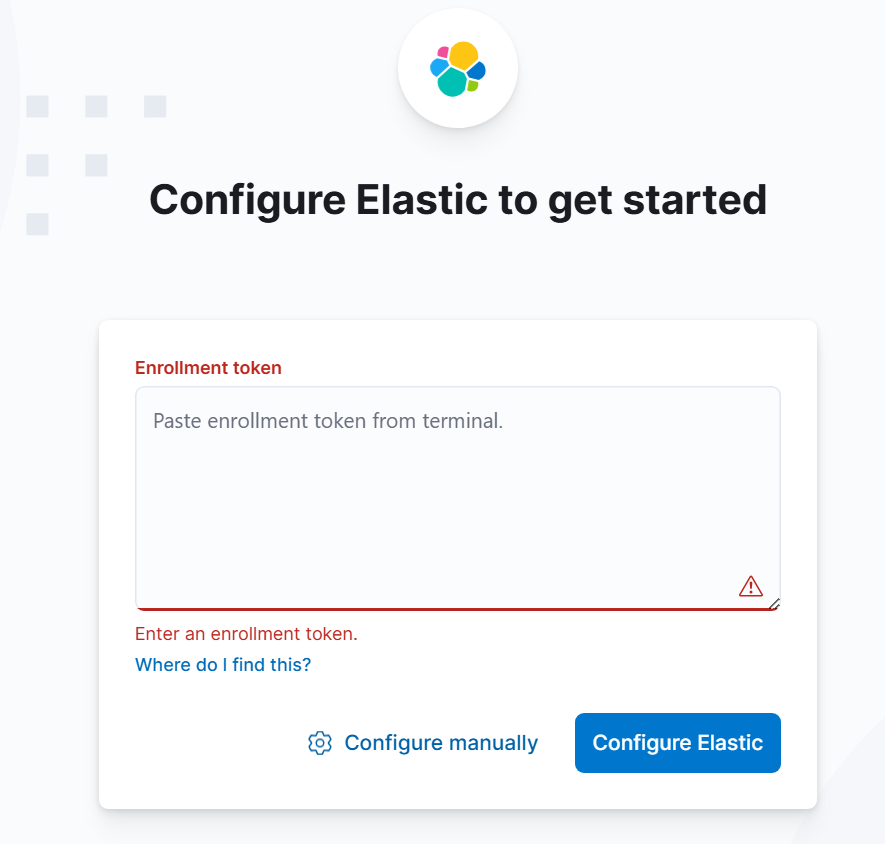

# Linux 环境安装

[参考文章, 腾讯云作者 Linux安装ElasticSearch](https://cloud.tencent.com/developer/article/2216722)

[参考视频, bilibili 2024最新Elastic Stack（ELK）教程入门到精通，深入浅出ES技术](https://www.bilibili.com/video/BV1nF4m1c7nk/?p=8&spm_id_from=pageDriver&vd_source=8d7ce9dd45b35258ee11a3c3ce982ea9)

## es安装

ElasticSearch 担任数据持久层的角色，负责储存数据

### 环境准备

- 安装和配置JDK
- 虚拟机内存建议4G以上,我这里配置的3G

### 下载安装包

搜索并下载随意版本, 我这里使用的是 elasticsearch-8.11.4 elasticsearch-8.11.4-linux-x86_64.tar.gz
> https://www.elastic.co/cn/downloads/elasticsearch

### 创建es用户

因为安全问题，Elasticsearch 不允许 root 用户直接运行, 所以要创建一个ES专属的普通用户es

```shell
# 创建一个es用户,主目录设置为 /home/es, 并且创建用户的同时创建这个目录
useradd es -d /home/es -m;
# 通过echo把 "es" 这个字符串输出到标准输出,然后 passwd从标准输出中获取刚才输出的字符串,把这个字符串设置为es用户的密码
echo "es" | passwd --stdin es;
```

### 前置准备部分配置修改

安装es还有一些前置准备这里省略, 比如修改每个进程允许打开的文件数量的限制, 操作系统层面每个用户创建的进程允许的最大线程数量
(操作系统可以创建的最大线程数量最大的因素主要取决于内存,一般来说从几千到几百万不等)

jvm.options

```
-Xms1g
-Xmx1g
```

elasticsearch.yml 的配置默认都没开

```yaml 
# 这里先开两个
network.host: 0.0.0.0
http.port: 9200
```

下面的配置在首次启动es之后,在elasticsearch.yml这个配置文件中会自动生成

```yaml
# 是否启动 x-pack的安全功能, 比如身份验证和授权
xpack.security.enabled: true
# 用于启动自动注册功能,在某些情况下，比如集群的初始设置中，能够使用自动注册来更为简化地添加新的 Elasticsearch 节点。设置为 true 会启用该功能。
xpack.security.enrollment.enabled: true
# 这一段配置用于启用 HTTP API 客户端连接（如 Kibana、Logstash 和 Agents）的加密。
xpack.security.http.ssl:
  # 启用 HTTP 层的 SSL 加密。确保所有通过 HTTP 协议往返于 Elasticsearch 的数据都是加密的。
  enabled: true
  # 指定包含 SSL 证书的 keystore 文件的路径，http.p12 是持有 SSL 证书及私钥的文件。
  keystore.path: certs/http.p12
# 此配置用于启用集群节点间通信的加密和双向认证。
xpack.security.transport.ssl:
  # 启用在集群节点之间的 SSL 加密，以保证节点间通信数据的安全性。
  enabled: true
  # 指定证书验证模式。certificate 模式下，集群节点将检验对方的证书，以确保通信的各方是可信的。
  verification_mode: certificate
  # 指定用于集群节点间通信的 keystore 文件路径，此文件包含节点的 SSL 证书和私钥。
  keystore.path: certs/transport.p12
  # 指定信任存储（truststore）文件路径，用于验证其他节点的 SSL 证书。此文件通常包含信任的证书颁发机构（CA）的证书。
  truststore.path: certs/transport.p12
# Create a new cluster with the current node only
# Additional nodes can still join the cluster later
cluster.initial_master_nodes: [ "node-128" ]
```

### 启动es,并打开初始页面

```shell
# 启动es
cd /bin 
./elasticsearch

# 我这里安装的是 ES8 与 ES7不同,会输出以下信息,首次启动时会进行安全配置
# 1. 为传输层和HTTP层生成TLS证书和密钥
# 2. TLS配置设置被写入 elasticsearch.yml 配置文件
# 3. 为 elastic 用户生成密码
# 4. 为 Kibana 生成一个注册令牌
# 启动成功后,可能会有如下的初始化信息,信息给出了 elastic 用户的密码
━━━━━━━━━━━━━━━━━━━━━━━━━━━━━━━━━━━━━━━━━━━━━━━━━━━━━━━━━━━━━━━━━━━━━━━━━━━━━━━━━━━━━━━━━━━━━━━━━━━━━━━━━━━━━━━━━━━━━━━━━━━━━━━━
✅ Elasticsearch security features have been automatically configured!
✅ Authentication is enabled and cluster connections are encrypted.

# 这就是生成的 elastic 用户的密码
ℹ️  Password for the elastic user (reset with `bin/elasticsearch-reset-password -u elastic`):
  Q_N3Ja+RBs3xHLhOdKz-

# 这是生成的CA证书的密钥信息, 暂时不管
ℹ️  HTTP CA certificate SHA-256 fingerprint:
  3d68f1114677d53e154ee4f944621b18f9c502d48e83cf9d05a4b329b6232922

# ES 为 Kibana 生成的访问令牌,Kibana访问ES服务需要用到(只有30分钟有效期) 
ℹ️  Configure Kibana to use this cluster:
• Run Kibana and click the configuration link in the terminal when Kibana starts.
• Copy the following enrollment token and paste it into Kibana in your browser (valid for the next 30 minutes):
  eyJ2ZXIiOiI4LjExLjQiLCJhZHIiOlsiMTkyLjE2OC44MC4xMjg6OTIwMCJdLCJmZ3IiOiIzZDY4ZjExMTQ2NzdkNTNlMTU0ZWU0Zjk0NDYyMWIxOGY5YzUwMmQ0OGU4M2NmOWQwNWE0YjMyOWI2MjMyOTIyIiwia2V5IjoiWl9uSGhKSUJ0ZUl3MzU2X0p6c046RVNpdlRZdUFSQ0daZ21LYkc0am8tQSJ9

# ES 为其他节点加入集群生成的访问令牌, 当前集群中需要加入新节点的时候需要携带此令牌(有效时间30分钟)
ℹ️ Configure other nodes to join this cluster:
• Copy the following enrollment token and start new Elasticsearch nodes with `bin/elasticsearch --enrollment-token <token>` (valid for the next 30 minutes):
  eyJ2ZXIiOiI4LjExLjQiLCJhZHIiOlsiMTkyLjE2OC44MC4xMjg6OTIwMCJdLCJmZ3IiOiIzZDY4ZjExMTQ2NzdkNTNlMTU0ZWU0Zjk0NDYyMWIxOGY5YzUwMmQ0OGU4M2NmOWQwNWE0YjMyOWI2MjMyOTIyIiwia2V5IjoiYWZuSGhKSUJ0ZUl3MzU2X0p6dGI6a1RvVTMwc3ZSdDZ5RC1ab1VOQVdIUSJ9

  If you're running in Docker, copy the enrollment token and run:
  `docker run -e "ENROLLMENT_TOKEN=<token>" docker.elastic.co/elasticsearch/elasticsearch:8.11.4`
━━━━━━━━━━━━━━━━━━━━━━━━━━━━━━━━━━━━━━━━━━━━━━━━━━━━━━━━━━━━━━━━━━━━━━━━━━━━━━━━━━━━━━━━━━━━━━━━━━━━━━━━━━━━━━━━━━━━━━━━━━━━━━━━
```

打开 https://192.168.80.128:9200/

输入账户 elastic 密码 Q_N3Ja+RBs3xHLhOdKz- 登录成功则部署完成

### 初始化后的其他配置

#### 关于es的初始密码和修改密码

是es的账户密码 Q_N3Ja+RBs3xHLhOdKz- 用户名是 elastic(最高权限)
我们也可以通过 bin/elasticsearch-reset-password 来调整密码

- ./elasticsearch-reset-password -u 用户名 重置密码
- ./elasticsearch-reset-password --username 用户名 -i 修改指定用户密码
- ./elasticsearch-reset-password --username kibana_system 重置kibana密码
- ./elasticsearch-reset-password --url "https://host:port" --username ‘用户名’ -i

#### kibana的ssl的token问题

> kibana初始化与Es链接SSl的token **有效期30分钟** 过期使用  
> **.\elasticsearch-create-enrollment-token -s kibana** 再次创建  
> 生成SSL的密钥都在**/config/certs**  
> **访问时需要带上 https**

## kibana安装

### 下载安装包

kibana 担任视图层角色，拥有各种维度的查询和分析，并使用图形化的界面展示存放在Elasticsearch中的数据

> https://www.elastic.co/cn/downloads/kibana

### 配置准备

kibana.yml文件初始化也是无配置的,我们添加如下配置

```yaml
server.port: 5601
# 允许所有源的访问
server.host: 0.0.0.0
# 添加中文支持
i18n.locale: "zh-CN"
```

### 启动

```shell
cd bin/
./kibana

# 初次启动这里会显示 
# i Kibana has not been configured.
# Go to http://localhost:5601/?code=024211 to get started.
```

打开 http://192.168.80.128:5601/ 进入首页会进入配置页面



输入刚才es提供的kibana的token,成功后进入登录页面
输入账户密码即可

整个过程完成后, kibana.yml的配置文件会自动新增一些配置

```yaml
# This section was automatically generated during setup.
elasticsearch.hosts: [ 'https://192.168.80.128:9200' ]
elasticsearch.serviceAccountToken: AAEAAWVsYXN0aWMva2liYW5hL2Vucm9sbC1wcm9jZXNzLXRva2VuLTE3Mjg4MDUzNzY3Mjg6WFNHSldFcnpTR3lySUZxVHg5eWhBQQ
elasticsearch.ssl.certificateAuthorities: [ /home/es/es/kibana-8.11.4/data/ca_1728805378099.crt ]
xpack.fleet.outputs: [ { id: fleet-default-output, name: default, is_default: true, is_default_monitoring: true, type: elasticsearch, hosts: [ 'https://192.168.80.128:9200' ], ca_trusted_fingerprint: 3d68f1114677d53e154ee4f944621b18f9c502d48e83cf9d05a4b329b6232922 } ]
```


### 环境迁移后，服务器IP变化，需要重新生成kibana的token

直接使用 elasticsearch-create-enrollment-token --scope kibana 重新生成令牌，但是失败，因为服务器IP变了，这导致 Elasticsearch 在建立 TLS 连接时，目标服务器的证书没有匹配到 `192.168.3.101` 的 **Subject Alternative Name (SAN)**。

```shell
[es@node-101 bin]$ ./elasticsearch-create-enrollment-token --scope kibana
warning: ignoring JAVA_HOME=/usr/local/java/jdk-17.0.12; using bundled JDK
21:33:39.742 [main] WARN  org.elasticsearch.common.ssl.DiagnosticTrustManager - failed to establish trust with server at [192.168.3.101]; the server provided a certificate with subject name [CN=node-128], fingerprint [7c524eca96490e731da3e61f01251f29c6ac6db8], no keyUsage and extendedKeyUsage [serverAuth]; the certificate is valid between [2024-10-13T07:27:32Z] and [2026-10-13T07:27:32Z] (current time is [2024-12-08T13:33:39.731573817Z], certificate dates are valid); the session uses cipher suite [TLS_AES_256_GCM_SHA384] and protocol [TLSv1.3]; the certificate has subject alternative names [IP:fe80:0:0:0:4069:a4e:dc5e:6395,DNS:node-128,DNS:localhost,IP:fe80:0:0:0:cc6f:a6af:8cec:52e5,IP:192.168.80.128,IP:0:0:0:0:0:0:0:1,IP:127.0.0.1,IP:fe80:0:0:0:1321:97e0:f2c9:89e0]; the certificate is issued by [CN=Elasticsearch security auto-configuration HTTP CA]; the certificate is signed by (subject [CN=Elasticsearch security auto-configuration HTTP CA] fingerprint [00b1a0b77a55b050fcfd6649c900429e35301274] {trusted issuer}) which is self-issued; the [CN=Elasticsearch security auto-configuration HTTP CA] certificate is trusted in this ssl context ([xpack.security.http.ssl (with trust configuration: Composite-Trust{JDK-trusted-certs,StoreTrustConfig{path=certs/http.p12, password=<non-empty>, type=PKCS12, algorithm=PKIX}})])
java.security.cert.CertificateException: No subject alternative names matching IP address 192.168.3.101 found

```

解决方案：

#### **更新证书的 SAN 配置**

```shel
elasticsearch-certutil cert --ca elastic-stack-ca.p12 --dns 192.168.3.101
```

但是生成的时候，需要输入密码，我直接回车会报错。

这里暂时先不弄了。有点复杂，涉及HTTPs证书的生成和使用。


## filebeat安装

ELK使用的组件是 Logstash, 担任控制层的角色，负责搜集和过滤数据

Filebeat 和 Logstash 的对比表格：

| 对比项         | Filebeat                                                                                                                                     | Logstash                                                                                                                          |
|-------------|----------------------------------------------------------------------------------------------------------------------------------------------|-----------------------------------------------------------------------------------------------------------------------------------|
| **功能与用途**   | 主要用于轻量级的日志文件收集和传输。<br>专门设计用于从文件系统中读取日志文件，并将这些数据发送到 Logstash 或直接发送到 Elasticsearch。<br>适合在资源有限的环境中使用，因为它占用较少的系统资源。<br>通常用于边缘节点（如服务器、容器等）的数据采集。 | 功能更为强大，支持多种数据源的输入、复杂的处理和多种输出。<br>可以处理多种类型的数据源，包括日志文件、数据库、API 等。<br>提供丰富的过滤和转换功能（如 grok 解析、数据转换、字段过滤等）。<br>适合在数据中心或需要复杂数据处理的场景中使用。 |
| **性能与资源占用** | 资源占用较低，适合在边缘节点上运行，对系统性能影响较小。<br>通常用于将日志数据从边缘节点传输到 Logstash 或 Elasticsearch。                                                                  | 资源占用较高，尤其是在处理大量数据或进行复杂数据转换时。<br>适合在数据中心或需要集中处理数据的地方使用。                                                                            |
| **数据处理能力**  | 数据处理能力较为简单，主要负责日志文件的读取和传输。<br>不支持复杂的数据处理或转换。                                                                                                 | 提供强大的数据处理能力，支持多种插件和过滤器。<br>可以进行数据解析、字段操作、数据转换、数据聚合等复杂操作。                                                                          |
| **架构与部署**   | 通常部署在边缘节点上，作为日志收集的代理。<br>可以直接将数据发送到 Elasticsearch，也可以发送到 Logstash 进行进一步处理。                                                                   | 通常部署在数据中心或集中处理数据的地方。<br>作为数据处理的中心节点，接收来自 Filebeat 或其他数据源的数据，并进行处理后发送到 Elasticsearch。                                              |
| **使用场景**    | 适用于需要简单、轻量级日志收集的场景。<br>适合在边缘节点上部署，如服务器、容器、虚拟机等。                                                                                              | 适用于需要复杂数据处理和转换的场景。<br>适合在数据中心或需要集中处理数据的地方使用。                                                                                      |
| **组合使用**    | Filebeat + Logstash 通常情况下，Filebeat 用于日志收集，Logstash 用于数据处理和转换。<br>Filebeat 将日志数据发送到 Logstash，Logstash 进行处理后再发送到 Elasticsearch。                | Filebeat + Logstash 通常情况下，Filebeat 用于日志收集，Logstash 用于数据处理和转换。<br>Filebeat 将日志数据发送到 Logstash，Logstash 进行处理后再发送到 Elasticsearch。     |

### 下载安装包

这里选择 filebeat-8.11.4-linux-x86_64.tar.gz
> https://www.elastic.co/cn/downloads/beats/filebeat

### 配置filebeat并输出到es

#### filebeat和日志不在一台服务器上,使用nfs挂载目录同步日志文件

```shell
# 在两台服务器都安装上nfs服务
yum install nfs-utils

# 在日志服务器上共享日志文件夹
vim /etc/exports 
# 添加以下内容, 这是一个日志文件的目录
# /var/lib/docker/volumes/26e54132cd61f944d04566e38c9758a44121fe97778404e65b78b573980809aa/_data

# 通过systemctl启动nfs服务
systemctl start nfs-server
# 开启启动nfs服务
systemctl enable nfs-server

# 在filebeat的服务器上需要同步这些日志文件
# 1. 创建一个存在日志文件的目录
mkdir loadlogs
# 2. 使用 mount 命令挂载目录
mount -t nfs 192.168.80.140:/var/lib/docker/volumes/26e54132cd61f944d04566e38c9758a44121fe97778404e65b78b573980809aa/_data /home/es/es/filebeat-8.11.4-linux-x86_64/loadlogs
# 3. 编辑 /etc/fstab文件以达到开机直接同步的目的
vim /etc/fstab
# 添加如下内容
# 192.168.80.140:/var/lib/docker/volumes/26e54132cd61f944d04566e38c9758a44121fe97778404e65b78b573980809aa/_data /home/es/es/filebeat-8.11.4-linux-x86_64/loadlogs nfs defaults 0 0

# 上述配置完成后,就可以在 loadlogs 文件夹中看到同步的文件了
```

#### 配置filebeat的配置文件

```shell
filebeat.inputs:
  # 这是一个默认的输入流
  - type: filestream
    id: my-filestream-id
    enabled: false
    paths:
      - /var/log/*.log
  
  # 这里我们定义一个上面用nfs同步过来的日志文件目录
  - type: log
    enabled: true
    paths:
      - /home/es/es/filebeat-8.11.4-linux-x86_64/loadlogs/*.log
      
# 默认配置
filebeat.config.modules:
  path: ${path.config}/modules.d/*.yml
  reload.enabled: false
setup.template.settings:
  index.number_of_shards: 1
setup.kibana:


# 这里配置一个 es 的输出流
# 需要配置用户名,密码,还有ssl证书,否则会报错
output.elasticsearch:
  hosts: ["https://192.168.80.128:9200"]
  username: "elastic"
  password: "Q_N3Ja+RBs3xHLhOdKz-"
  ssl:
    # CA 证书文件路径
    certificate_authorities: [ "/home/es/es/es-8.11.4/elasticsearch-8.11.4/config/certs/http_ca.crt" ]
  # 如果这里没有配置索引,会自动生成一个 我这里生成了一个 .ds-filebeat-8.11.4-2024.10.13-000001
    
# 默认配置
processors:
  - add_host_metadata:
      when.not.contains.tags: forwarded
  - add_cloud_metadata: ~
  - add_docker_metadata: ~
  - add_kubernetes_metadata: ~
```
在配置好配置文件之后,使用 ./filebeat启动服务, 如果打印下面的日志,则代表已经成功配置

> {"log.level":"info","@timestamp":"2024-10-13T17:08:58.214+0800","log.logger":"publisher_pipeline_output","log.origin":{"file.name":"pipeline/client_worker.go","file.line":145},"message":"Connection to backoff(elasticsearch(https://192.168.80.128:9200)) established","service.name":"filebeat","ecs.version":"1.6.0"}


# Docker 环境安装

[Docker 上安装部署 Elasticsearch（ES）详细教程 - SHENHUANJIE - 博客园](https://www.cnblogs.com/shenhuanjie/p/18085468/docker-installation-and-deployment-elasticsearch-es-detailed-tutorial-zntn2c)


```sh
# 因为我们还需要部署 Kibanna 容器，因此需要让 ES 和 Kibana 容器互联，这里先创建一个网络。
docker network create es-net

# 我这里使用的 springboot 版本是 2.7.18 在依赖关系中可以找到 es依赖绑定的版本 7.17.15
docker pull elasticsearch:7.17.15
docker pull kibana:7.17.15


docker run -d \
--name elasticsearch \
--restart=unless-stopped \
-e "ES_JAVA_OPTS=-Xms512m -Xmx512m" \
-e "discovery.type=single-node" \
-e "http.host=0.0.0.0" \
-v ./es/es-data:/usr/share/elasticsearch/data \
-v ./es/es-plugins:/usr/share/elasticsearch/plugins \
-v ./es/es-logs:/usr/share/elasticsearch/logs \
--privileged \
--network es-net \
-p 9200:9200 \
-p 9300:9300 \
elasticsearch:7.17.15


docker run -d \
--name kibana \
--restart=unless-stopped \
-e "I18N_LOCALE=zh-CN" \
-e ELASTICSEARCH_HOSTS=http://elasticsearch:9200 \
--network=es-net \
-p 5601:5601 \
kibana:7.17.15


```


# 配置开启自动启动(linux)

```
#!/bin/bash
#chkconfig: 345 63 37
#description: elasticsearch
#processname: elasticsearch-7.10.2

# 这个目录是你Es所在文件夹的目录
export ES_HOME=/home/es/es/es-8.11.4/elasticsearch-8.11.4
case $1 in
start)
    su es<<!
    cd $ES_HOME
    nohup ./bin/elasticsearch -d -p pid &
    exit
!
    echo "elasticsearch is started"
    ;;
stop)
    pid=`cat $ES_HOME/pid`
    kill -9 $pid
    echo "elasticsearch is stopped"
    ;;
restart)
    pid=`cat $ES_HOME/pid`
    kill -9 $pid
    echo "elasticsearch is stopped"
    sleep 1
    su es<<!
    cd $ES_HOME
    ./bin/elasticsearch -d -p pid
    exit
!
    echo "elasticsearch is started"
    ;;
*)
    echo "start|stop|restart"
    ;;
esac
exit 0

```


配置开启自启动

```shell
# 配置 777 权限
chmod 777 elasticsearch
# 添加系统服务
chkconfig --add elasticsearch
# 删除系统服务
chkconfig --del elasticsearch

# 启动服务
service elasticsearch start
# 停止服务
service elasticsearch stop
# 重启服务
service elasticsearch restart


# 开启开机自动启动服务
chkconfig elasticsearch on
# 关闭开机自动启动服务
chkconfig elasticsearch off

chkconfig --list
```


**Kibana自动启动配置**

```
#!/bin/bash
#chkconfig: 345 63 37
#description: kibana
#processname:kibana-7.6.2

export KIBANA_HOME=/home/es/es/kibana-8.11.4

case $1 in
        start)
        		# 切换到 es 用户进行启动
                su es<<!
                cd $KIBANA_HOME
                # 如果是 root 用户启动 需要添加 --allow-root 参数才能启动成功
                # nohup ./bin/kibana -p pid --allow-root &
                nohup ./bin/kibana -p pid &
                exit
!
                echo "kibana is started"
                ;;
        stop)
                pid=`cat $KIBANA_HOME/pid`
                kill -9 $pid
                echo "kibana is stopped"
                ;;
        restart)
                pid=`cat $KIBANA_HOME/pid`
                kill -9 $pid
                echo "kibana is stopped"
                sleep 5
                su kibana<<!
                cd $KIBANA_HOME
                ./bin/kibana -p pid &
                exit
!
                echo "kibana is started"
        ;;
    *)
        echo "start|stop|restart"
        ;;
esac
exit 0
```

