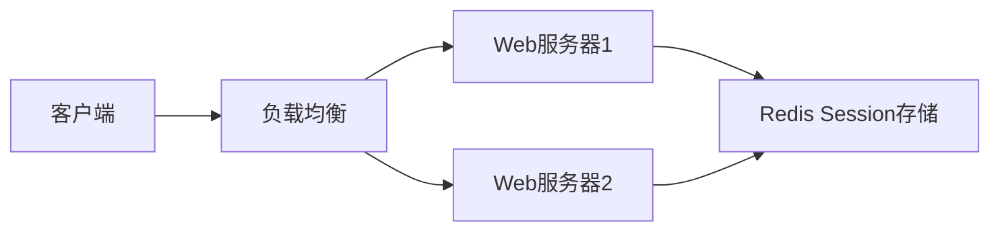
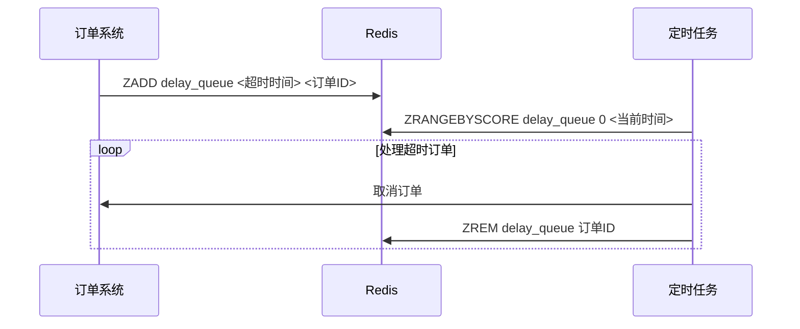
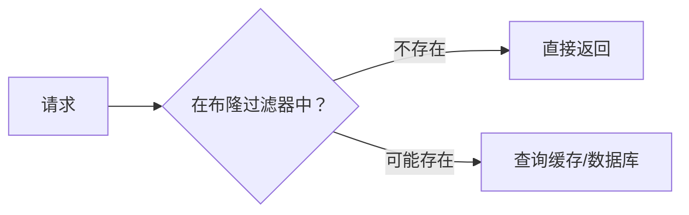
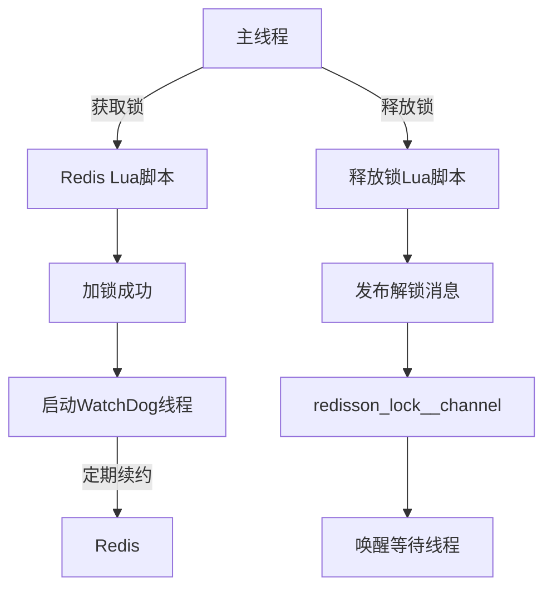
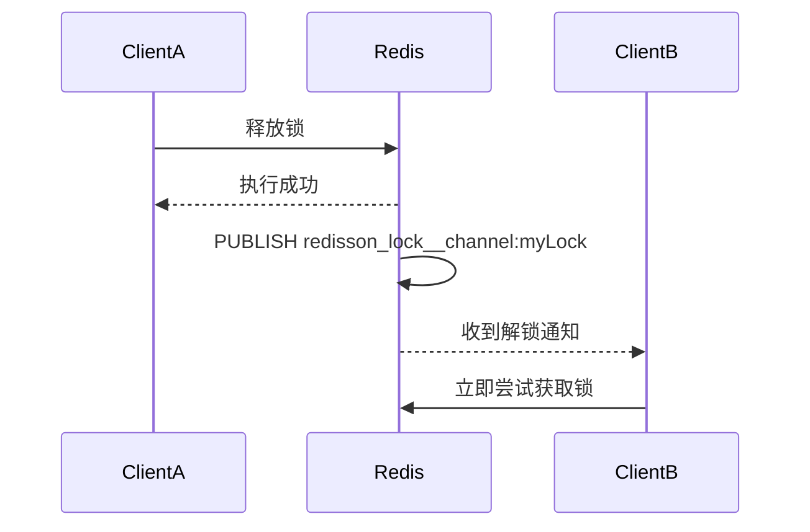
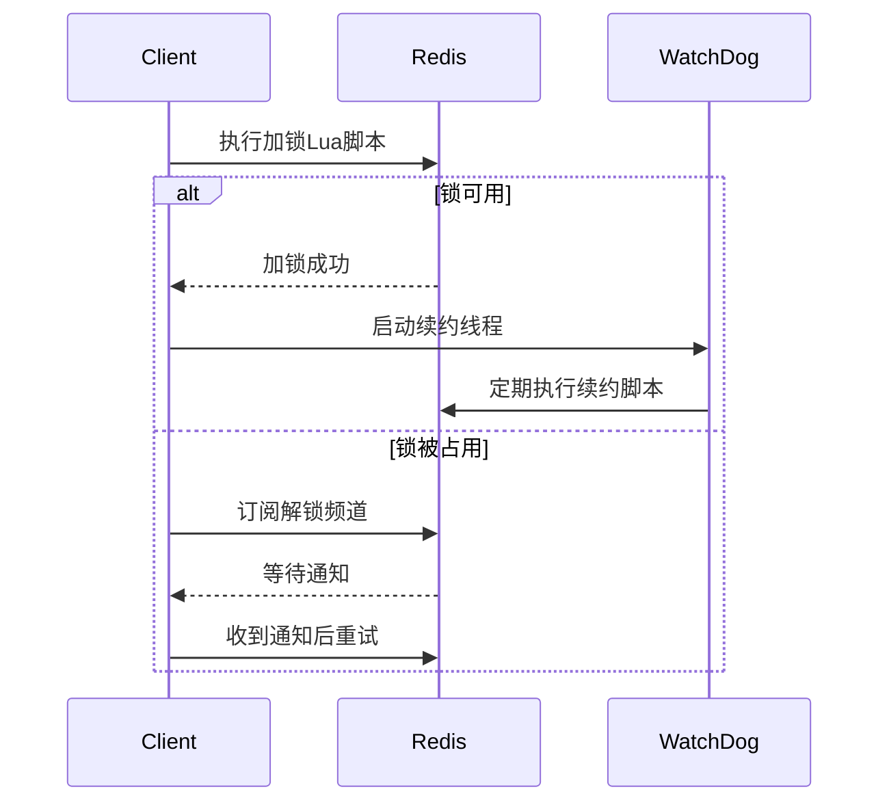
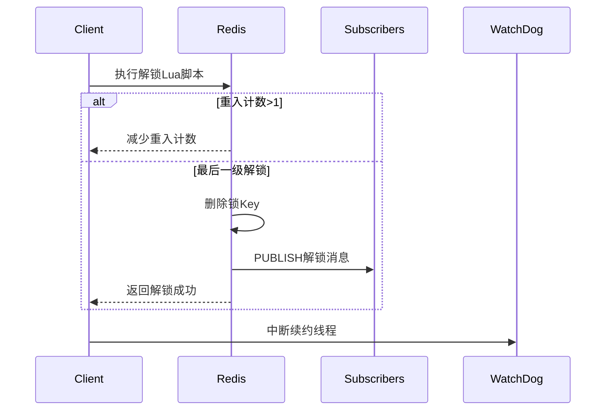

# redis基础

## 什么是redis

Redis 本质上是一个 Key-Value 类型的内存数据库，很像 memcached，整个数据库统统加载
在内存当中进行操作，定期通过异步操作把数据库数据 flush 到硬盘上进行保存。

1. **内存数据库架构**：
    - Redis 是一个内存数据库，将整个数据库加载到内存中进行操作，这使得其能够实现非常快速的读写操作。
    - 数据库定期通过异步操作将数据刷新到硬盘上进行保存，以防止数据丢失。

2. **优异性能**：
    - Redis 的性能出色，每秒可以处理超过 10 万次读写操作，是已知性能最快的 Key-Value 数据库。
    - 这种高性能主要归因于其纯内存操作和单线程模型的设计。

3. **多种数据结构支持**：
    - Redis 支持多种数据结构，包括字符串、列表、集合、哈希、有序集合等。
    - 允许单个 value 的最大限制为 1GB，这比起 memcached 的 1MB 更加灵活。

4. **功能丰富**：
    - 可以利用 Redis 的不同数据结构来实现各种功能，如使用列表实现 FIFO 双向链表，使用集合实现高性能的标签系统等。
    - Redis 还支持为存储的 Key-Value 设置过期时间，可以作为功能更强大的 memcached 使用。

5. **容量限制**：
    - Redis 的数据库容量受到物理内存的限制，不适合处理海量数据的高性能读写。
    - 主要适用于处理较小数据量的高性能操作和计算场景。

## 为什么redis单线程架构还能那么快

Redis 之所以快，主要有以下几个原因：

1. **内存存储**：
   Redis 将所有数据存储在内存中，这使得数据的读取和写入速度极快。内存访问速度要远快于磁盘访问速度。

2. **单线程模型**：
   Redis 使用单线程模型处理请求，避免了多线程的上下文切换和竞争问题。具体来说：
    - **减少上下文切换**：在多线程系统中，线程之间的切换会带来额外的开销。而单线程模型不存在这些开销。
    - **避免资源竞争**：多线程系统中，多个线程同时访问同一资源可能引发锁竞争问题，导致线程阻塞。而单线程系统中不会有这种资源竞争。

3. **高效的 I/O 多路复用**：
   Redis 使用 I/O 多路复用技术（通常是 `epoll` 在 Linux 上），使得单线程也能高效地处理大量并发连接。I/O 多路复用使得 Redis 能够在单个线程中处理多个文件描述符（网络连接），从而提高了并发处理能力。

4. **紧凑的数据结构**：
   Redis 内部使用了高度优化的数据结构（如字典、跳表等），这些数据结构经过精心设计，能够在内存中高效地存储和访问数据。

5. **高效的事件处理机制**：
   单线程的事件循环机制使得 Redis 可以高效地处理客户端的请求。Redis 使用事件驱动模型来处理网络事件，从而减少了事件处理的延迟。

6. **避免死锁和竞争**：
   单线程模型中，不存在死锁问题，因为一次只能有一个操作在运行。另外，开发人员也不需要花费额外精力去管理多线程带来的同步问题，从而减少了 bug 的可能性。

7. **快速的序列化/反序列化**：
   Redis 的数据存储和传输格式非常高效，能够快速进行数据序列化和反序列化。这减少了数据在网络上传输的时间。

总的来说，Redis 的设计强调简单和高效，通过使用内存存储、单线程模型和优化的数据结构，实现了非常高的性能。

## 什么是非阻塞I/O

非阻塞 I/O（Non-blocking I/O）是一种 I/O 操作的处理模式，它允许程序在进行输入输出操作时不被阻塞，从而使得程序能够同时处理多个任务或请求。

在传统的阻塞 I/O 模式中，当一个 I/O 操作被调用时，程序会一直等待，直到操作完成或者超时。这意味着在进行 I/O 操作时，程序无法执行其他任务，从而可能导致程序的性能下降。

相比之下，非阻塞 I/O 模式允许程序在进行 I/O 操作时继续执行其他任务，而不必等待操作完成。当一个 I/O 操作被调用时，程序会立即返回，而不会阻塞在那里等待操作完成。程序可以通过轮询或事件驱动的方式来检查 I/O
操作的状态，一旦操作完成，程序就可以继续处理数据或执行其他任务。

非阻塞 I/O 可以通过以下几种方式来实现：

1. **轮询（Polling）**：程序周期性地查询 I/O 设备或文件描述符的状态，以确定是否有数据可读或可写。

2. **选择（Select）**：使用 select() 系统调用或类似的机制来监视多个文件描述符的状态，以确定哪些文件描述符已经准备好进行读取或写入。

3. **多路复用（Multiplexing）**：使用多路复用技术（如 epoll、kqueue 等）来同时监视多个文件描述符的状态，从而避免了轮询和选择的效率问题。

4. **异步 I/O（Asynchronous I/O）**：通过操作系统提供的异步 I/O 接口，在发起一个 I/O 操作后，程序可以立即返回，而不必等待操作完成。当操作完成时，操作系统会通知程序，从而实现了真正的非阻塞 I/O。

非阻塞 I/O 可以提高程序的并发性和吞吐量，特别适用于需要同时处理大量 I/O 操作的场景，如网络服务器、文件系统等。然而，非阻塞 I/O 也会增加程序的复杂性，因为程序需要自行管理 I/O 操作的状态和处理逻辑。

非阻塞 I/O 可以通过多种方式来实现，以下是其中几种常见的实现方式及其特点：

1. **轮询（Polling）**：
    - **实现原理**：程序周期性地查询 I/O 设备或文件描述符的状态，以确定是否有数据可读或可写。
    - **工作方式**：当调用非阻塞的 I/O 操作时，程序会立即返回，然后周期性地轮询检查 I/O 设备或文件描述符的状态。
    - **优点**：简单易实现，适用于较少的并发连接。
    - **缺点**：效率较低，需要频繁地查询状态，可能会造成 CPU 资源浪费。
    - **示例**：使用 Java NIO 的 Selector 类进行轮询式非阻塞 I/O 操作。
   ```
   Selector selector = Selector.open();
   channel.configureBlocking(false);
   channel.register(selector, SelectionKey.OP_READ);
   while (true) {
       int readyChannels = selector.select();
       if (readyChannels == 0) {
           continue;
       }
       Set<SelectionKey> selectedKeys = selector.selectedKeys();
       Iterator<SelectionKey> keyIterator = selectedKeys.iterator();
       while (keyIterator.hasNext()) {
           SelectionKey key = keyIterator.next();
           if (key.isReadable()) {
               // 处理读事件
           }
           keyIterator.remove();
       }
   }
   ```

2. **选择（Select）**：
    - **实现原理**：使用 select() 系统调用或类似的机制来监视多个文件描述符的状态，以确定哪些文件描述符已经准备好进行读取或写入。
    - **工作方式**：通过操作系统提供的 select() 系统调用，程序可以监视多个文件描述符的状态，一旦某个文件描述符可读或可写，程序就可以进行相应的读写操作。
    - **优点**：比轮询方式效率更高，可以同时监视多个文件描述符。
    - **缺点**：对文件描述符的数量有限制，且在高并发场景下可能存在性能瓶颈。
    - **示例**：使用 C 语言的 select() 系统调用进行非阻塞 I/O 操作。
   ```c
   fd_set readfds;
   FD_ZERO(&readfds);
   FD_SET(fd, &readfds);
   while (true) {
       int ready = select(fd + 1, &readfds, NULL, NULL, NULL);
       if (ready == -1) {
           perror("select");
           break;
       }
       if (FD_ISSET(fd, &readfds)) {
           // 处理读事件
       }
   }
   ```

3. **多路复用（Multiplexing）**：
    - **实现原理**：使用多路复用技术（如 epoll、kqueue 等）来同时监视多个文件描述符的状态，从而避免了轮询和选择的效率问题。
    - **工作方式**：多路复用技术允许程序注册多个文件描述符，并在某个文件描述符就绪时得到通知，从而可以立即处理对应的 I/O 操作。
    - **优点**：效率高，支持大量并发连接，适用于高性能网络服务器。
    - **示例**：使用 epoll() 系统调用进行非阻塞 I/O 操作。
   ```c
   int epollfd = epoll_create1(0);
   struct epoll_event event;
   event.events = EPOLLIN | EPOLLET;
   event.data.fd = fd;
   epoll_ctl(epollfd, EPOLL_CTL_ADD, fd, &event);
   while (true) {
       struct epoll_event events[MAX_EVENTS];
       int n = epoll_wait(epollfd, events, MAX_EVENTS, -1);
       for (int i = 0; i < n; ++i) {
           if (events[i].events & EPOLLIN) {
               // 处理读事件
           }
       }
   }
   ```

4. **异步 I/O（Asynchronous I/O）**：
    - **实现原理**：通过操作系统提供的异步 I/O 接口，在发起一个 I/O 操作后，程序可以立即返回，而不必等待操作完成。当操作完成时，操作系统会通知程序。
    - **工作方式**：程序通过调用异步 I/O 接口发起 I/O 操作，并指定操作完成后的回调函数。当操作完成时，操作系统会自动调用回调函数，从而实现异步操作。
    - **优点**：效率高，避免了轮询和选择的开销，适用于高并发和高吞吐量的场景。
    - **缺点**：编程复杂度较高，操作系统支持程度不一，可能在某些平台上无法完全实现。
    - **示例**：使用 Java NIO 的 AsynchronousFileChannel 类进行异步文件读取操作。
   ```
   Path path = Paths.get("file.txt");
   AsynchronousFileChannel channel = AsynchronousFileChannel.open(path, StandardOpenOption.READ);
   ByteBuffer buffer = ByteBuffer.allocate(1024);
   channel.read(buffer, 0, buffer, new CompletionHandler<Integer, ByteBuffer>() {
       @Override
       public void completed(Integer result, ByteBuffer attachment) {
           System.out.println("Read " + result + " bytes");
       }
       @Override
       public void failed(Throwable exc, ByteBuffer attachment) {
           exc.printStackTrace();
       }
   });
   ```

以上是几种常见的非阻塞 I/O 实现方式及其示例。不同的实现方式适用于不同的场景，具体选择取决于应用程序的需求和平台的支持情况。

## Redis数据淘汰策略

Redis 提供了多种数据淘汰策略，用于在内存达到设定的最大使用量时清除部分数据，以便为新数据腾出空间。以下是 Redis 中常见的数据淘汰策略：

1. **LRU（Least Recently Used）**：最近最少使用策略。根据数据的访问时间，淘汰最近最少使用的数据。当内存空间不足时，优先淘汰最近最少被访问的数据项。

2. **LFU（Least Frequently Used）**：最不经常使用策略。根据数据的访问频率，淘汰使用频率最低的数据。当内存空间不足时，优先淘汰访问频率最低的数据项。

3. **TTL（Time To Live）**：生存时间策略。当数据设定了过期时间（TTL），在过期时间到达后将被自动淘汰。此策略不受内存空间限制，而是根据数据自身的过期时间来进行淘汰。

4. **Random（随机策略）**：随机淘汰策略。随机选择一些数据进行淘汰，没有特定的顺序或优先级。

5. **Maxmemory Policy = NoEviction**：禁止淘汰策略。当内存达到最大使用量时，新的写操作将会失败，客户端会收到错误响应。这种情况下需要客户端适当处理错误并清理数据以释放空间。

在 Redis 中，可以通过配置 `maxmemory-policy` 参数来选择所使用的淘汰策略。
默认情况下，`maxmemory-policy` 参数为 `volatile-lru`，表示使用 LRU 策略来淘汰设置了过期时间的数据。用户可以根据自己的需求和场景选择合适的淘汰策略。

1. `noeviction`：当内存使用超过配置的时候会返回错误，不会驱逐任何键。

2. `allkeys-lru`：从所有键中使用LRU算法进行淘汰。

3. `allkeys-lfu`：从所有键中驱逐使用频率最少的键。

4. `allkeys-random`：从所有键中随机淘汰数据。

5. `volatile-lru`：从设置了过期时间的键中使用LRU算法进行淘汰。

6. `volatile-lfu`：从已设置过期时间的数据集挑选使用频率最低的数据淘汰。

7. `volatile-random`：从设置了过期时间的键中随机淘汰。

8. `volatile-ttl`：在设置了过期时间的键中，淘汰过期时间剩余最短的。

   

## redis的两种持久化方式

Redis 的 RDB 和 AOF 的分别是：

1. **RDB**：RDB（Redis DataBase）全称为 Redis 数据库持久化。RDB 是 Redis 使用的一种快照持久化方式，它会周期性地将内存中的数据以快照的形式保存到磁盘上。  
   `SAVE` 命令和 `BGSAVE` 命令都是 Redis 中用于执行 RDB 持久化操作的命令，它们的作用是将当前 Redis 数据存储在磁盘上，以防止数据丢失。

    - **SAVE 命令**：`SAVE` 命令会在执行时阻塞 Redis 服务器进程，直到 RDB 持久化操作完成为止。在执行 `SAVE` 命令期间，Redis 服务器不能响应其他命令请求，因此通常不建议在生产环境中使用。

    - **BGSAVE 命令**：`BGSAVE` 命令会在后台异步执行 RDB 持久化操作，不会阻塞 Redis 服务器进程，因此可以在持久化操作进行的同时继续处理其他命令请求。`BGSAVE`
      命令通常是推荐的方式，在生产环境中用于执行 RDB 持久化操作。

   总体来说，`BGSAVE` 命令比 `SAVE` 命令更为常用，因为它不会阻塞 Redis 服务器进程，可以保证 Redis 在进行持久化操作时仍能响应其他请求，从而提高了系统的可用性和性能。

2. **AOF**：AOF（Append Only File）全称为 Redis 追加写入文件。AOF 是 Redis 使用的一种日志持久化方式，它会将 Redis 所有写入操作记录下来，以追加的方式保存到文件中。

这两种持久化方式都可以用来保证 Redis 数据的持久化，但它们的工作原理和实现机制不同。RDB 是周期性地保存快照，而 AOF 是将所有写入操作记录下来，可以选择在某些条件下进行重写和压缩。

以下是 RDB 和 AOF 各自的优缺点：

**RDB（Redis DataBase）：**

优点：

1. 整个数据集在一次快照中被紧凑地存储，非常适合用于备份和灾难恢复。
2. RDB 文件通常比 AOF 文件小，因为它们只包含了 Redis 在某个时间点上的快照。
3. 加载 RDB 文件的速度通常比重放 AOF 日志的速度更快，尤其是当数据集很大时。

缺点：

1. 如果 Redis 发生崩溃，最后一次 RDB 快照之后的数据将会丢失。
2. RDB 是定期执行的，因此在两次执行之间，如果 Redis 崩溃，可能会丢失一部分数据。

**AOF（Append Only File）：**

优点：

1. AOF 文件记录了所有写入 Redis 的命令，因此能够提供更精确的持久化保证。
2. AOF 文件是可读的文本文件，易于理解和分析。
3. 可以根据需要灵活地配置 AOF 的 fsync 策略，以权衡持久化和性能之间的关系。

缺点：

1. AOF 文件通常比 RDB 文件大，因为它包含了所有写入 Redis 的命令。
2. AOF 文件通常比 RDB 文件更慢地加载，因为它需要重放所有写入命令来重建数据集。
3. 在写入频繁的情况下，AOF 文件可能会变得很大，导致文件系统占用过多的磁盘空间。

## redis序列化

1. **Q1: 什么是序列化?**  
   把对象转换成字节码序列的过程称为对象的序列化, 把字节序列恢复为对象的过程成为反序列化  
   对象序列化的用途主要有:
    - 把对象的字节序列永久的保存在硬盘上, 以便之后恢复这个对象
    - 在网络上传送对象, 所以只要接受者使用相同的序列化机制, 那么收到这个字节序列就可以重塑这个对象
2. **Q1: 为什么非得序列化?**    
   主要是为了恢复对象, 可以提高性能, 不同的序列化方式性能不一样

Spring 提供了两个可使用的 RedisTemplate

* RedisTemplate<Object, Object> - 默认全部使用 JdkSerializationRedisSerializer 的序列化方式
* StringRedisTemplate - 默认全部使用 StringRedisSerializer.UTF_8 的序列化方式

自定义的 redis 的序列化方式

1. JdkSerializationRedisSerializer - POJO对象的存取场景, 使用 JDK 本身的序列化机制, 默认机制 ObjectInputStream/ObjectOutputStream 进行序列化操作
2. StringRedisSerializer - key 或者 value 为字符串
3. Jackson2JsonRedisSerializer - 利用 jackson-json 工具, 将 pojo 实例序列化为 json 格式存储
   GenericJackson2JsonRedisSerializer,GenericToStringSerializer

## Redis应用场景

Redis 作为高性能内存数据库，凭借其**丰富的数据结构、超高性能和原子性操作**，在分布式系统中有着不可替代的作用。以下是 Redis 在 12 个核心场景中的应用及实际案例解析：

---

### 一、缓存系统（核心场景）
**解决痛点**：数据库读压力大，响应慢  
**实现方案**：
```python
def get_data(key):
    data = redis.get(key)
    if not data:
        data = db.query("SELECT * FROM table WHERE id=?", key)  # 查数据库
        redis.setex(key, 3600, data)  # 缓存1小时
    return data
```
**典型场景**：
- 电商商品详情页缓存（命中率 > 98%）
- 新闻内容缓存（缓存时间：热点新闻5分钟，普通新闻2小时）

---

### 二、会话存储（Session Storage）
**解决痛点**：分布式系统会话共享  
**架构**：

**优势**：
- 用户登录态跨服务器共享
- 会话自动过期（TTL）
- 支持集群模式高可用

---

### 三、分布式锁
**解决痛点**：集群环境资源竞争  
**Redlock算法实现**：
```lua
-- KEYS[1]=lock_key, ARGV[1]=uuid, ARGV[2]=expire_ms
if redis.call('setnx', KEYS[1], ARGV[1]) == 1 then
    redis.call('pexpire', KEYS[1], ARGV[2])
    return 1
else
    return 0
end
```
**应用场景**：
- 订单支付防重复提交
- 库存扣减（避免超卖）
- 定时任务分布式调度

---

### 四、实时排行榜
**数据结构**：Sorted Set（ZSET）  
**典型命令**：
```bash
ZADD leaderboard 95 "user1"  # 添加分数
ZINCRBY leaderboard 5 "user2" # 增加分数
ZREVRANGE leaderboard 0 9 WITHSCORES  # 获取Top10
```
**应用案例**：
- 游戏玩家战力榜
- 直播平台礼物周榜
- 电商商品热销榜

---

### 五、计数器系统
**数据结构**：String（INCR/DECR）  
**场景示例**：
```bash
# 文章阅读量统计
INCR article:123:views

# 限流计数器（每分钟100次）
INCR user_ip:127.0.0.1
EXPIRE user_ip:127.0.0.1 60
```
**实际应用**：
- 网站PV/UV统计
- API调用限流
- 秒杀库存计数

---

### 六、消息队列
**解决方案**：
| 方案     | 数据结构 | 特点                |
| -------- | -------- | ------------------- |
| 简单队列 | LIST     | LPUSH/RPOP          |
| 可靠队列 | Stream   | 消息持久化/消费者组 |
| 延迟队列 | ZSET     | 用时间戳做Score     |

**电商订单超时取消案例**：


---

### 七、实时数据分析
**方案**：HyperLogLog + Bitmap  
**UV/PV统计对比**：
| 指标 | HyperLogLog | Bitmap    | 数据库 |
| ---- | ----------- | --------- | ------ |
| 内存 | 12KB/百万UV | 1.25MB/日 | >100MB |
| 精度 | 99%         | 100%      | 100%   |
| 速度 | 0.5ms       | 1ms       | >100ms |

**典型命令**：
```bash
# UV统计
PFADD 20240501_uv user1 user2 user3
PFCOUNT 20240501_uv

# 活跃用户判断
SETBIT 20240501_active 1001 1  # 用户ID 1001活跃
GETBIT 20240501_active 1001
```

---

### 八、社交关系
**数据结构**：Set  
**关系操作**：
```bash
# 关注/取关
SADD user:123:followings 456
SREM user:123:followings 789

# 共同关注
SINTER user:123:followings user:456:followings

# 可能认识的人
SDIFF user:456:followers user:123:followers
```

---

### 九、地理空间索引
**数据结构**：GEO  
**LBS应用**：
```bash
# 添加餐厅坐标
GEOADD restaurants 116.40439 39.90901 "全聚德"

# 查找5km内餐厅
GEORADIUS restaurants 116.400 39.900 5 km WITHDIST
```

---

### 十、布隆过滤器
**解决痛点**：穿透缓存的恶意查询  
**工作流程**：

**代码实现**：
```python
from redisbloom.client import Client
rb = Client()

# 添加100万个元素
for id in product_ids:
    rb.bfAdd("products", id)

# 检查是否存在
if rb.bfExists("products", request_id):
    # 继续查询
else:
    return "Not Exist"
```

---

### 十一、实时监控系统
**方案**：TimeSeries 模块  
**服务器监控示例**：
```bash
# 记录CPU使用率
TS.ADD server1:cpu * 85 LABELS type cpu server server1

# 查询最近5分钟数据
TS.RANGE server1:cpu - 5 min +
```

---

### 十二、二级索引
**方案**：Set + SortedSet 组合  
**商品多条件查询**：
```bash
# 建立索引
SADD category:electronics "product:1001"
ZADD price_index 2999 "product:1001"

# 组合查询（电子类且价格<3000）
SINTERSTORE tmp category:electronics
ZRANGEBYSCORE price_index 0 3000
ZINTERSTORE result 2 tmp price_index WEIGHTS 0 1
```

---

### Redis 适用边界
| **适合场景**           | **不适用场景**             |
| ---------------------- | -------------------------- |
| 高频读操作（>10万QPS） | 复杂事务处理               |
| 低延迟要求（<10ms）    | 大数据量持久化存储（>1TB） |
| 原子性操作需求         | 复杂关系查询               |
| 实时计算与分析         | 二进制大文件存储           |
| 分布式状态管理         | 替代关系型数据库主存储     |

---

### 性能优化建议
1. **热Key处理**：
   ```bash
   # 监控热点Key
   redis-cli --hotkeys
   ```
   - 解决方案：本地缓存 + 随机过期时间

2. **大Key拆分**：
   ```bash
   # 检测大Key
   redis-cli --bigkeys
   ```
   - Hash拆分为多个Key
   - SortedSet分片存储

3. **管道与Lua脚本**：
   ```python
   # 管道批量操作
   pipe = redis.pipeline()
   for id in ids:
       pipe.get(f"product:{id}")
   results = pipe.execute()
   ```

Redis 的威力在于**选择正确的数据结构解决特定问题**，合理使用可使系统性能提升10-100倍。但在引入时需严格评估数据一致性和持久化需求，避免误用为“万能数据库”。

# redis高可用

## 1.redis复制

**命令操作**

- 建立连接: slaveof 127.0.0.1 6379
- 查看复制状态信息: info replication
- 断开连接: slaveof on one

**主从架构**

主从架构可以分为: 1主1从, 1主多从, 树状主从

**复制的过程**

1. 保存主节点信息
2. 主从建立socket连接
3. 发送ping命令
4. 权限校验
5. 发送数据集
6. 命令持续复制

**数据同步(异步操作)**

- 复制偏移量: 主从节点各自维护自己的偏移量,当从节点和主节点的偏移量不同就知道数据不一致了
- 复制挤压缓冲区: 复制缓冲区是主节点上的一个固定长度的队列,存放的是每次的写入命令,存在的目的是为了部分复制和复制命令丢失的数据补救
- 主节点运行ID: 每个redis在运行时都会分配一个40位的16进制的字符串作为运行ID,目的是为了保证主节点重启时变更了数据集,从节点再根据偏移量复制时数据不安全的问题
- psync runId offset 用于从节点完成部分复制和全部复制,主节点在收到这个命令之后,会根据自身情况来决定是全量复制\部分复制

    1. **全量复制** 是第一次建立复制关系必经的阶段  
       执行流程如下: 从节点发送psync->主节点决定全量复制->从节点收到响应,保存runid和偏移量->主节点执行bgsave保存rdb文件->
       主节点发送rdb文件给从节点,从节点把rdb文件保存在本地并直接作为从节点的数据文件
       ->从节点在接收rdb文件的过程中,主节点会把写命令保存在复制客户端缓冲区,当从节点接收rdb完成后,会把缓冲区内的数据发给从节点->从节点接收完主节点的rdb文件后,会清空自身的所有旧数据->从节点加载rdb文件
       ->从节点如果开启了AOF那么会立即执行bgrewriteaof
    2. **部分复制** 由于出现网络闪断或者命令丢失时使用的复制方式
       主从节点之间出现网络问题时,如果超过了repl-timeout时间,主节点会认为从节点出现了问题->主节点会把断连期间的命令写入复制积压缓冲区
       ->当主从连接恢复之后,从节点会把runid和复制偏移量发给主节点,主节点收到后会检验runid,之后根据复制偏移量把复制就挤压缓冲区的数据发给从节点

## 2.redis复制的问题

1. **读写分离(从节点不主动删除数据)**
    - 数据延迟 由于复制是异步的,延迟无法避免,如果延迟过大,可以采用监听redis主节点的info replication的偏移量信息,过大时更换策略读取主节点数据
    - 读到过期数据 redis的删除策略组要有两种 **惰性删除(主节点收到读操作时才删除过期数据)** 和 **定时删除(redis内部有定时任务来删除过期数据)**
      如果大量数据超时,主节点删除操作更不上过期速度,就会产生读到过期数据,在redis3.2之后,redis采用从节点读取数据时会判断是否过期,过期就返回空了

2. **主从配置不一致**

有些配置主从之间是可以不一致的,主节点可以关闭AOF持久化而在丛节点开启.
但是内存相关的配置如果不一致可能会导致数据不一致,比如maxmemory如果从节点更小,那么从节点达到最大值的时候将按照maxmemory-policy执行内存溢出策略.

3. **规避全量复制**

4. **规避复制风暴**

## 3.redis哨兵机制

鉴于主从复制的一些问题:

1. 主节点出现故障之后，需要主动将从节点晋升为主节点，同时客户端侧还需要进行主节点地址的更换，其他从节点还需要重新配置主节点。
2. 主节点的写能力受到单机的限制。
3. 主节点的存储能力受到单机的限制。

所以redis推出redis sentinel，可以在主节点出现故障时，自动完成故障发现和故障转移。

sentinel实现原理：

- 三个定时任务
    1. 每隔10秒 每个sentinel节点向主节点和从节点发送info来获取最新的拓扑结构
    2. 每个2秒 每个sentinel节点发送和接收 _sentinel_:hello 的主节点判断信息
    3. 每隔1秒 每个sentinel节点向主节点、从节点、其他sentinel节点发送一条ping命令做一次心跳检测
- 主管下线和客观下线
    1. 心跳检测的超时时间超过了down-after-milliseconds，那么当前sentinel节点会认为是主观下线了
    2. 询问到其他sentinel节点后，同样认为主节点失效的节点超过了quorum时，则是客观下线了
- 领导者Sentinel节点选举
  故障转移工作由一个sentinel节点完成，所以所有的的sentinel节点会进行领导选举。
  选举算法采用raft算法
- 故障转移
    1. 从节点列表中选出一个节点作为新的主节点
    2. 对新的主节点执行 slaveof no one
    3. sentinel向剩余的从节点发出命令，让他们成为新的主节点的从节点
    4. sentinel把原来的主节点更新为从节点，关注到其恢复之后，让其复制新的主节点

## 4.redis集群


# redis缓存击穿，穿透，雪崩

好，这个问题很经典，下面我给你详细梳理一下 **Redis 缓存的击穿、穿透、雪崩** —— 这三种常见风险点，及它们的区别和典型解决方案。

------

## 🚨 一、概念区分

| 名称     | 定义                                                         | 典型场景                                      |
| -------- | ------------------------------------------------------------ | --------------------------------------------- |
| 缓存击穿 | 某个**热点 Key** 在某一刻失效，导致大量并发请求直接打到后端数据库 | 一个高并发的热门商品详情 Key 刚好过期了       |
| 缓存穿透 | 请求的 Key 根本不存在于缓存和数据库中，导致每次请求都去查数据库 | 攻击者不断请求不存在的用户 ID                 |
| 缓存雪崩 | 大量 Key 在同一时间同时失效，瞬间请求全部打到数据库          | 大批 Key 设置了相同的过期时间，到期后同时失效 |

------

## 🔍 二、场景细化 + 风险点

### 1️⃣ 缓存击穿

- 特点：**单热点 Key**，大并发，请求集中。
- 核心风险：单 Key 失效瞬间，后端数据库压力剧增。
- 常见触发：高并发下没有预热，没有加互斥锁。

------

### 2️⃣ 缓存穿透

- 特点：**请求的 Key 永远不存在**（数据库也没有）。
- 核心风险：缓存根本不命中，每次都打后端。
- 常见触发：
  - 黑客攻击（大量请求随机 ID）。
  - 正常业务里也可能出现（如用户输入了异常 ID）。

------

### 3️⃣ 缓存雪崩

- 特点：**大量 Key 同时失效**。
- 核心风险：瞬时大量请求击穿缓存层，后端雪崩。
- 常见触发：
  - 定时任务批量加载后，Key 过期时间一样。
  - 大促前手动批量刷新 Key，设了同一过期。

------

## ✅ 三、如何防护？（核心方案总结）

### 🔑 【缓存击穿】

**目标：避免热点 Key 突然失效**

**方案：**

1. **加互斥锁（Mutex）**
   - 当缓存失效，只有一个线程能去加载数据库，其他线程等待或稍后重试。
   - 典型实现：`SETNX` + 过期时间。
2. **永不过期 / 逻辑过期**
   - 对极热点数据（如秒杀核心商品），可设置**永不过期**。
   - 定时异步刷新 Key 内容，避免实际过期。
3. **提前预热**
   - 热点 Key 在系统启动时预加载或使用延迟队列自动刷新。

------

### 🔑 【缓存穿透】

**目标：避免不存在的 Key 每次都查询后端**

**方案：**

1. **缓存空值**
   - 当查询结果是 `null`，也写一个短时间空缓存，比如 5 分钟，防止重复击打后端。
   - 例如：`key=user:1000000 -> null`，TTL = 5 分钟。
2. **参数校验**
   - 对外部传入的 ID 做白名单、格式校验、最小值校验。
   - 不合法的直接丢弃，不查库也不查缓存。
3. **布隆过滤器（Bloom Filter）**
   - 在缓存前加一层布隆过滤器，把所有合法 ID 加进去。
   - 请求先判断是否可能存在，如果一定不存在就直接拒绝。

------

### 🔑 【缓存雪崩】

**目标：避免大规模 Key 同时失效**

**方案：**

1. **过期时间随机化**

   - 给 Key 的过期时间加一个随机偏移，比如 3600 秒 ± 300 秒。

   ```java
   int base = 3600;
   int random = ThreadLocalRandom.current().nextInt(300);
   redis.set(key, value, base + random);
   ```

2. **热点 Key 永不过期**

   - 结合后台刷新机制，避免集中过期。

3. **分批加载**

   - 避免批量 Key 一起刷新。

4. **限流 & 降级**

   - 雪崩时对后端接口做熔断或限流，防止打挂 DB。

------

## ⚙️ 四、三者对比总结

| 对比点   | 击穿                   | 穿透                 | 雪崩                         |
| -------- | ---------------------- | -------------------- | ---------------------------- |
| 典型表现 | 单 Key 突然失效        | 请求不存在的 Key     | 大量 Key 同时失效            |
| 风险点   | 大并发压垮 DB          | 高频无效请求压垮 DB  | 高并发集体压垮 DB            |
| 核心防护 | 互斥锁、预热、永不过期 | 空值缓存、布隆过滤器 | 过期时间随机化、热点永不过期 |

------

## 🚀 五、实用示例：布隆过滤器

假设你的用户 ID 都是从 1 到 1000000

```java
// 初始化布隆过滤器（Guava）
BloomFilter<Integer> bloomFilter = BloomFilter.create(Funnels.integerFunnel(), 1000000, 0.01);

// 加载所有用户 ID
for (int i = 1; i <= 1000000; i++) {
    bloomFilter.put(i);
}

// 查询前先判断
if (bloomFilter.mightContain(userId)) {
    // 可能存在 -> 查缓存 -> 查库
} else {
    // 一定不存在，直接返回
}
```

------

## 📝 总结一句话

- **击穿**：一个热点 Key 失效，压力打到数据库。
- **穿透**：请求永远不存在的 Key，每次都查数据库。
- **雪崩**：一批 Key 同时失效，集体冲击数据库。

------

如果需要，我可以帮你：
 ✅ 出示 **Spring Boot + Redis 的示例代码**
 ✅ 提供 **缓存雪崩防护脚本**
 ✅ 画一张 **击穿/穿透/雪崩防护流程图**

要不要给你准备一下？要的话告诉我场景，我直接帮你写！🔥

## redis内存不够了怎么办

当使用 Redis 时内存不够了，有几种解决方案可以帮助你管理和优化内存使用，以确保 Redis 集群能够正常运行。以下是一些常见应对策略：

### 1. **内存使用优化**

#### 1.1 清理不需要的数据

- **设置过期时间（TTL）**: 使用 `EXPIRE` 命令为键设置过期时间。这样可以自动清除不需要的数据，从而释放内存。
- **按需删除**: 定期检查并删除不再需要的数据。

#### 1.2 压缩数据存储

- **数据压缩**: 采用更高效的编码方式来存储数据，尽量减少数据的冗余。如可以使用 `HASH`、`SET` 等更为紧凑的数据结构。
- **减少键名长度**: 使用较短的键名和字段名来节省内存。

### 2. **内存回收策略 (Eviction Policies)**

Redis 提供了内存回收策略，当达到内存上限（`maxmemory`）时，可以自动清除部分键。你可以从以下几种策略中选择适合的配置：

- **noeviction**: 达到内存限制后，不再执行任何写操作，返回错误。
- **allkeys-lru**: 驱逐最少使用的键（基于最近最少使用算法）。
- **volatile-lru**: 驱逐设置了过期时间的键中最少使用的键。
- **allkeys-random**: 随机驱逐键。
- **volatile-random**: 随机驱逐设置了过期时间的键。
- **volatile-ttl**: 驱逐将要过期的键。

可以通过 redis.conf 文件或运行时配置命令来设置：

```sh
# 在配置文件中设置
maxmemory-policy allkeys-lru

# 或者通过命令行设置
CONFIG SET maxmemory-policy allkeys-lru
```

### 3. **增加内存**

#### 3.1 垂直扩展（增加单实例内存）

- **升级硬件**: 如果是单台 Redis 服务器，增加服务器的内存。

#### 3.2 水平扩展（扩展到多个实例）

- **Redis Cluster**: 使用 Redis Cluster 实现数据的水平分片，将数据分布到多个 Redis 节点，以扩展整体内存容量和性能。
- **主从复制**: 设置 Redis 主从复制，虽然主从复制主要用于高可用性和读扩展，但在某些情况下可以协同使用来分担部分内存负担。

### 4. **外部存储**

- **持久化到磁盘**: 使用 Redis 的持久化功能（RDB 和 AOF）将长期不变的数据保存到磁盘。在需要时可以加载到内存中来释放 Redis 的内存压力。
- **混合架构**: 将热数据保存在 Redis 中，冷数据保存在其他持久化存储系统中（如数据库、文件系统），以减轻 Redis 的内存负担。

### 5. **使用压缩模块**

Redis 生态中存在一些第三方模块或方案，可以对数据进行压缩以节省内存。例如，使用 Redis 的 `RedisTimeSeries` 模块来存储时间序列数据，该模块在设计上经过了优化，可以节省大量内存。

### 6. **监控和报警**

- **监控内存使用**: 使用 Redis 自带的 `INFO` 命令或者其他监控工具（如 Prometheus、Grafana）来实时监控 Redis 的内存使用情况。根据监控数据及时调整配置和策略。

```sh
INFO memory
```

### 7. **优化数据结构和使用模式**

- **合理选择数据结构**: 根据应用的需求选择最合适的数据结构，比如用 `HASH` 代替多个 `STRING`，用 `SET` 代替多个 `LIST`。
- **批量操作**: 考虑在应用层进行优化，例如减少 Redis 请求次数，通过批量操作减少频繁的网络通信和内存开销。

### 示例: 设置内存回收策略和过期时间

```sh
# 设置 Redis 实例最大内存为 512MB
CONFIG SET maxmemory 512mb

# 设置内存回收策略为 allkeys-lru
CONFIG SET maxmemory-policy allkeys-lru

# 设置键的过期时间为 3600 秒 (1小时)
EXPIRE mykey 3600
```

通过综合运用以上这些策略，可以有效管理和优化 Redis 内存使用，减少内存不足带来的问题。根据应用的具体情况，选择合适的方法进行调整。


# 关于集群模式和哨兵模式

好，这个点很多人都会问，但这里要先 **打断一下常见的误区** ——
 **Redis Cluster 和 Redis Sentinel 是两个不同的高可用方案，原则上不是一起用的，除非你非常清楚它们各自做了什么。**

------

## 📌 先解释重点：

### 🚩 1️⃣ Redis Sentinel 是用来管理「单主多从（哨兵模式）」的

- Sentinel 会监控 *一个主节点* 的可用性，发现宕机后把它的从节点提升为新主。
- 客户端通过 Sentinel 获取新的主节点地址。

适用场景：**单主多从、无分片！**

------

### 🚩 2️⃣ Redis Cluster 本身就带有分片+主从+故障转移

- Cluster 里，slots 自动分配在多个主节点上，每个主可以有从节点。
- 主节点挂了，由从节点选举成新主节点，自动接管 slots。
- 客户端通过 `MOVED` 重定向感知 slot 所在的节点。

**这套主从和故障切换机制就是内置的，不需要 Sentinel。**

------

### 🚩 3️⃣ 如果你强行把 Sentinel 加在 Cluster 上，会冲突

- Sentinel 不知道 Cluster 的 slots 分配，只看单机主从关系。
- 如果 Sentinel 把一个主从切换了，但 Cluster slots 不知道，还会让集群路由表乱掉。
- 这会导致：有 slots 没有主节点，或者客户端读写时重定向错了。

------

## ✅ 正确做法

- **Redis Cluster 不需要 Sentinel**
  - 它自己就有 Gossip、故障转移、主从复制。
  - 客户端用 `redis-cli --cluster` 或者支持 Cluster 的驱动（Jedis、Lettuce、ioredis）即可。
- **Redis Sentinel 用于单机主从**
  - 如果你只是想要一个主+多个从，没有分片需求，就用 Sentinel。
  - 如果要分片（横向扩容），就用 Cluster，不要再套 Sentinel。

------

## 🔑 如果你非要在 Cluster 上用 Sentinel，一般原因是：

1. 你想要额外的健康监控和报警（这可以用其他监控工具代替，比如 Prometheus）。
2. 你把每个分片独立管理，比如每个分片是一个独立的「单主多从 + Sentinel」，然后用客户端做分片路由。—— 这种做法比较少见，现在都用 Redis Cluster 代替了。

------

## ⚡ 总结：

- Redis Cluster 内置分片 + 主从复制 + 自动选举，不需要 Sentinel。
- 如果你只是想有监控 + 自动故障切换，Cluster 已经自带。
- **最关键：让客户端使用支持 Redis Cluster 的驱动，能自动处理 slots 重定向就行。**

------

## 🗂️ 推荐你这样做：

✅ 如果是生产：

- 使用 Redis Cluster，配置多个主节点 + 每个主节点至少 1~2 个从节点。
- 所有节点都 `cluster-enabled yes`，不要混用 Sentinel。
- 客户端连接使用支持 Cluster 的驱动，不要写死 IP 和端口。

------

### 🛠️ 如果你确实要监控：

- 用 `redis-cli --cluster info` 可以随时查看 slots、节点状态。
- 用 Prometheus + Redis Exporter + Grafana 来做指标和告警，代替 Sentinel 的健康监控功能。

------


# 服务路由，分区，去中心化

好，这个问题非常核心，咱们一步步讲清楚：

------

## 🎯 1️⃣ Redis Cluster 的官方设计 —— 服务端路由

**Redis Cluster 的关键点：**

- Redis 原生单机只能处理单节点上的数据，内存受限（比如 64GB~256GB）。
- 要想把数据分散到多个节点，就得分区（sharding）。
- Redis Cluster 就是官方提供的**原生分片 + 高可用**方案。

**怎么做的？**

- Redis Cluster 把 16,384 个 hash slots 平均分布到多个主节点上。
- 客户端执行 `SET k1 v1` 时，先对 `k1` 做 CRC16，再对 16,384 取模，确定落在哪个 slot。
- Redis Cluster 的所有节点都知道 slot 和节点的映射表（服务端路由表）。
- 客户端连到任意节点发命令，如果命中了本地的 slot，就直接执行。
- 如果命中了别的节点，它会返回 `MOVED` 告诉客户端正确的节点，客户端自动重定向。

所以叫**服务端路由**：节点自己知道谁负责哪个 slot，客户端只要支持重定向就行。

------

## 🎯 2️⃣ 为什么要做分区（sharding）

根本原因：

- Redis 单实例受限于单机内存、单核 CPU。
- 单实例 QPS 再高，也跑不过多机并行。
- 当数据规模 > 单机内存 或 单机 QPS 不够，就要把数据切片放到多台机器。

分区（sharding）就是把大 Key 空间拆成小片，分给多个 Redis 实例并行处理。
 本质目的是：**横向扩容存储空间 & 横向扩容吞吐量。**

------

## 🎯 3️⃣ 去中心化 vs 中心化

**中心化路由**：

- 客户端先连到一个中心化代理，比如 Twemproxy、Codis、Kproxy。
- 代理知道所有分片在哪，帮客户端做路由转发。
- 客户端啥都不用管，和单机 Redis 一样用。

**去中心化路由（Redis Cluster）**：

- 没有中心化代理，所有节点都知道 slots 分布。
- 客户端自己做 hash，或通过 `MOVED` 自我感知路由表。
- 节点之间通过 gossip 协议同步 slots 和主从信息。

**好处：**

- 没有中心化单点瓶颈。
- 没有额外代理层延迟。
- 节点可以自动发现、选举、重平衡。

------

## 🎯 4️⃣ 智能路由

智能路由就是：

- 客户端本地实现 hash slot 计算，知道哪个 key 落在哪个节点。
- 客户端 SDK（Jedis、Lettuce、ioredis）会自己维护 slots 表，收到 `MOVED` 时自动更新。
- 一次 hash 定位到正确节点，避免多次跳转。

这是 Redis Cluster 推荐的做法：**让客户端自己带路由能力，而不是依赖额外代理。**

------

## ✅ 总结一句话

- **为什么要分区**：单机不够，必须横向扩容。
- **官方方案是什么**：Redis Cluster，分片 + 主从 + 自动故障转移 + 服务端路由。
- **核心原理**：所有节点都知道 slots 路由表，客户端支持重定向或自己做智能路由。
- **中心化代理是替代方案**：比如 Codis / Twemproxy，这样客户端完全无感知，适合不支持 Cluster 的老客户端，但失去了去中心化自愈能力。


# Redisson 分布式锁深度解析：双线程、频道与锁管理机制

Redisson 的分布式锁实现是其核心特性之一，通过巧妙的设计解决了分布式锁的续约问题。下面我将详细解释整个机制，包括两个线程的工作流程、`redisson_lock__channel`的作用以及内部 Map 集合的功能。

## 一、整体架构设计



## 二、核心组件解析

### 1. 双线程工作机制

#### (1) 主线程（业务线程）
```java
public void businessMethod() {
    RLock lock = redisson.getLock("myLock");
    lock.lock();  // 主线程执行加锁
    try {
        // 执行业务逻辑
    } finally {
        lock.unlock();  // 主线程执行解锁
    }
}
```

**工作流程**：
1. 执行 Lua 脚本尝试获取锁
2. 如果获取成功，启动 WatchDog 线程
3. 执行业务逻辑
4. 业务完成后执行解锁操作

#### (2) WatchDog 线程（守护线程）
```java
private void scheduleExpirationRenewal() {
    Thread renewalThread = new Thread(() -> {
        while (!Thread.currentThread().isInterrupted()) {
            try {
                // 每1/3锁超时时间续约一次
                Thread.sleep(lockWatchdogTimeout / 3);
                // 执行Lua续约脚本
                renewExpiration();
            } catch (InterruptedException e) {
                break;
            }
        }
    });
    renewalThread.setDaemon(true);
    renewalThread.start();
}
```

**工作流程**：
1. 以守护线程方式运行
2. 每隔 `lockWatchdogTimeout/3` (默认10秒) 执行一次续约
3. 使用 Lua 脚本延长锁的过期时间
4. 当主线程释放锁或线程中断时停止

### 2. `redisson_lock__channel` 的作用



**核心功能**：
1. **实时通知**：当锁被释放时，通过 Redis 的 PUB/SUB 机制通知所有等待的客户端
2. **避免轮询**：减少客户端不断重试获取锁的网络开销
3. **降低延迟**：客户端收到通知后立即尝试获取锁，减少等待时间

**频道命名规则**：
- 格式：`redisson_lock__channel:{lock_name}`
- 示例：`redisson_lock__channel:order_lock_123`

### 3. 内部 Map 集合的作用

在 `RedissonLock` 类中有一个重要结构：
```java
private final ConcurrentMap<String, LockEntry> locks = new ConcurrentHashMap<>();
```

**LockEntry 结构**：
```java
class LockEntry {
    int count;          // 重入计数器
    UUID threadId;      // 持有线程ID
    long threadId;      // JVM内部线程ID
    Future<?> watchdog; // WatchDog线程引用
}
```

**功能说明**：
1. **重入管理**：记录同一线程多次加锁的计数
2. **线程绑定**：确保只有锁持有者能解锁
3. **WatchDog 管理**：存储续约线程的引用
4. **锁状态跟踪**：维护 JVM 进程内的锁状态

## 三、完整工作流程

### 1. 加锁过程


**加锁 Lua 脚本核心逻辑**：
```lua
local counter = redis.call('hincrby', KEYS[1], ARGV[3], 1);
redis.call('pexpire', KEYS[1], ARGV[2]);
return counter;
```

### 2. 解锁过程


**解锁 Lua 脚本核心逻辑**：
```lua
if (redis.call('hexists', KEYS[1], ARGV[3]) == 0) then
    return nil; -- 非持有者解锁
end;
local counter = redis.call('hincrby', KEYS[1], ARGV[3], -1);
if (counter > 0) then
    redis.call('pexpire', KEYS[1], ARGV[2]); 
else
    redis.call('del', KEYS[1]); 
    redis.call('publish', KEYS[2], ARGV[1]); -- 发布解锁消息
end;
return counter;
```

## 四、关键配置参数

### 1. WatchDog 配置
```yaml
# application.yml
redisson:
  lock:
    watchdog-timeout: 30000 # 默认30秒
    # 续约间隔 = watchdog-timeout / 3 = 10秒
```

### 2. 锁等待配置
```java
RLock lock = redisson.getLock("myLock");
// 尝试获取锁，最多等待100秒，锁定后30秒自动释放
boolean res = lock.tryLock(100, 30, TimeUnit.SECONDS);
```

## 五、异常处理机制

### 1. WatchDog 异常处理
```java
private void renewExpiration() {
    // ... 续约逻辑
    
    // 异常处理
    if (e instanceof RedisException) {
        // Redis连接异常
        cancelExpirationRenewal(); // 取消续约
        throw (RedisException) e;
    }
    
    // 续约失败但锁仍存在
    if (remainingTime > 0) {
        // 重新调度续约
        scheduleExpirationRenewal(remainingTime);
    }
}
```

### 2. 客户端断连处理
```java
public void lock() {
    // ... 加锁逻辑
    
    // 网络异常处理
    catch (RedisConnectionException e) {
        // 尝试本地回退
        if (lockLocally()) {
            return;
        }
        throw e;
    }
}

private boolean lockLocally() {
    // 检查本地Map中是否已有锁记录
    LockEntry entry = locks.get(getEntryName());
    return entry != null && entry.threadId == Thread.currentThread().getId();
}
```

## 六、性能优化建议

1. **合理设置超时**：
   ```java
   // 业务执行时间 < 看门狗超时时间
   lock.lock(60, TimeUnit.SECONDS); // 明确指定超时
   ```

2. **避免过度重入**：
   ```java
   // 减少不必要的重入
   if (!lock.isLocked()) {
       lock.lock();
   }
   ```

3. **频道订阅优化**：
   ```java
   // 重用订阅连接
   config.setSubscriptionsPerConnection(50);
   ```

## 七、Redisson 锁 vs SET NX PX

| 特性     | Redisson 锁      | SET NX PX        |
| -------- | ---------------- | ---------------- |
| 自动续约 | ✅ WatchDog 机制  | ❌ 需手动实现     |
| 重入支持 | ✅ 内置计数       | ❌ 需自行实现     |
| 等待通知 | ✅ 发布订阅通知   | ❌ 需轮询         |
| 复杂度   | 高               | 低               |
| 适用场景 | 长事务、复杂业务 | 短事务、简单场景 |

Redisson 的分布式锁通过双线程协同工作、发布订阅机制和精细的锁状态管理，解决了分布式环境下的锁续约和高效通知问题。`redisson_lock__channel` 是实现高效等待通知的核心，而内部 Map 集合则负责维护 JVM 进程内的锁状态和重入计数，三者共同构成了 Redisson 强大而可靠的分布式锁体系。


# redis 热点数据

好的，我来帮你详细讲讲 **Redis 缓存中的热点 Key**，以及常见问题和解决方案。

------

### 📌 **什么是热点 Key？**

在 Redis 中，**热点 Key** 指的是：

- 被大量并发访问（读或写）的 Key。
- 它的访问频率远高于其他 Key。
- 它的存在对 Redis 性能有较大影响，一旦访问量过大，可能导致：
  - **Redis 网络或 CPU 瓶颈**（单线程处理请求）。
  - **热点 Key 被击穿**（缓存失效，大量请求直击后端数据库）。
  - **热点 Key 被雪崩**（批量 Key 同时失效）。

------

### ⚠️ **热点 Key 带来的风险**

1️⃣ **缓存击穿**
 某个 Key 突然失效（如过期），所有请求直接落到数据库，引发后端负载激增。

2️⃣ **缓存雪崩**
 大量 Key 在同一时间失效，瞬间涌向后端，带来同样风险。

3️⃣ **单点瓶颈**
 单 Key QPS 太高，Redis 单线程处理不过来，导致高延迟。

------

### ✅ **常见的应对方法**

| 场景         | 解决思路         | 典型做法                         |
| ------------ | ---------------- | -------------------------------- |
| 缓存击穿     | 避免单点失效     | 加锁、互斥、预热                 |
| 缓存雪崩     | 避免同一时间过期 | 给缓存 Key 设置 **随机过期时间** |
| 访问压力过大 | 分散流量         | 使用热点 Key 分片/本地缓存/CDN   |

------

### 🔑 **热点 Key 常用解决方案**

#### 1️⃣ 缓存预热

服务启动时，先把热点 Key 加载到缓存中，避免刚上线就直击后端。

#### 2️⃣ 加互斥锁（Cache-Aside + Mutex）

- 当缓存失效，多个线程可能同时读不到去查数据库。
- 可以对 Key 加分布式锁（如 Redis 的 `SETNX`）。
- 只有第一个线程查库并回填，其他等待。

#### 3️⃣ 永不过期（或延迟过期）

- 对真正极热点的数据（如固定配置），可以考虑永不过期。
- 或者配合后台任务定期刷新。

#### 4️⃣ 本地缓存（多级缓存）

- 热点数据可以放在 Redis + JVM 内存里（如 Caffeine）。
- 本地缓存命中后不走 Redis，减少网络和单点压力。

#### 5️⃣ 分布式热点 Key 分片

- 把一个 Key 分成多个 Key，比如把大榜单拆页缓存。
- 或按 Hash 分片，减少单 Key 压力。

#### 6️⃣ 使用热点 Key 统计

- 可以配合监控（如 Redis `MONITOR`、`slowlog`、`keyspace hits`）找出访问频率高的 Key，针对性优化。

------

### 🛠️ **示例：热点 Key 加互斥锁**

```java
// 伪代码示例
String key = "hot_key";
String value = redis.get(key);
if (value == null) {
    if (acquireLock(key + ":lock")) {
        // 加锁成功
        value = db.query();
        redis.set(key, value, 60); // 回填缓存，60秒
        releaseLock(key + ":lock");
    } else {
        // 其他线程睡一会再试
        Thread.sleep(50);
        value = redis.get(key);
    }
}
return value;
```

------

### 🔍 **如何发现热点 Key？**

- `INFO keyspace` 查看各库命中率。
- `MONITOR` 实时监听所有操作（慎用，生产下非常消耗资源）。
- 使用 `Redis Slowlog` + 日志分析。
- 配合应用层埋点，监控缓存命中率。

------


# Redis 常见性能问题和解决方案？

好问题，下面我帮你整理一份比较 **全面的 Redis 常见性能问题和对应解决方案**，这份清单会从 **连接、命令、内存、网络、部署** 等多个方面来帮你系统化排查和优化。

------

## 🚨 一、常见性能问题清单

下面列出最常见、对生产 Redis 性能影响最大的场景：

| 类别     | 典型问题              | 描述                                             |
| -------- | --------------------- | ------------------------------------------------ |
| 连接     | 大量短连接/连接泄漏   | 客户端连接没复用，频繁创建/关闭                  |
| 命令     | 慢查询                | 使用了高复杂度命令（如 KEYS、SMEMBERS）          |
| 内存     | 内存不足 / 内存碎片化 | 数据量超限，或者没有合理内存淘汰                 |
| 网络     | 大 Key                | 单个 Key 很大，读写一次就消耗大量带宽            |
| 单线程   | 单线程瓶颈            | 单核心用满，QPS 达不到预期                       |
| 持久化   | RDB/AOF 阻塞          | RDB 快照/重写 AOF 时阻塞主线程                   |
| 主从     | 主从复制延迟          | 网络抖动/主库写入太多                            |
| 热点 Key | 单 Key 过热           | 突发高并发集中打一个 Key                         |
| 缓存失效 | 雪崩、击穿、穿透      | 大量 Key 同时过期，或者 Key 不存在导致 DB 被打爆 |

------

## ✅ 二、典型性能问题解决方案

### 1️⃣ 【连接管理】

- **问题**：短连接、连接泄漏。
- **方案**：
  - 使用连接池（JedisPool、Lettuce）。
  - 设置合理的 `maxActive`、`maxIdle`。
  - 长连接 + KeepAlive。
  - 避免单个客户端创建过多连接。

------

### 2️⃣ 【慢查询/高复杂度命令】

- **问题**：
  - 使用 `KEYS *`、`SMEMBERS`、`SUNION`、`SORT` 等会阻塞 Redis 单线程。
- **方案**：
  - 禁用危险命令：生产上可通过 `rename-command` 或直接禁用。
  - 用 `SCAN` 代替 `KEYS`。
  - 大集合拆分分页，或在写入时就维护索引。

------

### 3️⃣ 【内存使用/大 Key】

- **问题**：
  - Key/Value 太大，一次传输占用带宽 + 内存。
  - 内存碎片化导致可用内存降低。
- **方案**：
  - 拆分大 Key（大 Hash、List、Set）。
  - 配置 `maxmemory-policy`（LRU/LFU/TTL 驱动的淘汰策略）。
  - 定期监控 `MEMORY STATS` 和 `MEMORY USAGE`。

------

### 4️⃣ 【单线程瓶颈】

- **问题**：
  - Redis 单线程处理读写命令，高并发下可能 CPU 核心满载。
- **方案**：
  - 做读写分离（读走从库）。
  - 多实例拆分（同机多 Redis 进程，充分利用多核）。
  - 使用集群分片（水平拆分 Key）。

------

### 5️⃣ 【持久化阻塞】

- **问题**：
  - RDB 快照和 AOF 重写会导致主线程 IO 阻塞。
- **方案**：
  - 配置合理的 `save` 规则。
  - 调整 `AOF` 重写触发阈值。
  - 使用 SSD + 更大磁盘 IO。
  - 关键业务可禁用 AOF，仅靠主从多副本 + RDB。

------

### 6️⃣ 【网络瓶颈】

- **问题**：
  - 大 Value 单次传输，带宽耗尽。
- **方案**：
  - 限制单 Key 大小。
  - 开启压缩（客户端压缩 Value）。
  - 就近部署，降低网络 RTT。

------

### 7️⃣ 【主从同步延迟】

- **问题**：
  - 主从间数据量大，网络延迟或者写操作过多。
- **方案**：
  - 使用高效的复制链路（局域网内）。
  - 调整 `repl-backlog` 大小。
  - 用 Proxy 或 Sentinel 做故障转移。

------

### 8️⃣ 【热点 Key】

- **问题**：
  - 单个 Key QPS 超高，单线程处理不过来。
- **方案**：
  - 本地缓存（Caffeine）。
  - Key 分片（分成 N 个 Key）。
  - 使用 CDN 或其他分布式缓存。

------

### 9️⃣ 【雪崩、击穿、穿透】

- 同前面讲过的：
  - 缓存穿透 → 布隆过滤器 + 空值缓存。
  - 缓存击穿 → 互斥锁/逻辑过期。
  - 缓存雪崩 → 随机过期时间 + 永不过期热点。

------

## 🔍 三、如何定位？

- 开启 `SLOWLOG`：定位耗时命令。
- `MONITOR`：临时监控命令执行（要慎用！）。
- `INFO stats`：查看 Keyspace 命中率、QPS。
- `INFO memory`：内存碎片率、内存使用详情。
- `CLIENT LIST`：看是否有异常连接数。

------

## ⚙️ 四、常用优化参数

| 配置项             | 作用         | 推荐                          |
| ------------------ | ------------ | ----------------------------- |
| `maxmemory`        | 内存上限     | 根据机器 RAM 合理设置         |
| `maxmemory-policy` | 淘汰策略     | `allkeys-lru`、`volatile-lru` |
| `timeout`          | 空闲连接超时 | 防止连接泄漏                  |
| `tcp-keepalive`    | TCP 保活     | 保证连接长期可用              |
| `save`             | RDB 触发条件 | 根据业务需要调整              |
| `appendonly`       | 是否开启 AOF | 权衡数据安全性和性能          |

------

## 🗂️ 五、部署层面优化

✅ 使用主从 + 哨兵（Sentinel）高可用
 ✅ 做水平分片（Redis Cluster）
 ✅ 用 Twemproxy / Codis 做代理
 ✅ SSD / NVMe 提高 IO
 ✅ 合理预估写入量 + 过期策略
 ✅ 结合业务热点，做本地缓存 + Redis 多级缓存

------

## ✨ 总结

> **一句话：Redis 慢，一定要先排查 “大 Key、慢命令、连接池、热点 Key、过期策略、主从延迟” 这些核心点，设计好数据结构、命令用法、淘汰策略，90% 的坑都能避开！**

------


# Redis缓存预热 缓存降级

好，这两个也是缓存体系设计里很核心的两个手段，我来帮你 **详细、通俗、可落地** 地讲讲：

------

## 📌 一、什么是 **缓存预热（Cache Warming）**

**缓存预热** 指的是：
 **在系统上线或重新部署后**，提前把一些热点数据加载到缓存里，避免第一批用户访问时遇到缓存为空，全部直击后端数据库，造成瞬间压力。

------

### ✅ 典型场景

- 系统刚启动，缓存是空的。
- s服务容灾切换到新节点，新节点缓存是空的。
- 大促场景（秒杀、双十一），有些数据必须提前准备好。
- 定时任务生成一些热门榜单、推荐内容，提前塞到缓存里。

------

### ⚠️ 如果不做预热会怎么样？

- 缓存击穿：一大波并发请求瞬间击穿数据库。
- 性能抖动：首批请求响应慢、用户体验差。
- 下游压力大：容易连带把数据库、磁盘 IO 拉满。

------

### 🔑 常见实现方式

| 实现方式   | 典型做法                                           |
| ---------- | -------------------------------------------------- |
| 启动时预热 | 项目启动后，执行一个任务批量加载热点数据放进 Redis |
| 定时刷新   | 定时任务（cron job）定期更新热门 Key               |
| 访问触发   | 第一次访问时若没命中，自动查库后回填               |
| 手动预热   | 后台管理平台人工点击“预热按钮”                     |

------

### 🗂️ 实战示例（伪代码）

```java
@PostConstruct
public void warmUp() {
  List<Product> hotProducts = productService.getHotProducts();
  for (Product p : hotProducts) {
    redisTemplate.opsForValue().set("product:" + p.getId(), p, Duration.ofHours(1));
  }
}
```

------

### 🔍 预热要点

- 不要一次性塞太多，避免 Redis 吞吐爆掉。
- 热点数据可以分批加载。
- 热点数据需要动态更新（不能永远预热一次就完事）。

------

## 📌 二、什么是 **缓存降级（Cache Degradation）**

**缓存降级** 指的是：
 当缓存服务不可用或命中率极低时，为了保证系统核心功能可用，**临时切换到简化或兜底的逻辑**，避免因缓存挂掉导致整个业务雪崩。

------

### ✅ 典型场景

- Redis 挂掉了（网络分区、不可达）。
- 缓存命中率大幅下降（批量失效）。
- 后端 DB 压力扛不住。
- 缓存层 QPS 超限。

------

### ⚠️ 如果不做降级会怎么样？

- 所有请求都直击 DB，数据库很快打挂。
- 下游雪崩，导致整个链路不可用。

------

### 🔑 常见降级做法

| 降级方式     | 典型做法                               |
| ------------ | -------------------------------------- |
| 返回兜底值   | 给用户一个默认值（推荐位为空给空数组） |
| 降级静态页   | 返回缓存的旧数据或静态页面             |
| 部分功能关闭 | 暂时关闭非核心功能（如个性化推荐）     |
| 限流或拒绝   | 超过阈值的请求直接丢弃或降级响应       |

------

### 🗂️ 实战示例（伪代码）

```java
try {
  String value = redisTemplate.opsForValue().get(key);
  if (value == null) {
    value = db.query(key);
    redisTemplate.opsForValue().set(key, value, 60);
  }
  return value;
} catch (Exception e) {
  log.warn("Redis unavailable, fallback to DB");
  // 降级策略：要么读 DB，要么返回默认值
  return "default value";
}
```

------

### ⚙️ 实际中的降级技巧

- 一般只对非核心业务做降级，核心链路要保证可用。
- 降级后的数据可能不是最新的，要权衡一致性。
- 可以结合本地缓存（Caffeine）做临时兜底。
- 配合熔断/限流：超过 DB 承载能力就直接丢弃。

------

## 📌 三、**预热 & 降级** 的核心对比

|            | 缓存预热                 | 缓存降级                        |
| ---------- | ------------------------ | ------------------------------- |
| 什么时候用 | 服务启动、热点数据变更前 | 缓存层不可用、命中率低时        |
| 目标       | 提前准备好缓存           | 保证系统可用、可承压            |
| 风险       | 预热不充分 → 缓存击穿    | 降级策略差 → 返回错误或一致性差 |
| 核心做法   | 定时加载、手动触发       | 限流、熔断、兜底数据            |

------

## 🎯 总结一句话

- ✅ **预热是为了提前防止击穿**
- ✅ **降级是为了故障时不崩溃**

------

### 🚀 如果你需要，我可以帮你：

✅ 写一套 **Spring Boot 缓存预热 + 降级的完整示例**
 ✅ 提供 **多级缓存 + 降级的架构图**
 ✅ 给你一个可执行的 **预热脚本/定时任务模板**

要不要？要的话，告诉我你的实际业务场景，我帮你落地到代码！✨


# redis和数据库保持一致性

这个问题的前提是 redis作为缓存中间件使用,缓存查询到的数据以便后续使用,而不需要再次访问db,而更新数据库带来的数据更新可能导致缓存与真实数据的不一致

主要从先操作数据库还是先操作缓存说起:

1. 先操作缓存再操作数据库
   先操作缓存(无论是更新还是删除)再更新数据库
   存在的问题是: 1.缓存如果更新失败,那么就会导致两者数据不一致 2.先删除缓存,再更新数据库,在极端情况下,删除缓存和更新缓存不是原子也导致数据不一致
2. 先操作数据库再操作缓存
   存在的问题: 数据库更新成功,但是缓存操作失败

上述问题的解决并不是一成不变的,需要根据具体业务场景来判断

- 最终一致性方案: 1.使用消息中间件在缓存更新失败的情况下进行重试操作 2.使用canal组件监控mysql的binlog日志更新缓存
- 延迟双删-更新数据时先删除一遍redis的数据,再更新数据库,更新完成后延迟一定时间再删除redis的数据
- 强一致性方案: 整个过程加读写锁,更新时其他线程无法访问当前数据


这真的是 **缓存体系设计里最难啃的骨头之一**，非常多高并发场景下都逃不过这个问题。
 我帮你把这块讲清楚：**为什么会有一致性问题、常见一致性方案、典型实现、优缺点、以及怎么选**。

------

## 🚩 为什么有 **缓存与数据库双写一致性问题**

当你有 **读写分离** 时，典型的流程是：

```
写数据：
1）更新数据库（DB）
2）更新/删除缓存（Redis）

读数据：
1）先读缓存（Redis）
2）缓存没有 → 读数据库 → 写入缓存
```

**问题就出在：更新是两个步骤，分布式下无法保证原子性。**

------

## 🔥 常见的典型问题

假如我们执行：
 1️⃣ **先更新 DB，后删除缓存**，此时可能出现：

- A 线程更新 DB → 正准备删缓存
- B 线程刚好读缓存，命中老数据
- A 线程把老数据删了，但 B 线程把老数据又写回来了
   => 缓存又脏了！

------

## ✅ 业界常见一致性方案

### 方案一：**先删缓存，再更新数据库**（Cache Aside）

- 流程：

  ```
  1）先删除缓存
  2）再更新数据库
  ```

- 理由：

  - 如果这时候有并发请求，读缓存发现没命中，强制从 DB 读，读到的是新数据。

- 缺点：

  - 如果 DB 更新失败了，缓存已经删了，下一次读就会把老数据写回缓存。

### 方案二：**先更新数据库，再删除缓存**

- 这是大多数人用的方案（例如淘系双写）

- 流程：

  ```
  1）更新数据库
  2）删除缓存
  ```

- 如果缓存删除失败，就会有脏读。
   所以要保证删除操作尽量可靠（重试、失败告警）。

------

### 方案三：**延迟双删**

- 这是阿里、京东都很常用的方案。

- 流程：

  ```
  1）更新数据库
  2）删除缓存
  3）延迟一段时间后，再删一次缓存
  ```

- 延迟再删一遍是为了覆盖“刚好有并发读把老数据写回去”的场景。

- 实现：延迟 200ms~500ms 的异步任务。

------

### 方案四：**异步消息队列保证一致性**

- 流程：
  - 写 DB 成功后，发送一个 MQ 消息
  - 消费端接收到消息去删除缓存
- 好处：
  - 保证删除操作更可靠。
  - 可以在失败时多次重试。
- 缺点：
  - 一致性依旧是最终一致性。
  - 需要额外的 MQ 运维成本。

------

### 方案五：**强一致方案（乐观锁或事务）**

- 分布式事务把 DB 和缓存操作放在同一个事务里（很少用，开销大）。
- 或者对 DB 做乐观锁，版本号控制，只有最新版本才写缓存。
- 通常是牺牲一点性能换一致性。

------

## 🔑 方案对比小结

| 方案                | 思路           | 一致性             | 实际难点       |
| ------------------- | -------------- | ------------------ | -------------- |
| 先删缓存，再更新 DB | Cache Aside    | 容易出现 DB 写失败 |                |
| 先更新 DB，再删缓存 | 淘宝、京东主流 | 有写回风险         |                |
| 延迟双删            | 淘宝经典方案   | 更高一致性         | 延迟时间要调好 |
| MQ 异步删           | 多用于高一致性 | 可靠性高           | 引入 MQ        |
| 分布式事务          | XA/Seata       | 理论最强一致       | 大部分不用     |

------

## ⚙️ 怎么选？

> 📌 **大多数场景：先更新 DB，再删除缓存，+ 延迟双删 就够用了**

- 读多写少：可以接受偶尔不一致
- 核心场景：加延迟双删 + MQ 异步补偿
- 业务能容忍秒级不一致：不要上分布式事务，复杂度和代价太高

------

## 🧩 典型实现（伪代码）

```java
// 更新业务
public void updateProduct(Long id, Product newData) {
  productDao.update(newData); // 先更新 DB
  redisTemplate.delete("product:" + id); // 删除缓存

  // 延迟双删
  Executors.newSingleThreadScheduledExecutor().schedule(() -> {
    redisTemplate.delete("product:" + id);
  }, 500, TimeUnit.MILLISECONDS);
}
```

------

## 📌 实战 Tips

✅ 缓存永远设置过期时间，防止永远脏数据
 ✅ 热点 Key 可以用逻辑过期 + 主动刷新
 ✅ 使用版本号或标记位做幂等更新
 ✅ 告警/监控：缓存命中率、删除失败率要报警
 ✅ 大规模写操作，最好异步化+批量操作

------

## 🎯 总结一句话

> 真正的关键点：**无法 100% 保证强一致，只能做 “最终一致”，所以要让业务能容忍短时间不一致，并用延迟双删 / MQ / 幂等 保证可接受的可靠性！**

------

如果你想要，我可以：

- 给你做一个 **Spring Boot + Redis 延迟双删 Demo**
- 给你画一个 **一致性时序图**
- 给你写一份 **带 MQ 的一致性示例**

需要的话，直接告诉我，帮你打包一套实用 Demo 🚀
