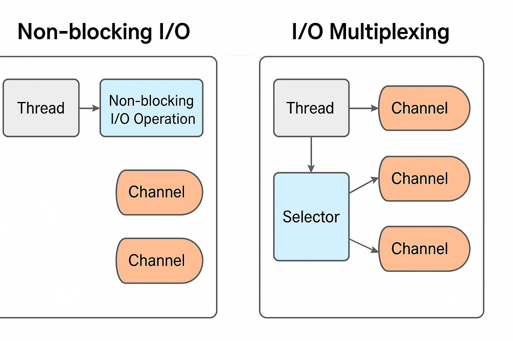

     * 高并发 IO 的底层原理
     * 1. IO 读写的基本原理
     *  会用到底层提供的 read 和 write 两大系统调用, read 和 write 不会直接在物理内存上写入/读取数据, 都是通过缓冲区进行的
     *  数据在内核缓冲区和用户缓冲区之间流动,  网卡 -> 内核缓冲区 -> 用户缓冲区
     * 2. 四种主要的 IO 模型
     *  同步IO, 同步非阻塞IO, IO多路复用, 异步IO
     *  同步IO: 从发起 read请求开始, 一直到内核缓冲区的数据完整的复制到用户缓冲区才接触阻塞
     *  同步非阻塞IO: 在内核数据到达之前, 用户线程一直轮询进行IO系统调用, 不阻塞. 一旦内核数据到达, 一直到用户进程获取到数据才会解除阻塞状态
     *  IO多路复用: 提供选择器注册, 可以同时监控多个socket状态, 轮询访问列表以得到就绪的socket, 然后进行数据复制(从内核到用户缓冲的复制过程仍需要阻塞用户线程)
     *  异步IO: 整个过程都是异步的, 这种IO需要操作系统的底层支持
     * 3. 通过合理的配置来支持百万级别的并发连接
     *
     *
     * Java NIO核心
     * 1. Java NIO 简介
     * 2. NIO buffer
     *  一个非线程安全的内存块, 可以写入数据, 也可以读取数据.
     * 3. NIO channel
     * 4. NIO select
     *
     * Reactor模式
     * 1. 单线程 Reactor模式
     *  多线程OIO, 每一个新连接都创建一个新的线程, 高并发场景下, 伴随着大量线程的创建, 销毁, 切换, 性能会大打折扣
     *  Reactor 模式分为两部分, 1.分发 2.处理
     *  Reactor负责查询 IO 事件, 当有新的事件发生的时候, 发送给 IO 事件对应的 Handler
     *  Handler与 IO 事件绑定, 完成连接建立和逻辑处理
     *  单线程 Reactor 把请求的建立和请求的处理放在同一个线程内, 当某一个 Handler 阻塞的时候, 会导致其他的 Handler 阻塞
     * 2. 多线程 Reactor模式
     *  多线程 Reactor 把请求的建立和请求的处理分成两个线程
     * 3. Reactor模式的优缺点
     *
     * Netty核心原理
     * 1. Netty里的 Reactor模式
     *  Netty 对 Reactor 模式进行了微调, 把 IO 事件的处理分为了四步, 1.通道注册 2.查询事件 3.事件内部分发, 数据读取和发射 4.流水线传播和业务处理
     *  netty 设计了自己的 Reactor角色, 叫做 EventLoop, 负责通道注册
     *  EventLoop 需要做的事情有很多, 不仅要负责 channel 的注册, 还要负责事件的查询, 甚至还要负责事件的分发, 数据的读取和发射
     *  EventLoopGroup 内部包含多个 Thread 和多个 EventLoop.
     * 2. bootstrap
     * 3. channel
     * 4. handler
     * 5. pipeline
     * 6. bytebuf
     * 7. netty的零拷贝
     *
     * Decoder和 Encoder
     * 1. 粘包和拆包

# IO

在Java中所谓IO到底是什么？为什么我的潜意识里总会认为IO就是和磁盘文件挂钩呢？这是我的误区吗？

------

## 🌐 1️⃣ **IO 在 Java（或计算机科学）里到底是什么？**

**IO** 是 *Input/Output*（输入/输出）的简称，指的是 **程序与外部环境之间交换数据** 的行为。

- **输入（Input）**：从外部（键盘、网络、文件、传感器……）读取数据到程序中。
- **输出（Output）**：把程序中的数据写到外部（屏幕、文件、网络、打印机……）。

**关键点：IO 的本质是“程序 ↔ 外部世界的数据通道”。**

------

## 📁 2️⃣ **为什么很多人下意识会把 IO 和磁盘文件联系在一起？**

这其实很正常，主要原因是：

- 在初学编程时，接触的 IO 大多是“文件读写”，比如 `FileInputStream`、`FileReader`、`BufferedWriter` 之类。
- 学校/教程里的 IO 样例常常用“读文件”“写文件”做演示，因为它直观、容易看到效果。
- 文件是持久化的、看得见摸得着，比较好理解“读/写”是什么。

所以，你会把 IO 和“文件”挂钩，其实是因为最常见的 IO 使用场景是文件读写。这不是错误，只是不完整。

------

## 🌐 3️⃣ **Java 的 IO 远远不限于文件！**

Java 的 IO 范畴包括：

- **文件 IO**：`FileInputStream`、`FileReader`、`FileChannel` 等等。
- **网络 IO**：`Socket`、`ServerSocket`、`InputStream` / `OutputStream` 读写网络数据。
- **控制台 IO**：`System.in`（键盘输入）、`System.out`（标准输出）、`System.err`（标准错误）。
- **内存 IO**（字节流/字符流）：比如 `ByteArrayInputStream`、`CharArrayReader`，这其实是模拟 IO，但数据在内存中流动。
- **管道 IO**：`PipedInputStream`、`PipedOutputStream`，线程之间通信的“IO”。

**只要是“把数据从这里搬到那里”，就属于 IO。**
 它和磁盘没必然关系，文件只是 IO 的一个特殊媒介。

------

## ✅ **结论**

> **IO ≠ 文件 IO**
>  文件 IO ⊂ IO

你觉得 IO == 文件，不算“误区”，只是对 IO 的“起点理解”。
 当你做网络编程（HTTP、TCP）、多线程通信、甚至消息队列的时候，你会发现：
 **IO 无处不在，但未必涉及磁盘！**

------

### 🚀 **延伸理解：NIO**

如果你接触过 `java.nio`：

- 这个 **New IO** 主要是为了更高效地处理 **网络 IO** 和 **文件 IO**。
- 它有 `Channel`、`Buffer`、`Selector`，核心就是“面向块”、“非阻塞”。
- 很多高并发服务器（Netty）就是基于 NIO。

------

## 🔑 **一句话记住**

> **IO 是程序和外部世界沟通的桥梁。文件只是其中一种沟通方式。**

------

## Java I/O 类全面解析

Java I/O (输入/输出) 系统提供了丰富的类来处理各种数据输入输出操作。这些类主要位于 `java.io` 包中，可以分为几个主要类别：

### 1. 按数据流向分类

#### 输入流 (Input Streams)
- **字节输入流**：`InputStream` (抽象基类)
  - `FileInputStream`：从文件读取字节
  - `ByteArrayInputStream`：从字节数组读取
  - `PipedInputStream`：从管道读取
  - `FilterInputStream`：装饰器基类
    - `BufferedInputStream`：带缓冲
    - `DataInputStream`：读取基本数据类型
    - `PushbackInputStream`：支持回退
  
- **字符输入流**：`Reader` (抽象基类)
  - `FileReader`：从文件读取字符
  - `CharArrayReader`：从字符数组读取
  - `StringReader`：从字符串读取
  - `BufferedReader`：带缓冲，有`readLine()`方法
  - `InputStreamReader`：字节流到字符流的桥梁

#### 输出流 (Output Streams)
- **字节输出流**：`OutputStream` (抽象基类)
  - `FileOutputStream`：写入文件
  - `ByteArrayOutputStream`：写入字节数组
  - `PipedOutputStream`：写入管道
  - `FilterOutputStream`：装饰器基类
    - `BufferedOutputStream`：带缓冲
    - `DataOutputStream`：写入基本数据类型
    - `PrintStream`：格式化输出(System.out就是此类)
  
- **字符输出流**：`Writer` (抽象基类)
  - `FileWriter`：写入文件
  - `CharArrayWriter`：写入字符数组
  - `StringWriter`：写入字符串
  - `BufferedWriter`：带缓冲
  - `OutputStreamWriter`：字符流到字节流的桥梁
  - `PrintWriter`：格式化输出

### 2. 按功能分类

#### 文件操作类
- `File`：文件和目录路径名的抽象表示
- `RandomAccessFile`：支持随机访问文件

#### 对象序列化
- `ObjectInputStream`：读取序列化对象
- `ObjectOutputStream`：写入序列化对象

#### 转换流
- `InputStreamReader`：字节流→字符流
- `OutputStreamWriter`：字符流→字节流

### 3. 新I/O (NIO) 类

Java 1.4引入的`java.nio`包提供了更高效的I/O操作：
- `Channel`：文件通道、套接字通道等
- `Buffer`：数据缓冲区
- `Selector`：多路复用I/O
- `Charset`：字符集编码解码

### 4. 常用组合模式

#### 字节流典型组合
```java
// 带缓冲的文件读取
try (InputStream in = new BufferedInputStream(new FileInputStream("file.txt"))) {
    // 读取操作
}

// 带缓冲和基本类型支持的文件写入
try (DataOutputStream out = new DataOutputStream(
        new BufferedOutputStream(
            new FileOutputStream("data.bin")))) {
    out.writeInt(123);
    out.writeUTF("文本");
}
```

#### 字符流典型组合
```java
// 带缓冲的文本文件读取
try (BufferedReader reader = new BufferedReader(new FileReader("text.txt"))) {
    String line;
    while ((line = reader.readLine()) != null) {
        // 处理行
    }
}

// 带缓冲的文本文件写入
try (PrintWriter writer = new PrintWriter(new BufferedWriter(
        new FileWriter("output.txt")))) {
    writer.println("Hello World");
}
```

### 5. 选择指南

- **文本数据**：使用字符流(Reader/Writer)
- **二进制数据**：使用字节流(InputStream/OutputStream)
- **需要基本数据类型**：使用DataInputStream/DataOutputStream
- **需要缓冲**：总是包装BufferedXXX类
- **网络编程**：考虑使用NIO的Channel和Buffer
- **大文件处理**：考虑使用内存映射文件(MappedByteBuffer)

Java I/O系统设计采用了装饰器模式，可以通过组合各种流类来获得所需的功能，这种设计既灵活又强大。

# BIO

在 NIO 基础出现之前，服务端的同步阻塞IO处理。

这里参考代码 

服务端代码：org.hulei.basic.jdk.io.ConnectionPerThread

客户端代码：org.hulei.basic.jdk.io.Client


# NIO

# 同步非阻塞IO和多路复用IO

你的理解已经很接近了！这块是很多人刚接触 **非阻塞 IO** 和 **多路复用 IO** 时的一个疑问点，我来帮你理顺一下它们的核心区别和联系。

------

## 🗂️ **1️⃣ 非阻塞 IO 到底是什么？**

**非阻塞 IO** 的本质是：

- 当程序调用 IO 操作（比如 `read`）时，如果数据还没准备好，不会让线程一直挂起等待，而是 **立即返回**（告诉你：没数据可读）。
- 所以程序可以做别的事，或者循环尝试，直到读到数据。

👉 对应到 Java，就是 `Channel` 设置成 `non-blocking` 模式。

------

## 📍 **痛点：非阻塞 IO 只能对一个通道起作用？**

非阻塞 IO **本身不限制你只能处理一个文件描述符（FD）**，它只是单个 IO 调用是“非阻塞”的。

但是：

- 如果没有多路复用，你得对 **每个连接/通道都单独轮询**：

  ```java
  while (true) {
    if (channel1.hasData()) { read(channel1) }
    if (channel2.hasData()) { read(channel2) }
    if (channel3.hasData()) { read(channel3) }
  }
  ```

- 这会浪费 CPU，叫 **忙轮询**（busy poll）。

- 当连接数变多时，开销太大。

所以，**非阻塞 IO 单独使用时，效率并不理想**。

------

## 🧩 **2️⃣ 多路复用 IO 是怎么补足的？**

**多路复用 IO（IO Multiplexing）** 就是：
 让内核帮你监听多个 FD，一旦有任何一个就绪，就通知你。

典型的实现有：

- `select`、`poll`（经典 C 里的）
- `epoll`（Linux）
- `kqueue`（BSD）
- Java 的 `Selector`（NIO）

它的流程是：

1. 你注册多个通道/FD 到 Selector。
2. 线程调用 `selector.select()` 阻塞等待。
3. 内核会告诉你 **哪些 FD 已经可读/可写**。
4. 你对就绪的 FD 做非阻塞 IO 操作。

👉 这样：

- 一个线程就能管理成千上万个连接。
- 没有忙轮询的 CPU 浪费。

------

## ✅ **所以，多路复用 IO 其实是非阻塞 IO 的“放大器”**

- **非阻塞 IO：** 单个通道是非阻塞的。
- **多路复用 IO：** 内核 + Selector + 非阻塞 IO，组合起来，让一个线程高效管理多个通道。

------

## 🧵 **关键点总结**

| 特性         | 非阻塞 IO                   | 多路复用 IO                       |
| ------------ | --------------------------- | --------------------------------- |
| 定义         | IO 调用立即返回，不阻塞线程 | 同时监听多个 FD，哪个就绪处理哪个 |
| 需要的机制   | Channel/FD 非阻塞模式       | 内核支持 select/epoll/kqueue 等   |
| 是否自己轮询 | 是（如果单独用非阻塞 IO）   | 否（由 Selector 帮你做）          |
| 适用场景     | 少量连接                    | 高并发，高连接数                  |

------

## 🔑 **一句话记住**

> 多路复用 IO = 多个非阻塞 IO + 内核就绪通知（Selector）

------



# 单线程模型多路复用IO

如果在单线程中使用多路复用IO，就像 [NIOFileReceiveServer.java](..\..\java-basic\src\main\java\org\hulei\basic\jdk\io\nfio\NIOFileReceiveServer.java) 这个类一样， **“一个线程能监听多个连接”，但忽略了“处理阶段仍然是单线程”这个限制**。

------

## ⚙️ 1️⃣ **多路复用只解决了 \*就绪通知\*，没解决 \*处理并发\***

**多路复用（epoll、select、kqueue、Selector）** 的作用：

- 是让单个线程能 **高效等待多个 IO 通道**。
- 不需要开 N 个线程来分别阻塞在 N 个 `read()` 上。

🚦 **但是！**

- 它只帮你发现“谁有数据来了”。
- 真正的“数据读取、业务处理、响应”还是需要 CPU 来做，依然是**当前线程**干活。

------

## 🕹️ 2️⃣ **你的现象：为什么单线程下还是会卡住？**

举个例子：

1. 假设你用单线程 + Selector。
2. 同时有 1000 个 TCP 连接，客户端都发来了数据。
3. Selector 通知你有 1000 个 `SelectionKey` ready。
4. 你开始处理第一个连接：
   - 读数据
   - 解析协议
   - 执行业务逻辑（比如查数据库）
   - 写回响应
   - 然后才处理第二个连接...

这时：

- 在处理第一个连接期间，**整个线程被业务逻辑占满**。
- 剩下的 999 个连接虽然已经 ready，却没人管它们。

**结论：多路复用只能把“发现 IO 就绪”效率最大化，但无法让你的“处理”阶段并行。**

------

## ⚡ 3️⃣ **所以高性能服务器是怎么做的？**

真实的高性能网络框架（如 Netty、Nginx）会：

- 用 Selector 负责 **IO 事件检测**。
- 把 **读到的请求** 尽快交给 **线程池**（Worker Pool）去处理：
  - IO 线程负责“发现 ready → 读 → 放到队列”
  - Worker 线程负责“真正的业务计算 / 数据库交互 / 回写响应”

这样：

- IO 线程始终轻量，只干“读写通道”这件事，不被业务阻塞。
- CPU 核心能并行跑多个 Worker 来处理连接请求。

------

## ✅ **这就是常说的 “Reactor 模式”**

👉 经典单 Reactor 单线程：
 只能处理少量请求，比如最简单的 Selector 示例。

👉 多 Reactor + Worker Pool（Netty、Nginx）：

- Reactor 负责 IO 多路复用。
- Worker Pool 负责业务计算。
- 二者解耦。

------

## 🧩 **结论**

> **IO 多路复用只能提高“检测多个连接的效率”，无法提高“单线程处理多连接的能力”。想提高整体吞吐，还得靠多线程或多进程把耗时的业务处理并发化。**

------

### 🔑 **一句话：Selector 让 IO 不堵，Worker Pool 让 CPU 跑满。**

------

