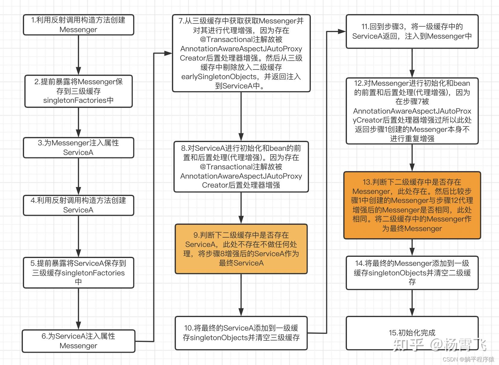
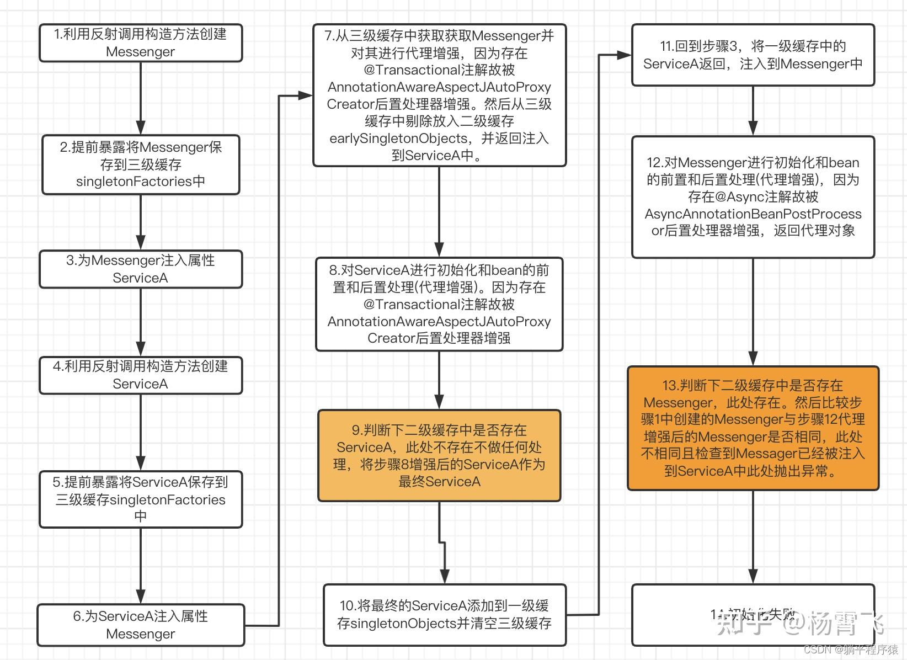

## 概念

### 简要介绍一下spring

首先定位: 开源的,轻量级的,企业应用开发框架  
主要思想: DI(dependency inject 依赖注入)和AOP(面向切面编程)  
主要功能: DI,AOP,事务管理,数据访问,web开发,控制反转(IoC Inversion of Control)

### 简要介绍一下spring各个模块

Spring 框架是一个模块化的框架，拥有多个模块，每个模块都专注于不同的功能领域。以下是 Spring 框架中一些主要的模块：

1. **Spring Core Container**：
    - **IoC Container（控制反转容器）**：Spring 的 IoC 容器是 Spring 框架的核心，负责管理应用程序中的对象（Bean）的生命周期、依赖关系、配置和注入。它包括
      BeanFactory 和
      ApplicationContext 两个主要实现。
        - **BeanFactory**
            - `BeanFactory` 是 Spring 框架的核心接口之一，它负责管理应用程序中的对象（Bean）的生命周期、依赖关系、配置和注入。
            - `BeanFactory` 通过将应用程序的配置信息加载到容器中，并使用这些信息实例化、配置和组装 Bean
              对象，从而实现了控制反转（IoC）和依赖注入（DI）。
            - `BeanFactory` 提供了许多实现类，其中最常用的是 `DefaultListableBeanFactory` 和 `XmlBeanFactory`。
        - **ApplicationContext**
            - `ApplicationContext` 是 `BeanFactory` 的子接口，它是 Spring 框架中更高级的容器，提供了更多的功能和特性。
            - `ApplicationContext` 在 BeanFactory 的基础上，添加了对国际化、事件传播、资源加载、AOP 等方面的支持。
            - `ApplicationContext` 实现类包括 `ClassPathXmlApplicationContext`、`FileSystemXmlApplicationContext`
              、`AnnotationConfigApplicationContext` 等。
        - 这两个部分是 Spring Core Container 的核心组件，它们提供了 Spring 框架中最基本的功能，例如 Bean
          的创建、依赖注入、配置管理、生命周期管理等。通过这些功能，Spring Core
          Container
          实现了松耦合、模块化和可测试性，使得应用程序的开发和维护变得更加简单和灵活。
    - **Dependency Injection（依赖注入）**：Spring 使用依赖注入来管理对象之间的依赖关系，使得对象之间的耦合度降低，更易于测试和维护。

2. **Spring AOP（面向切面编程）**：
    - **Aspect（切面）**：切面是一种模块化的方式，用于横向切割关注点（cross-cutting concerns），例如事务管理、日志记录、安全等。
    - **Join point（连接点）**：连接点是在应用程序执行期间可以插入切面的点，例如方法的调用、异常的处理等。
    - **Advice（通知）**：通知是切面在连接点上执行的动作，例如在方法执行前后、抛出异常时等。 前置通知（Before
      advice）、后置通知（After returning advice）、异常通知（After
      throwing advice）、最终通知（After finally
      advice）、环绕通知（Around advice）。
    - **Weaving（织入）**：织入是将切面应用到目标对象的过程，可以在编译时、加载时或运行时进行。

    ```java
    import org.aspectj.lang.annotation.Aspect;
    import org.aspectj.lang.annotation.Before;
    
    // 这整个类就是一个切面
    @Aspect
    public class LoggingAspect {
    
        // 切入点为UserService的所有方法的前置通知
        @Before("execution(* com.example.service.UserService.*(..))")
        public void beforeAdvice() {
            System.out.println("Before method execution");
        }
    }
    
    ```
   @Aspect 注解标记了这个类为一个切面。  
   @Before 注解标记了一个前置通知，指定了切入点表达式 "execution(* com.example.service.UserService.*(..))"，表示所有
   UserService 类中的方法调用作为连接点。  
   在 beforeAdvice() 方法中，我们定义了在方法执行之前输出日志的逻辑。

3. **Spring DAO（数据访问）**：
   Spring DAO 模块是 Spring 框架的一个重要部分，专注于简化数据访问层的开发。它提供了许多实用的功能和技术，使得与数据库交互更加简单、高效和可维护。下面是
   Spring DAO 模块的一些主要特点和功能：
    1. **JDBC 抽象层**：
       Spring DAO 提供了对 JDBC 的抽象，简化了 JDBC 编程的复杂性。它包括了一系列的 JDBC 模板类（例如
       JdbcTemplate、NamedParameterJdbcTemplate），这些模板类提供了许多便捷的方法来执行 SQL
       查询、更新和批处理操作，同时封装了异常处理和资源释放等操作，减少了样板式代码的编写。
    2. **ORM 整合**：
       Spring DAO 提供了与主流的 ORM 框架（例如 Hibernate、JPA）的集成支持，使得在 Spring 应用中使用 ORM 技术变得更加容易。通过
       Spring DAO，可以轻松地将 ORM 框架的功能与
       Spring
       的事务管理、依赖注入等特性无缝整合，从而实现更加灵活和可维护的数据访问层。
    3. **声明式事务管理**：
       Spring DAO 提供了声明式事务管理的支持，使得在 Spring 应用中管理事务变得更加简单和灵活。通过声明式事务管理，开发者可以使用注解或
       XML 配置来定义事务的边界和传播行为，而无需手动编写事务管理代码。
    4. **数据访问异常处理**：
       Spring DAO 提供了一套一致的异常体系用于处理数据访问中的异常，使得在应用程序中统一处理数据库相关的异常变得更加方便和可靠。
    5. **数据访问支持类**：
       Spring DAO 提供了许多支持类和工具类，用于简化数据访问层的开发。例如，它提供了 RowMapper 接口用于将查询结果集映射到
       Java 对象，提供了 SQL 参数的封装类
       SqlParameterSource，提供了 JdbcOperations 接口用于执行 JDBC
       操作等。

   总的来说，Spring DAO 模块通过提供一系列的抽象、工具和技术，使得在 Spring 应用中进行数据访问变得更加简单、灵活和高效。无论是直接使用
   JDBC 进行操作，还是通过集成的 ORM
   框架进行持久化操作，都可以得到很好的支持和便利。

4. **Spring MVC（模型-视图-控制器）**：
    - **DispatcherServlet（调度器 Servlet）**：Spring MVC 的核心组件，负责接收 HTTP 请求并将其分派到相应的处理器（Controller）上进行处理。
    - **HandlerMapping（处理器映射器）**：负责将请求映射到相应的处理器上。
    - **Controller（控制器）**：处理 HTTP 请求，执行业务逻辑，并返回相应的视图。
    - **ViewResolver（视图解析器）**：将逻辑视图名称解析为实际的视图对象。

5. **Spring Security（安全框架）**：Spring Security 是一个功能强大的安全框架，用于保护应用程序的安全性，包括身份验证、授权、会话管理、加密等功能。

6. **Spring Boot（快速应用开发）**：Spring Boot 是 Spring 的一个子项目，旨在简化 Spring
   应用程序的开发和部署。它提供了自动配置、起步依赖、内嵌容器等特性，使得开发者可以更加快速地构建独立的、生产级别的应用程序。

7. **Spring Data（数据访问）**：Spring Data 是一个用于简化数据访问的项目，它为不同的数据存储提供了统一的数据访问抽象，并提供了
   Repository 接口用于简化数据访问层的开发。

8. **Spring Integration（集成框架）**：Spring Integration 是一个用于企业集成的框架，提供了丰富的集成模式和组件，用于处理消息、文件、WebService
   等各种集成场景。

这些是 Spring 框架中的一些主要模块，每个模块都专注于不同的领域，并提供了丰富的功能和特性，使得开发者可以更加轻松地构建复杂的企业级应用程序。

### spring用到了哪些设计模式

Spring 框架在其设计和实现中运用了多种设计模式，其中一些常见的设计模式包括但不限于：

1. **工厂模式**：
   Spring 使用工厂模式来创建和管理对象的生命周期。例如，BeanFactory 和 ApplicationContext 是 Spring 中常用的工厂类，它们负责创建和管理
   bean 对象。

2. **单例模式**：
   Spring 中的 bean 默认是单例的，即每个 bean 在容器中只有一个实例。这样可以节省资源，并且保证了依赖注入时的一致性。

3. **模板方法模式**：
   Spring 的 JdbcTemplate 和 HibernateTemplate 等模板类使用了模板方法模式。例如，JdbcTemplate 提供了一系列执行数据库操作的方法，其中包括了模板方法
   execute()
   ，而具体的数据库操作在其中由回调方法来实现。

4. **观察者模式**：
   Spring 的事件（Event）机制使用了观察者模式。ApplicationContext 可以发布事件，而监听器（ApplicationListener）可以订阅这些事件，并在事件发生时做出相应的处理。

5. **代理模式**：
   Spring AOP 使用了代理模式来实现面向切面编程。在 Spring AOP 中，目标对象被代理对象包装，代理对象拦截目标对象的方法调用，并在方法执行前后执行额外的逻辑。

下面以实际的例子说明 Spring 使用的设计模式：

示例：工厂模式

```java
public interface Animal {
    void makeSound();
}

public class Dog implements Animal {
    @Override
    public void makeSound() {
        System.out.println("Woof");
    }
}

public class Cat implements Animal {
    @Override
    public void makeSound() {
        System.out.println("Meow");
    }
}

public class AnimalFactory {
    public Animal createAnimal(String type) {
        if ("dog".equalsIgnoreCase(type)) {
            return new Dog();
        } else if ("cat".equalsIgnoreCase(type)) {
            return new Cat();
        }
        return null;
    }
}
```

在上面的例子中，AnimalFactory 使用了工厂模式来根据类型创建不同的 Animal 对象。通过 AnimalFactory 可以动态地创建不同类型的
Animal 对象，而无需直接依赖具体的类实现。

这些是 Spring 中常见的设计模式示例，Spring 在设计上充分利用了这些设计模式来提高代码的灵活性、可维护性和可扩展性。

### IOC 容器对 Bean 的生命周期

在 Spring 中，当一个 bean 被 IoC 容器创建并初始化之后，可能会涉及到以下几种方法的调用：

1. **构造函数（Constructor）**：
   首先，IoC 容器会调用 bean 类的构造函数来创建 bean 的实例。构造函数用于初始化 bean 实例的状态，并确保 bean
   的一致性和正确性。构造函数的调用发生在 bean 实例化的阶段。

2. **属性设置（Properties Setting）**：
   在 bean 实例化后，IoC 容器会注入 bean 的属性值。这包括通过 setter 方法注入属性值，或者通过字段直接注入属性值（使用
   `@Autowired` 或 `@Inject` 注解）。属性设置的调用发生在 bean
   实例化之后，属性注入之前。

3. **自定义初始化方法（Custom Initialization Method）**：
   在属性设置完成之后，可以定义一个自定义的初始化方法，用于执行一些额外的初始化操作。这个初始化方法通常使用
   `@PostConstruct` 注解标记，表示在属性注入完成后立即调用。在这个初始化方法中，可以执行一些与 bean
   相关的初始化逻辑，例如数据加载、资源初始化等。

4. **BeanPostProcessor 的前置处理（Before Initialization）**：
   在调用自定义初始化方法之前，IoC 容器会调用所有注册的 BeanPostProcessor 的 `postProcessBeforeInitialization()`
   方法。BeanPostProcessor 是 Spring
   容器的扩展点，允许开发者在 bean
   初始化前后做一些额外的处理。在 `postProcessBeforeInitialization()` 方法中，开发者可以对 bean 进行修改、增强或者验证等操作。

5. **自定义初始化方法的调用**：
   IoC 容器调用 bean 的自定义初始化方法，例如使用 `@PostConstruct` 注解标记的方法。在这个方法中，可以执行一些与 bean
   相关的初始化逻辑。

6. **BeanPostProcessor 的后置处理（After Initialization）**：
   在调用自定义初始化方法之后，IoC 容器会再次调用所有注册的 BeanPostProcessor 的 `postProcessAfterInitialization()`
   方法。在这个方法中，开发者可以对 bean
   进行进一步的修改、增强或者验证等操作。

7. **使用 bean**：
   在初始化完成后，bean 就处于可用状态，可以被其他 bean 或者应用程序的其他部分使用。在应用程序运行期间，可以使用容器的获取方法获取
   bean 实例，并使用它们提供的功能。

在 bean 初始化的过程中，构造函数、属性设置、自定义初始化方法以及 BeanPostProcessor 的前置处理和后置处理等方法都可能被调用，以确保
bean 在初始化过程中的一致性和正确性。

### spring中各种后置处理器

BeanFactoryPostProcessor 和 BeanPostProcessor 是 Spring 框架中两个重要的接口，它们在 Spring 容器初始化和实例化 Bean
的过程中起着不同的作用。

1. **BeanFactoryPostProcessor：**
    - BeanFactoryPostProcessor 是在 Spring 容器实例化 Bean 之前执行的一种扩展机制。
    - 它允许在容器实例化 Bean 之前修改 Bean 的定义（例如，修改属性值、添加新的属性等）。
    - BeanFactoryPostProcessor 接口有一个方法：`void postProcessBeanFactory(ConfigurableListableBeanFactory beanFactory)`
      ，在这个方法中，你可以获取和修改 Bean 的定义信息。

2. **BeanPostProcessor：**
    - BeanPostProcessor 是在 Spring 容器实例化 Bean 后，在调用 Bean 的初始化方法前后执行的一种扩展机制。
    - 它允许在每个 Bean 实例化后对 Bean 进行一些额外的处理，例如，对 Bean 进行代理、添加监听器等。
    - BeanPostProcessor 接口有两个方法：`Object postProcessBeforeInitialization(Object bean, String beanName)`
      和 `Object postProcessAfterInitialization(Object bean, String beanName)`，分别在 Bean 初始化方法执行前后被调用。

区分它们的关键在于执行时机和作用对象：

- BeanFactoryPostProcessor 在 Spring 容器实例化 Bean 之前执行，作用于 Bean 的定义；
- BeanPostProcessor 在 Spring 容器实例化 Bean 后，在初始化方法执行前后执行，作用于每个具体的 Bean 实例。

### 关于懒加载

在 Spring 中，懒加载（Lazy Loading）指的是在需要时才实例化或加载 Bean 对象的一种机制。  
默认情况下，Spring 容器在启动时会创建并初始化所有定义的 Bean 对象，即采用立即加载（Eager Loading）的方式。  
但是，通过设置懒加载属性，可以将 Bean 对象的加载时机延迟到第一次被请求时才进行加载。

Spring 中懒加载的作用包括：

1. **减少启动时间和内存占用**：在大型的 Spring 应用中，如果所有 Bean 都是立即加载的，可能会导致启动时间过长以及占用大量内存。懒加载可以延迟实例化
   Bean，从而在应用启动时减少初始资源消耗。

2. **性能优化**：懒加载可以降低应用程序的启动时间，尤其是对于那些需要大量初始化时间的 Bean 对象或者依赖其他资源的 Bean
   对象。通过懒加载，可以将初始化的成本分散到应用程序运行时的不同阶段，提高应用程序的性能。

3. **避免不必要的资源浪费**：如果某些 Bean 在应用程序启动时可能不会被立即使用，那么懒加载可以避免在启动时加载这些不必要的资源，节省系统资源。

懒加载在 Spring 中通过 `@Lazy` 注解来实现，可以在 Bean 的定义上使用该注解来指示 Spring 容器在需要时才加载该 Bean。
这样，在应用程序运行过程中第一次使用 `MyLazyBean` 实例时，Spring 容器才会进行加载和实例化。

## 问题

### 什么是循环依赖,spring是如何解决循环依赖问题的?

循环依赖是指一个或多个类出现互相依赖的关系的导致的.  
spring通过三级缓存解决循环依赖的问题.
而spring依赖注入的方式有三种:
属性注入 - 此方法spring现在都不再推荐了,缺乏可见性和控制力,让替换变得困难.且无法注入一个final对象
方法注入 - 同样也无法注入不可变对象, 注入的对象还可能被修改
构造器注入 - *这种方式是无法解决循环依赖的,所以如果存在循环依赖,又使用构造器来实现依赖注入,那么容器将无法初始化

[spring为什么使用三级缓存而不是两级](spring为什么使用三级缓存而不是两级.mhtml) 这篇文章写得不错

下面是一个例子：

``` Java
@Service
public class ServiceA {
    @Autowired
    private Messenger messenger;

    @Transactional
    public void method(){
        // 主要业务
        // 不重要通知
        messenger.send();
    }
}

------------------------------------
@Service
public class Messenger {

    @Autowired
    private ServiceA serviceA;

    @Async
    public void send(){
        // 通知逻辑
    //...
    }

    @Transactional
    public void transaction(){

    }
}
```

若不带@Aysnc注解按spring正常的循环依赖处理步骤应该如下图所示。

若带 @Async注解的初始化流程图如下：


上面报错换成人话：
在步骤7时已经将三级缓存中提前暴露的messenger进行代理增强移入二级缓存并且注入到ServiceA中了。
但是在步骤12时messenger由于@Async注解被AsyncAnnotationBeanPostProcessor后置处理器进行代理增强，
且与二级缓存中的messenger代理增强不相等，若将步骤12产生的messenger代理增强作为最终版本，
则ServiceA的messenger不是最终版本，此时在spring容器中存在messenger的两个版本。

### spring的单例bean是线程安全的吗?

Spring框架中的单例bean并不是线程安全的¹²³⁴。Spring框架中的Bean默认是单例模式的，框架并没有对bean进行多线程的封装处理²⁴。

实际上，大部分时间Bean是无状态的（比如Dao），所以在某种程度上来说Bean其实是安全的²⁴。但是，如果Bean是有状态的，那就需要开发人员自己来进行线程安全的保证²⁴。最简单的办法就是改变bean的作用域，把"
singleton"
改为“prototype”，这样每次请求Bean就相当于是新建一个Bean实例，这样就可以保证线程的安全了²⁴。

然而，即使是加上`@Scope`注解也不一定能保证Controller 100%的线程安全²。所以是否线程安全在于怎样去定义变量以及Controller的配置²。
